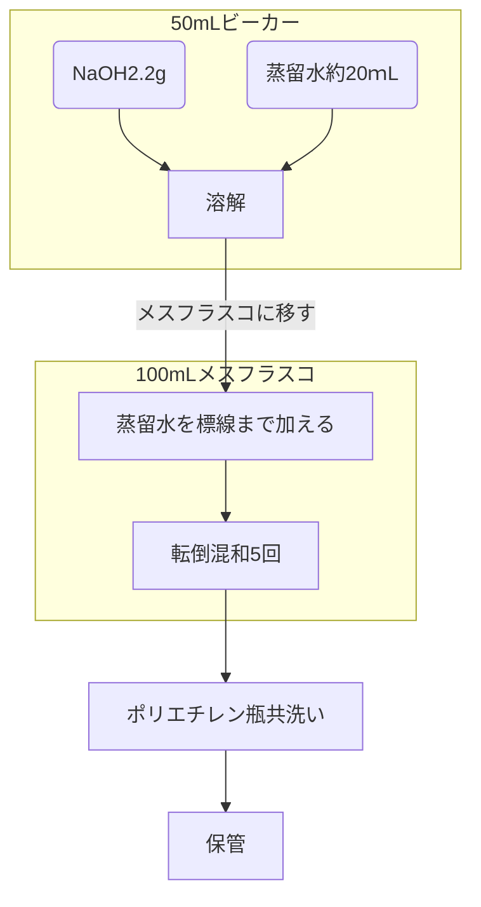
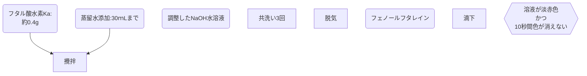

### 3.実験方法

#### 3.1 実験器具

-	ガラス電極ｐHメーター
-	ビュレット
-	メスフラスコ(500ｍL,100ｍL)
-	ビーカー(500ｍL,300ｍL)
-	コニカルビーカー
-	ホールピペット
-	ロート
-	薬包紙
-	マグネチックスターラー
-	撹拌子

#### 3.2 試薬

-	フタル酸水素カリウム($KHC_8H_4O_4$,分子量　204.22)：0.4[g]
-	水酸化ナトリウム(NaOH,分子量　40)：2.2[g]
-	塩化ナトリウム(NaCl,)：0.5844[g]
-	リン酸($H_3PO_4$)：0.1[mol/dm-3]溶液　15[ｍL]
-	フェノールフタレイン
-	pH標準液

#### 3.3 実験方法

実験は滴定剤の調整と評定、ｐHメーターの調整、滴定の三段階に分かれている。以下のフローチャートにそれぞれの手順を示す。

#### 3.3.1　NaOHの調整

 

1. NaOH2.2gをビーカーで直接秤量した。試薬の純度が100パーセントではなく、またNaOHは潮解性を持ち純度が落ちる可能性があるため、必要量の理論値である2.0gよりも多くはかり取った。

2. 蒸留水を約20ｍL加え、溶解させた。

3. 溶液を500ｍLメスフラスコに移した。この時、ビーカーに溶液が残らないよう、内部を蒸留水で洗浄し、洗浄した液もメスフラスコに加えた。

4. メスフラスコの標線まで蒸留水を加え、5回ほど転倒混和しよく攪拌した。

5. 調整した溶液をポリエチレン瓶に移した。この時、瓶内壁に水滴などの不純物が付着している可能性があるため、調整した溶液で約3回共洗いを行った。

#### 3.3.2 NaOH水溶液の評定

調整したNaOH水溶液の濃度を正確に知るため、フタル酸水素カリウムを用いて評定を行った。この操作は5回行い、4d法を用いて統計的にNaOH水溶液の濃度を測定した。

