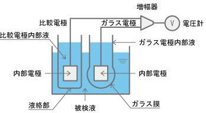
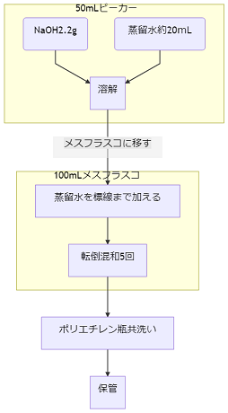
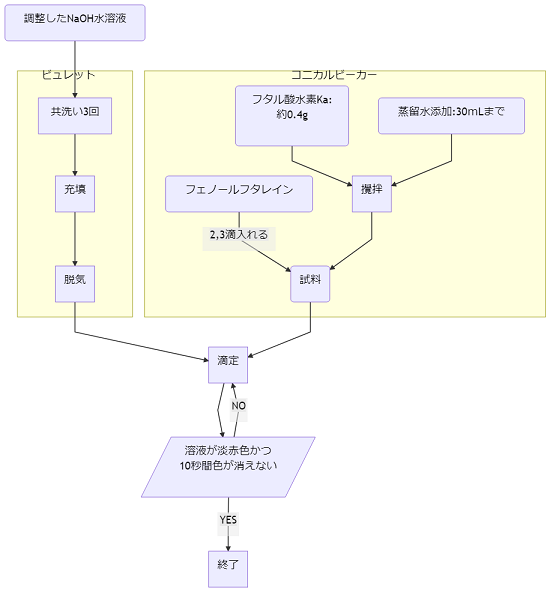
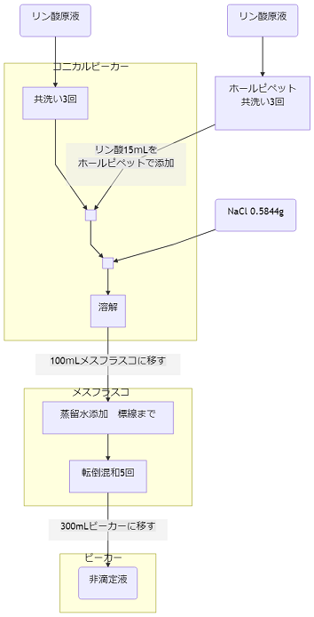
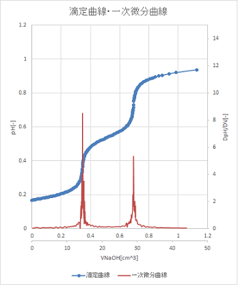
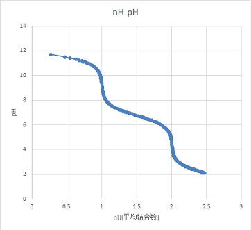
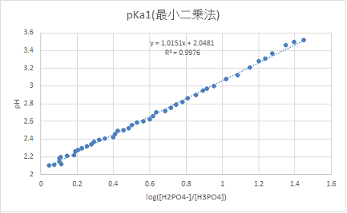
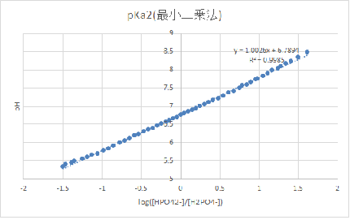

# 1.目的

今回の実験では、リン酸の酸解離反応について、ガラス電極ｐ H メーターを用いてｐ H の測定を行う。また、作図法、微分法、平均結合数を用いる方法、最小二乗法の四つの方法を用いて酸解離定数を計算し、多価の酸の酸解離平衡について理解を深める。

# 2．原理

## 2.1 酸解離平衡について

一般的な一価の酸解離反応において、酸解離定数$pK{an}$は以下のように表される。

$$HA \rightleftharpoons H^+ + A^-~~~~~K_A=\cfrac{[H^+][A^-]}{[HA]}$$ $$pK_a=-logK_A$$

今回取り扱うリン酸は三価の酸であり、以下のように三段階の酸解離反応が起こる。

$$H_3PO_4\rightleftharpoons H^+ + H_2PO_4^{-}~~~~~pK_{a1}=-log\left(\cfrac{[ H_2PO_4^{-}][H^+]}{[H_3PO_4]}\right)=2.15$$

$$H_2PO_4^{-}\rightleftharpoons H^+ + HPO_4^{2-}~~~~~pK_{a2} =-log\left(\cfrac{[HPO_4^{2-}][H^+]}{[H_2PO_4^{-}]}\right)= 7.20$$

$$HPO_4^-\rightleftharpoons H^+ + PO_4^{3-}~~~~~~pK_{a3}=-log\left(\cfrac{[PO_4^{3-}][H^+]}{[HPO_4^{2-}]}\right)=12.4$$

ここで示した$pK_{an}$は理論値であるが、相互に 4 以上離れているためそれぞれの反応を独立なものとして扱う。 また、$pK_{an}$値は水溶液中でのプロトンの放出のしやすさを表すが、これは電離後のイオンが安定であるほど起こりやすい。ゆえに$pK_{an}$値はイオン強度 I の関数となる。イオン強度は酸解離反応以外にも様々な要因で変化しうる値であるため、今回はこれを一定にするために支持塩として NaCl を少量加える。

## 2.2 　滴定・滴定曲線について

滴定とは、化学分析で最も基本的な手法のひとつであり、試料に濃度既知の滴定剤を滴下し、反応に要した滴定剤の体積から試料溶液の濃度を測定する方法である。今回はｐ H メーターを用いた電位差測定により反応を観測するため、電位差滴定法とも呼ばれる。
式 1 のような一般的な一価の酸(HA)を一価の塩基(BOH)で滴定するとき、以下の物質収支式(式 7)・電荷収支式(式 8)が成立する。

$$[A]^T = [HA] + [A^-]$$ $$[H^+]+[B^+] = [A^-] + [OH^-]$$

また、水分子そのものも解離平衡を持ち、これを水の自己プロトリシスという。

$$[H^+][OH^-]=Kw~~~~~pKw=14$$

以上の式と適切な近似を用い、滴定剤である塩基の滴下量$V_B$を横軸、ｐ H を縦軸にプロットすると図のような滴定曲線が得られる。
ここで、当量点(A)とは滴定曲線の傾きが無限大になる点であり、この時滴定剤である塩基と試料中の酸は当量となる。
半当量点(B)においては酸のうち半量が中和され、解離した酸の濃度$[A^-]$と解離していない酸の濃度$[HA]$が等しくなる。
よって、式 1 を約分することができ、半当量点のｐ H は試料の酸解離定数$K_A$と一致する。リン酸に関しては多価の酸で一般的な滴定とは異なる点もあるため、後述する。

## 2.3 　ガラス電極ｐ H メーターについて

 
ガラス電極ｐHメーターはガラス電極・比較電極の二つの電極を持つ。ガラス電極は内部にｐH標準液が充填されており、試料溶液中の比較電極との電位差を測定することができる。ｐH標準液はｐHが既知であり、電位差とｐHは酸～中性域では線形の関係にある。これを用いてｐHを測定する。
ガラス薄膜にプロトンを含む溶液を接触させると、以下のネルンストの式に応じた膜電位が発生する。

$$E=E^{\circ}+\cfrac{RT}{nF}lna_x$$

ｐ H はプロトン濃度を表す指標であるため、プロトンの活量を考えて上式をｐ H で表すと、

$$E=E^{\circ}+\cfrac{2.303RT}{F}log[H^+]=E^{\circ}-\cfrac{2.303RT}{F}pH$$

となる。
ｐ H の異なる二種の溶液がガラス薄膜を隔てて接触すると、上式から以下のような起電力が発生することがわかる。

$$\Delta E{out-in} =\left(E^{\circ}-\cfrac{2.303RT}{F}pH_{out}\right)-\left(E^{\circ}-\cfrac{2.303RT}{F}pH_{in}\right)= \cfrac{2.303RT}{F}(pH_{in}-pH_{out})$$

以上がガラス電極の電位差発生機構である。参照電極は液絡部に微小な穴が開いており、ｐ H のわかっている内部溶液が電極付近に漏れ出すため外部溶液のｐ H によらず一定の起電力を示す。ガラス電極内部のｐ H も標準溶液により校正されるため、この二つの電極を電池と考え、その起電力を測定すれば外部溶液のｐ H のみに依存した起電力を得ることができる.

# 3.実験方法

## 3.1 実験器具

-   ガラス電極ｐ H メーター
-   ビュレット
-   メスフラスコ(500 ｍ L,100 ｍ L)
-   ビーカー(500 ｍ L,300 ｍ L)
-   コニカルビーカー
-   ホールピペット
-   ロート
-   薬包紙
-   マグネチックスターラー
-   撹拌子

## 3.2 試薬

-   フタル酸水素カリウム($KHC_8H_4O_4$,分子量　 204.22)：0.4[g]
-   水酸化ナトリウム(NaOH,分子量　 40)：2.2[g]
-   塩化ナトリウム(NaCl,)：0.5844[g]
-   リン酸($H_3PO_4$)：0.1[mol/dm-3]溶液　 15[ｍ L]
-   フェノールフタレイン
-   中性 pH 標準液(25℃ で pH6.86,リン酸塩水溶液)

*   酸性 pH 標準液(25℃ で pH4.01,フタル酸塩水溶液)

## 3.3 手順

実験は滴定剤の調整と評定、ｐ H メーターの調整、滴定の三段階に分かれている。以下のフローチャートにそれぞれの手順を示す。

### 3.3.1 　 NaOH の調整　　

NaOH 水溶液調整の大まかな手順を図 1 のフローチャートに示す.

1. NaOH2.2g をビーカーで直接秤量した。試薬の純度が 100 パーセントではなく、また NaOH は潮解性を持ち純度が落ちる可能性があるため、必要量の理論値である 2.0g よりも多くはかり取った。

2. 蒸留水を約 20 ｍ L 加え、溶解させた。

3. 溶液を 500 ｍ L メスフラスコに移した。この時、ビーカーに溶液が残らないよう、内部を蒸留水で洗浄し、洗浄した液もメスフラスコに加えた。

4. メスフラスコの標線まで蒸留水を加え、5 回ほど転倒混和しよく攪拌した。

5. 調整した溶液をポリエチレン瓶に移した。この時、瓶内壁に水滴などの不純物が付着している可能性があるため、調整した溶液で約 3 回共洗いを行った。
 

### 3.3.2 NaOH 水溶液の評定

調整した NaOH 水溶液の濃度を正確に知るため、フタル酸水素カリウムを用いて評定を行った。この操作は 5 回行い、4d 法を用いて統計的に NaOH 水溶液の濃度を測定した。

1. 評定剤であるフタル酸水素カリウムを 0.4[g]精秤した。この時に秤量誤差が生じる可能性があるため、評定は 5 回行った。また、秤量したフタル酸水素カリウムをコニカルビーカーに移す際、薬包紙を蒸留水で洗浄し、洗浄液もコニカルビーカーに加えた。

2. 1 のコニカルビーカーに、液量が 30 ｍ L となるまで蒸留水を加え、攪拌して溶解させた。

3. 攪拌した溶液に指示薬としてフェノールフタレインを 2,3 滴加え、試料とした。フェノールフタレイン自体も酸解離平衡をもつため、少量の添加にとどめた。

4. 調整した NaOH 溶液を少量ビュレットに充填し、内壁によく伝わせた。この共洗いの操作を合計三回行った。

5. 共洗いが終わったビュレットに NaOH 溶液を漏斗を用いて充填し、先端に残った空気を少量の溶液ごと抜いた。

6. ビュレットから少量ずつ NaOH 溶液を滴下し、滴定を行った。滴下後、溶液の色が淡赤色に変化したが、攪拌すると無色に戻った。これを繰り返し、攪拌しても 10 秒間色が残るようになるまで NaOH 溶液を滴下した。また、滴定中に NaOH が足りなくなったときは一度ビュレット中の溶液をすべて捨ててから再充填し、滴定を続けた。このとき、共洗いは行わなかった。

7. 以上の滴定操作を 5 回行った。

### 3.3.3. ｐ H メーター校正

1. pH メーターの電源を入れ、ガラス電極を蒸留水で洗浄した。特に、液絡部をよく洗浄した。

2. 洗浄後、液絡部に残った蒸留水をふき取ったのちｐ H 標準液に浸し、測定したｐ H と中性標準溶液のｐ H が等しくなるようにダイヤルを調整した。

3. 同様に電極を洗浄した後に酸性標準溶液とｐ H が等しくなるようにダイヤルを調整し、酸性領域での校正を行った。

4. 最後に、再度電極を洗浄してから中性標準溶液に浸し、2 で調整した値を同じになるように再度調整を行った。

5. 4 と同様に酸性標準溶液を用いて再度校正を行った。2.3 の操作を合計三回繰り返した。

### 3.3.4 　被滴定液の調整

この操作についてのフローチャートを図 3 に示す。

1. 100mL コニカルビーカー・ホールピペットをリン酸の原液で洗浄した。この共洗いの操作は三回行った。

2. 1 で洗浄したコニカルビーカーに、洗浄したホールピペットをもちいてリン酸原液を 15 ｍ L 移した。ホールピペットの先端についた液滴が誤差の原因となるため、これを落としてからビーカーに移した。また、最後にピペット内に残った液滴も、ピペットの球部を温めることで空気を膨張させ、完全に移した。

3. 支持塩である塩化ナトリウムを 0.5844[g]秤量し、2 のコニカルビーカーに加えた。このとき、薬包紙に塩化ナトリウムが残らないよう、蒸留水で洗浄した。

4. 100mL メスフラスコに 3 のコニカルビーカーの内容物を移した。この際もコニカルビーカーの内壁を蒸留水で洗浄し、洗浄液もメスフラスコに加えた。

5. メスフラスコの標線まで蒸留水を足し、5 回ほど転倒混和して攪拌した。

6. 300 ｍ L ビーカーに調整した溶液を移した。

### 3.3.5 リン酸の滴定

1. 3.3.4 のビーカーに撹拌子を入れ、マグネチックスターラーで攪拌を行った。また、滴定剤である NaOH を充填したビュレットをセットした。

2. NaOH を滴下しない状態のｐ H を測定した。

3. NaOH を滴下するごとに攪拌を止めてｐ H を測定し、また、ビュレットの目盛りを記録した。当量点付近ではｐ H が急激に変化するため、注意深く滴定を行った。

# 4.結果

今回は、得られたデータを作図法、微分法、平均結合数を用いる方法、最小二乗法を用いる方法の四つの方法で解析した。 また、滴定曲線・一次微分曲線について図 1、当量点付近の一次微分曲線について図 2,3、nH-pH プロットについて図 4,最小二乗法にもちいたグラフを図 5,6 に示す。また、以下では滴定するリン酸の体積を$V_0$、初期濃度を$C_{H_3PO_4}^0$,NaOH の滴下体積を$v$,濃度を$C_{NaOH}^0$とする。

## 4.1 　 NaOH 濃度決定

今回、NaOH 濃度を決定するためにフタル酸水素カリウムを用いて評定を 5 回行った。得られた結果を以下の表 1 に示す。

| サンプル No. | フタル酸水素カリウム精秤値[g] | NaOH の滴定量[mL] | CNaOH[mol dm-3] |
| ------------ | ----------------------------- | ----------------- | --------------- |
| 1            | 0.3979                        | 18.91             | 0.1030          |
| 2            | 0.4030                        | 19.01             | 0.1038          |
| 3            | 0.4006                        | 18.78             | 0.1045          |
| 4            | 0.3981                        | 18.76             | 0.1039          |
| 5            | 0.4026                        | 18.84             | 0.1046          |

以上の結果から、4d 法を用いて外れ値の棄却を行った。全サンプルの平均値を$\overline{x}$,ある値を除いた平均値を$\overline{x_n}$とし、今回は外れ値をサンプル 1 と仮定した。すべての値の平均,サンプル 1 を除いた平均はそれぞれ

$$\overline{x}=0.1040~~~~~~\overline{x_1}=0.1042$$

であった。$x_n-\overline{x_1}$の二乗平均を平均残差という。平均残差を d'とすると

$$
$$

外れ値の値$x_1$と外れ値の値を除いた平均$\overline{x_1}$の差が d’の四倍よりも大きいときに棄却可能である。今回は

$$4d'=0.0013739,~~~~~~x_1-\overline{x_1}=0.0011673 で　4d'>x_1-\overline{x_1}$$

であるため棄却不可能である。よって、NaOH 水溶液濃度は

$$C_{NaOH}=0.103968718[mol/dm^3] \approx0.104 [mol/dm^3]$$
とした。

## 4.2 解析に必要な式の導出

今回の測定では、滴定するリン酸の体積$V_0$,初期濃度$C_{H_3PO_4}^0$,水酸化 Na の滴下体積$v$,濃度を$C_{NaOH}^0$,ｐ H が測定可能な値である。ゆえに、当量点や平均結合数をこれらの既知の値で表さなくてはならない。ここでは、これらの式の導出を示す。2 節で述べたように、リン酸は以下の三段階の酸解離平衡をもつ。

$$H_3PO_4\rightleftharpoons H^+ + H_2PO_4^{-}~~~~~pK_{a1}=-log\left(\cfrac{[ H_2PO_4^{-}][H^+]}{[H_3PO_4]}\right)$$

$$H_2PO_4^{-}\rightleftharpoons H^+ + HPO_4^{2-}~~~~~pK_{a2} =-log\left(\cfrac{[HPO_4^{2-}][H^+]}{[H_2PO_4^{-}]}\right)$$

$$HPO_4^-\rightleftharpoons H^+ + PO_4^{3-}~~~~~pK_{a3}=-log\left(\cfrac{[PO_4^{3-}][H^+]}{[HPO_4^{2-}]}\right)$$

ここで、$pK_{a1}$,$pK_{a2}$について式を変形すると

$$pH=pK_{a1}+log\left(\cfrac{[H_2PO_4^{-}]}{[H_3PO_4]}\right)$$

二段階目では

$$pH=pK_{a2}+log\left(\cfrac{[HPO_4^{2-}]}{[H_2PO_4^{-}]}\right)$$

が成立する。ここで、物質収支式(式 11)・電荷収支式(式 12)を用い各成分の濃度を既知の値で表す。$H^+$と$OH^-$については 2 節で述べたように独自の解離平衡を持つが、酸性域については$OH^-$,中性においては両方を存在しないものとして近似する。
$$[H_3PO_4]^T=[H_3PO_4]+[H_2PO_4^{-}]+[HPO_4^{2-}]+[PO_4^{3-}]$$
$$[Na^+]+[H^+]=[H_2PO_4^-]+2[HPO_4^{2-}]+3[PO_4^{3-}]+[OH^-]$$

また、各段階の反応を独立として扱うと、一段階目において式 11,12 は

$$[H_3PO_4]^T=[H_3PO_4]+[H_2PO_4^{-}]$$
$$[Na^+]+[H^+]=[H_2PO_4^{-}]$$
と簡単化できる。これを 9 式に代入すると、一段階目の解離においてｐ H,$pK_{a1}$の関係は
$$pH=pK_{a1}+log\left(\cfrac{C_{NaOH}^0\cdot v+(V_0+v)\cdot10^{-pH}}{C_{H3PO_4}^0\cdot V_0-C_{NaOH}^0\cdot v}\right)$$

と既知の値のみで導出することができる。
また、二段階目における式 11、12 は

$$[H_3PO_4]^T=[H_2PO_4^{-}]+[HPO_4^{2-}]$$
$$[Na^+]=[H_2PO_4^-]+2[HPO_4^{2-}]$$

と変形できる。したがって 10 式は以下の 10’式で表すことができる。

$$pH=pK_{a2}+log\left(\cfrac{C_{NaOH}^0\cdot v-C_{H_3PO_4}^0 \cdot V_0}{2C_{H_3PO_4}^0 \cdot V_0 - C_{NaOH}^0 \cdot v}\right)$$

平均結合数$n_H$を以下の式 13 のように定義する。これは、溶液中のリン酸イオンが平均していくつのプロトンを持つかを表し、$n_H=1.5$のときのｐ H が$pK_{a2}$点となる。
$$n_H=\cfrac{3[H_3PO_4]+2[H_2PO_4^{-}]+[HPO_4^-]}{[H_3PO_4]^T}$$

この式も式 11,12 を用いて既知の値で表すことができる。
一段階目の解離では$OH^-$を無視して

$$n_H=\cfrac{3[H_3PO_4]^T-[Na^+]-[H^+]}{[H_3PO_4]^T}=3-\cfrac{C_{NaOH}^0 v +(V_0 +v) \cdot 10^{(-pH)}}{C_{H_3PO_4}^0V_0}$$

二段階目では

$$
  }^0V_0}$$

となる。式14,15の違いは$OH^-$の考慮の有無のみであり、ｐHから$[OH^-]$は得られるため、今回は式15を用いて解析を行う。

## 4.3　作図法

<!--線引くのがだるいのであとで-->

作図法で用いた滴定曲線は末尾で示す。滴定曲線に傾き１の接線を引き、当量点を挟んだ接線の平行二等分線と滴定曲線の交点をｐHジャンプの中心とし、そこから各当量点を読み取った。また、求めた当量点から半当量点を求め、その時のｐHを$pK_{an}$とした。
　また、第一当量点においては、すべてのリン酸イオンが一つづつプロトンを失った状態であると言えるため、この時
$$

であると言える。第一当量点での NaOH 滴下体積を$v_1$とすると、この式は

$$\cfrac{C_{H_3PO_4}^0 \cdot V_0}{v_1+V_0}=\cfrac{C_{NaOH}^0 \cdot v_1}{v_1 + V_0}$$

となりリン酸濃度を算出することができる。今回測定された第一当量点は$v_1=14.4[cm^3]$であり、$V_0=100[cm^3]$と 4.1 で求めた NaOH 濃度$C_{NaOH}^0=0.104[mol/dm^3]$から、リン酸濃度は

$$
0.15[mol/dm^3] $$

となった。
第一当量点の時点ですべてのリン酸イオンが二つのプロトンと結合しており、第二当量点でそれらのリン酸イオンすべてが一つづつプロトンを失うと考えれば、第二当量点を用いても同様にリン酸濃度を算出することができる。第二当量点$v_2=28.73[cm^3]$より、第二当量点を用いて求めたリン酸濃度は
$$

である。

## 4.4 微分法

滴定曲線・一次微分曲線を図 4 に示す。

当量点においてはｐ H が大きく上昇するｐ H ジャンプがおこり、理論上滴定曲線の傾きが無限大となる。そのため、今回は一次微分曲線が極大となるときの滴下量を当量点とする。

## 4.5 　平均結合数を用いる方法

4.1 で述べたように、平均結合数 nH=1.5 のときのｐ H は$pK_{a2}$にあたる。以下、図 7 に nH-pH プロットを示す

## 4.4 最小二乗法

式 9’、10’から、ｐ H は常用対数 log を含む項と比例していることがわかる。つまり、log 以下を横軸・ｐ H を縦軸に取ったグラフは傾き 1 の直線になると考えられ、このときの pH 軸切片が$pK_{an}$にあたる。以下、図 8,9 に第一当量点付近の$pH-log\frac{[H_2PO_4^-]}{[H_3PO_4]}$プロット、,第二当量点付近の$pH-log\frac{[HPO_4^{2-}]}{[H_2PO_4^-]}$プロットをそれぞれ示す。

## 4.5 まとめ

上記 4 つの分析から得られた値を以下の表に示す。

| 方法       | 第一当量点 | 第二当量点 | $pK_{a1}$ | $pK_{a2}$ |
| ---------- | ---------- | ---------- | --------- | --------- |
| 作図法     | 14.4       | 28.7       | 2.49      | 6.74      |
| 微分法     | 14.39      | 28.9       | -         | -         |
| 平均結合数 | -          | -          | -         | 6.69      |
| 最小二乗法 | -          | -          | 2.05      | 6.79      |

# 5.課題

課題 1,2 はそれぞれ 4.5,2.3 節参照

## 5-1 近似の妥当性について

今回の実験は、二段階目の反応が始まる段階では一段回目の反応は完全に終了しており、互いに影響を及ぼさないという近似のもと成立している。4.3 節において第一当量点・第二当量点を用いてリン酸濃度を算出したが、有効数字を加味したときにこの二つの値は等しくなった。ゆえに、一段階目で反応せずに残ったリン酸イオンが存在しないと言えるため、各段階の反応を独立して扱うのは妥当であるといえる。

## 5-2 デバイ‐ヒュッケルの拡張則による評価

今回の実験では酸解離平衡を考える際、各イオンの濃度を用いたが、本来これは活量で考えるものである。活量$a_i$は濃度$C_i$と活量係数$f_i$で

$$a_i=f_i \cdot C_i$$

の式で表され、イオン強度$I=0.10$のとき活量係数は以下の拡張デバイ‐ヒュッケル則と呼ばれる$I$の関数となる。

$$ln f_i = -\cfrac{A |z_+ \cdot z_-| \sqrt{I}}{1+B \sqrt{I}}$$

$$A=\left(\cfrac{e^2}{4\epsilon kT}\right)^{1.5} \cdot \left(\cfrac{2N_A}{\pi^2}\right)^{0.5}\cdot \cfrac{1}{ln10}$$

$$B=\sqrt{\cfrac{2N_Ae^2}{\epsilon kT}}$$

A,B はアボガドロ数$N_A$,電気素量 e,誘電率$\epsilon$,ボルツマン定数 k,温度 T からなる定数であり、溶媒が 25℃ の水の時、

$$A=0.5092 ~~~~B=3.29$$

として知られている。以上から、$I$が一定であると仮定すると各反応において両方のイオンの価数は ±1 であるため、

$$lnf_i = -0.1127 ~~ したがって ~~f_i=0.8934$$

となる。この値から、各酸解離定数$pK_{a1}$,$pK_{a2}$を補正すると、電離していない化学種の活量係数は 1 であるため、

$$pK_{a1}^0=-log\left(\cfrac{{a_{H^+}\cdot a_{H_2PO_4^{}-}}}{a_{H_3PO_4}}\right)=-log\left(\cfrac{f_i[H^+] \cdot f_i[H_2PO_4^-]}{[H_3PO_4]}\right)=pK_{a1}-2logf$$

より

$$pK_{a1}^0=2.147$$また、$K_{a1}$の理論値を$K_{a1}^*$とすると

$$K_{a1}^* = 2.15$$

であり、ほぼ理論値に一致する値が得られた。
同様にして、二段階目の電離はイオン強度は変わらないがイオンの価数が異なることを加味し、活量係数を$f_i'$とすると

$$lnf_i'=-0.158~~~~ゆえに~~~~f_i'=0.854$$

$$pK_{a2}^0=-log\left(\cfrac{{a_{H^+}\cdot a_{HPO_4^{2-}}}}{a_{H_2PO_4^-}}\right)=-log\left(\cfrac{f_i'[H^+] \cdot f_i'[HPO_4^{2-}]}{[H_2PO_4^-]}\right)=pK_{a2}-2logf_i'$$

より

$$pK_{a2}^0=6.927$$

また、$K_{a2}$の理論値も同様に$K_{a2}^{*}$とすると

$$K_{a2}^* = 7.12$$

である。この値は、$pK_{a2}^0$と比較して理論値との差が大きい。この理由について以下で考察する。

## 5-3 第三当量点について

リン酸はリンを中心に酸素原子が四つ結合し、一つは 2 重結合、残りの 3 つは反対側にプロトンを持つ単結合である。電離によりプロトンを一つ失うと分子全体が負電荷を持つアニオンとなる。このとき、さらにもう一つプロトンを引き抜こうとしても、分子が電気的中性を保つために残ったプロトンとより強く結合し、解離が起こりにくくなるこれが$pK_{a1}\gg pK_{a2}\gg pK_{a3}$となる理由である。ｐ H ジャンプが観測されるのは$pK_{an}<9$程度の範囲であり、リン酸の三段階目の解離定数は$pK_{a3}=12.4$であるためｐ H ジャンプ、並びに第三当量点は観測されない。

## 5-4 各日の演習課題

一日目 →4.1 節 NaOH の濃度決定　参照
二日目 → 末尾に添付
三日目 → 末尾に添付

# 6.考察

5.4 より求めた、活量補正した$pK_{a1}^0,pK_{a2}^0$はそれぞれ第一当量点までは$[OH^-]$,第一当量点・第二当量点の間については$[H^+],[OH^-]$の両方を 0 と近似して物質収支式を変形している。6.2 でも述べたように$pK_{a1}^0$と比べて$pK_{a2}^0$は理論値との差が大きいが、これは中性領域で$[H^+],[OH^-]$両方を無視する極端な近似により精度が落ちていると考える。

# 7.参考文献

図の参照元

-   図 1：http://ko-ko-kagaku.net/center-kagaku1/2009_2_3.html 高校化学 net 参考書

-   図 2：https://www.tacmina.co.jp/library/coretech/199/　 4-2. ガラス電極　 pH 測定の原理・pH 計の原理｜基礎講座｜技術情報・便利ツール｜株式会社タクミナ

参考文献

-   https://www.jaima.or.jp/jp/analytical/basic/electrochem/pd/　 JAIMA 一般社団法人 日本分析機器工業会　‐電位差測定装置の原理と応用

-   https://www.horiba.com/jp/application/material-property-characterization/water-analysis/water-quality-electrochemistry-instrumentation/ イオン電極測定方法の一般的特性 -LAQUA[水質計測総合サイト]

-   クリスチャン分析化学　原書 7 版　 1．基礎編　　 H31/2/25 発行　今任稔彦・角田欣一監訳　(株)丸善出版発行

-   アトキンス物理化学(上)第 10 版　 H29/3/10 発行　中野元裕・上田貴洋・奥村光隆・北河康隆　訳　(株)東京化学同人　発行
