---

title: 実験レポート　テーマI 
subtitle: Grignard試薬によるトリフェニルメタノールの合成
date: 提出日：2020年7月12日
author: 学籍番号　B8TB3040 　氏名　斉藤依緒
output:
    pdf_document:
        latex_engine: lualatex
documentclass: ltjsarticle
filters:
- pandoc-crossref
header-includes: 
  \usepackage[version=4]{mhchem}
  \usepackage{chemfig}
  \usepackage{siunitx}
  \usepackage[margin=1in]{geometry}
---

### 1.背景

今回の実験ではエステル化反応・Grignard試薬の合成・そしてGrignard試薬を求核剤として用いたカルボニル化合物の求核置換反応を扱う。まず、一つ目の安息香酸とエタノールの反応は以下の反応式で表される。エステル化反応は、プロトンの脱離により求電子性となったカルボニル炭素をアルコールの水酸基が攻撃し、水分子の脱離を伴いエステル結合を形成する縮合反応である。  
二行目に示す反応の一段階目では、カルボニル酸素がプロトンを得る。これは、今回のように酸触媒を加えた溶媒中では常に平衡状態にある。二段階目ではエタノールの酸素がカルボニル炭素に求核攻撃することで\ce{C-O}結合が形成され、またプロトンの脱離が起こる。三段階目ではプロトンが水酸基の酸素上の孤立電子対と結合し、水分子として脱離する。最後に、カルボニル酸素に結合したプロトンが脱離してエステルとなる。  

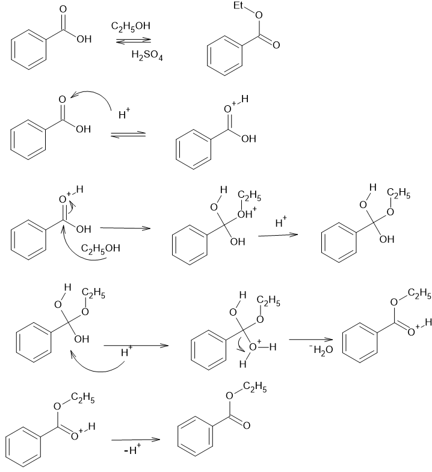{height=100mm}  

Grignard試薬は求核剤であるカルボアニオンを発生させるために用い、ハロゲン化アルキルに\ce{Mg}を反応させて生成する。今回はハロゲン化アルキルとして臭化ベンゼンを用いる。この反応は以下のようなラジカル反応である。  

$$\mathrm{R}-\mathrm{X}+\mathrm{Mg} \longrightarrow \mathrm{R}-\mathrm{X}^{\bullet}+\mathrm{Mg}^{\bullet} $$
$$\mathrm{R}-\mathrm{X}^{\bullet-} \longrightarrow \mathrm{R}^{\bullet}+\mathrm{X}^{-} $$
$$\mathrm{X}^{-}+\mathrm{Mg}^{\bullet+} \longrightarrow \mathrm{XMg}^{\bullet} $$
$$\mathrm{R}^{\bullet}+\mathrm{XMg}^{\bullet} \longrightarrow \mathrm{RMgX}$$

最後にエステルとGrignard試薬の反応は以下の式で表される。式中の[]で囲まれた部分は反応中間体である。Grignard試薬を用いたカルボアニオンの求核反応は2,3級アルコールの合成によく用いられる。特にエステルとの反応では一段階めの反応が終わった時点でケトンが生成する。このケトンはエステルと異なり直接結合している酸素原子がないためカルボニル炭素の求核性がより強くなり、3級アルコールを生成しやすくなる。  

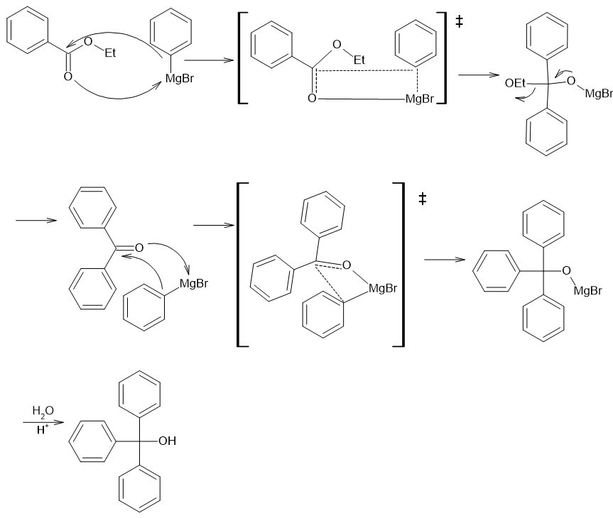
Grignard試薬は、用いるアルキル基を変化させることで複雑なアルコールを生成することができるほか、塩基や還元剤としても働くため工業的に重要な試薬である。しかし、酸素との反応や副反応などが起こりやすく、大量生産が難しい試薬であった。今回の実験では臭化ベンゼンからGrignard試薬を合成し、反応機構や副反応について理解を深め、工業生産における工夫について考察する。  

### 2.実験手順

今回の実験操作の手順を以下のフローチャートに示す。  

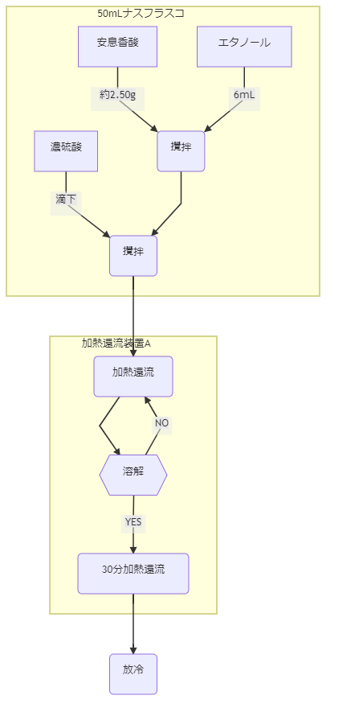{height=150mm}  

1. 予めナスフラスコに約2.50gはかっておいた安息香酸にエタノールを6ｍL加えた。  

2. 濃硫酸1mLを少量ずつ滴下した。このとき溶液が発熱した。

3. 2のナスフラスコに撹拌子を入れ、加熱還流装置に接続した。還流冷却管の上方には三方コックを用いてバルーンを接続し、密閉しつつも内圧が上がりすぎないようにした。

4. オイルバスの温度を120℃に設定し、安息香酸の溶解後30分間、攪拌しながら加熱還流した。反応中、上部に接続したバルーンが膨らんでいたことから、内圧が上昇していたことがわかる。

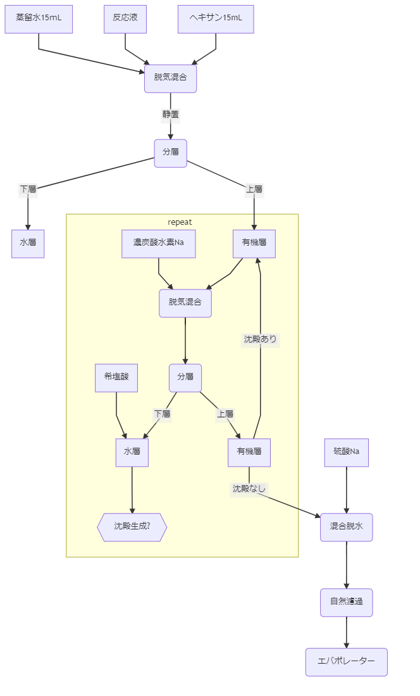{height=150mm}  

1. 反応液を分液漏斗に移し、各15ｍLの蒸留水・ヘキサンで分液操作を行った。このときナスフラスコ中に残った反応液はヘキサンで流しいれた。

2. 分層したのち下層を破棄し、上層に飽和炭酸水素Na水溶液を15ｍL加え、脱気・混合したのち静置して分層させた。水層を三角フラスコ取り出し、希塩酸を加えると白色沈殿が生じた。

3. 水層に沈殿が生じなくなるまで2の操作を繰り返した。その後有機層を三角フラスコに取り、硫酸Naを加えて脱水した。

4. 有機層を自然濾過し、硫酸Naを取り除いた。フラスコ中に残った溶液や固体はヘキサンで洗い、濾過した。ろ液を計量したナス型フラスコに受け、ロータリーエバポレーターで減圧乾燥し、溶媒を留去することで安息香酸エチルを得た。  

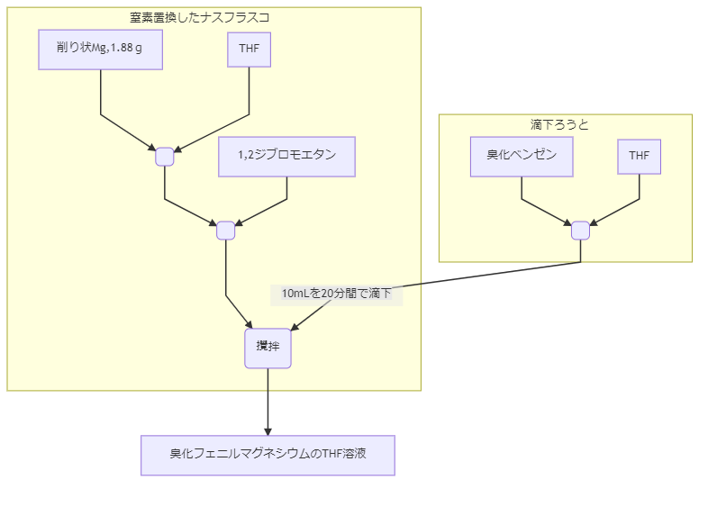{height=150mm}

1. 100mLナスフラスコに削り状のMg,乾燥テトラヒドロフラン(THF)20mL,攪拌子を入れ、セプタム栓、還流冷却管、3方コックを取り付けた加熱還流装置に接続し反応器を窒素置換した。窒素置換は反応器をポンプで減圧したのち窒素を充填したバルーンを接続して行い、以後の反応では常にバルーンを接続することで反応器に空気が入らないようにした。

2. 滴下漏斗に臭化ベンゼンを7.5mL,THFを60ｍL充填し、フラスコ上部に設置した。

2. シリンジを用い、1.2-ジブロモエタン0.02mLを反応器内に加えた。

4. 滴下ろうと内の臭化ベンゼンのTHF溶液を10ｍL反応器に滴下した。この時、フラスコ内が発熱した。また、滴下すると溶液は褐色に変化し、攪拌すると無色に戻った。

5. 滴下後約1分間で液体から気体が発生し、泡立っていた。その後、残りの臭化ベンゼンTHF溶液を少量ずつ滴下した。このとき、溶液はわずかに黒みがかっていた。

6. すべての溶液を滴下して30分経つと溶液は黒褐色に変色していた。この溶液をA液とする。

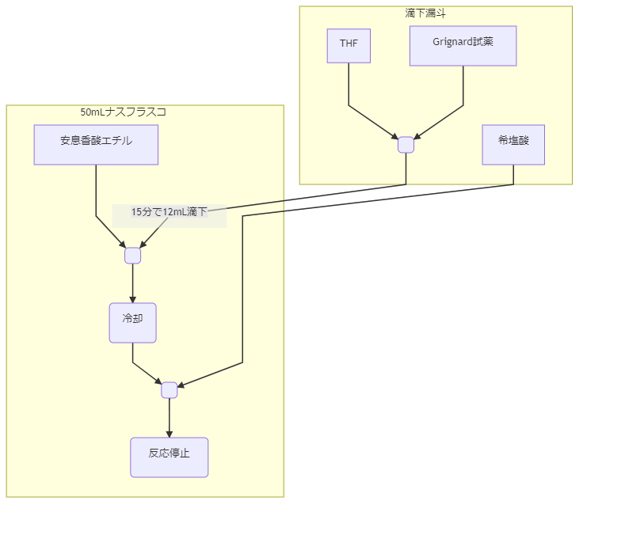{height=150mm}

1. 安息香酸エチルが入った50ｍLナスフラスコに滴下漏斗を接続し、さらに上方に3方コックと窒素を充填したバルーン、ダイヤフラムポンプを接続した。反応器内をポンプで減圧した。

2. ドライヤーで反応器を加熱し、容器内の水分・空気を完全に出した。その後、反応器に窒素を開放した。

3. １,２を3回繰り返し反応器を窒素置換した。その後、ダイヤフラムポンプのあった場所にセプタム栓を取付け、シリンジでフラスコにTHFを入れた。

4. A液12ｍLをシリンジで滴下漏斗に満たした。

5. 10分間かけてA液をフラスコに滴下した。このとき、滴下後すぐに溶液は無色透明から紫色に変化した。

6. 滴下終了後、溶液は灰色に変化していた。

7. 6の状態から1日攪拌をつづけた。1日経ったのち、溶液は灰褐色に変化していた。

8. フラスコを水浴に浸した状態で10mL希塩酸を加え、反応を停止した。このとき溶液から気体が発生した。また、反応停止後の溶液は無色透明であった。

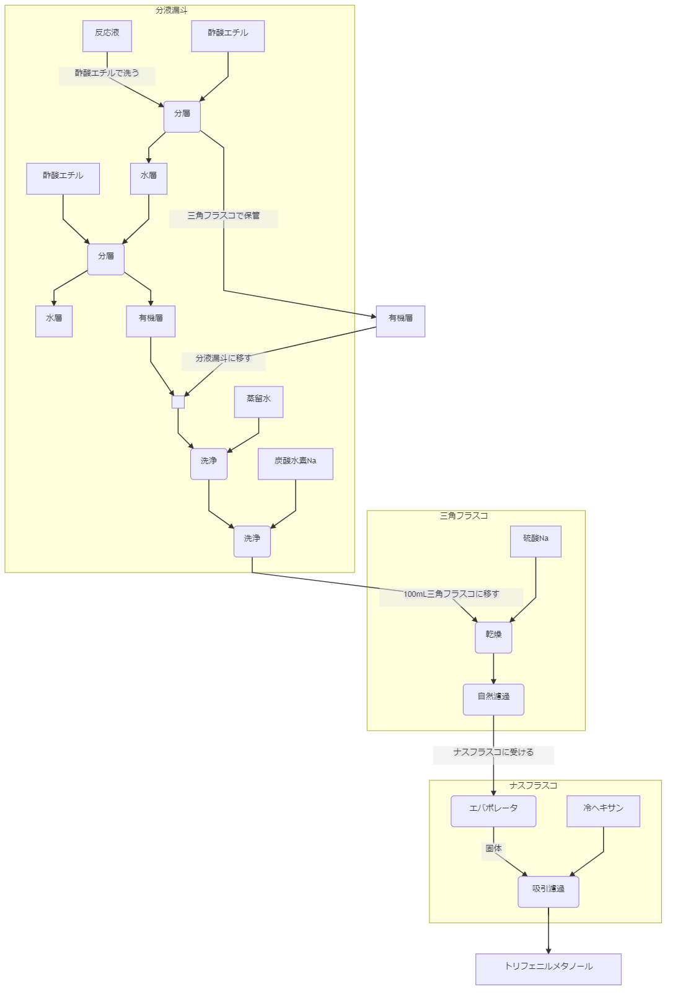{heigt=150mm}

1. 反応溶液を分液漏斗に移した。フラスコは酢酸エチルを用いて洗浄した。15ｍLの酢酸エチルで分液操作を行い、水層を取り除いた。有機層は一度三角フラスコに取り出し、水層を分液漏斗に戻してもう一度少量の酢酸エチルで分液操作を行った。

2. 2回の分液操作で得られた有機層をあわせ、飽和炭酸水素ナトリウム水溶液、蒸留水をそれぞれ15ｍLずつ用いて分液操作をさらに2回行い、有機層を洗浄した。

3. 洗浄した有機層を三角フラスコに移し、無水硫酸Naを10ｇ加えて脱水し、自然濾過して無水硫酸Naを取り除いた。フラスコに残った無水硫酸Naは酢酸エチルで洗浄し、ろ液は50ｍLナスフラスコに受けた。

4. 3のナスフラスコをロータリーエバポレーターにかけて溶媒を留去した。溶媒留去後は白色固体が析出していた。

5. 4の固体を30ｍLの冷やしたヘキサンで溶かし、ブフナー漏斗を用いて吸引濾過した。

### 3.収量と収率  

収率計算には、各原子のモル質量として以下の値を用いた。

| 元素 | モル質量[g/mol] |
|------|-----------------|
| H    | 1.008           |
| C    | 12.01           |
| O    | 16.00           |
| Br   | 79.9            |

#### 3.1 エステル化反応の収率

| 安息香酸の実使用量（g） | 安息香酸エチルの収量（g） | 安息香酸エチルの収率（%） |
|-------------------------|---------------------------|---------------------------|
| 2.50                    | 2.41                      | 78.4                      |

計算式:  

* 安息香酸の分子量:122.118[g/mol]  

* 安息香酸エチルの分子量:150.17[g/mol]  

この反応では安息香酸1分子から安息香酸メチル1分子が得られるため、反応がすべて進行した場合の安息香酸エチルの収量を$X$[g]とすると、

$$X=2.50 \times \cfrac{150.17}{122.118} =3.07[g]$$
収率を$x$[%]とすると、
$$x=\cfrac{2.41}{X}\times100 = 78.5[\%]$$

#### 3.2 Grignard反応の収率

| 安息香酸エチルの実使用量（g) | トリフェニルメタノールの収量（g) | トリフェニルメタノールの収率（%） |
|------------------------------|----------------------------------|-----------------------------------|
| 0.350                        | 0.501                            | 82.5                              |

計算式:  
* 安息香酸エチルの分子量:150.17[g/mol]
* トリフェニルメタノールの分子量:260.318[g/mol]  

この反応では安息香酸メチル1分子に対しトリフェニルメタノールは1分子生成する。反応がすべて進行した場合の安息香酸エチルの収量を$X$[g]とすると、

$$X=0.350 \times \cfrac{260.318}{150.17} =0.607[g]$$
収率を$x$[%]とすると、
$$x=\cfrac{0.501}{X}\times100 = 82.5[\%]$$

### 4.NMRスペクトルの帰属
| 1H NMR ピーク | ppm  | 積分比 | 分裂 | 帰属           |
|---------------|------|--------|------|----------------|
| a             | 1.4  | 3      | 3    | $\mathrm{H_A}$ |
| b             | 4.4  | 2      | 4    | $\mathrm{H_B}$ |
| c             | 7.45 | 2      | -    | $\mathrm{H_D}$ |
| d             | 7.55 | 1      | -    | $\mathrm{H_E}$ |
| e             | 8.05 | 2      | -    | $\mathrm{H_C}$ |

理由:  

* a:積分比が3であることから等価なプロトンは3個あり、かつトリプレットであることからこのプロトンが結合している炭素の隣の炭素には2つのプロトンが結合していることがわかるため。  

* b:aと同様。また、エステル結合による化学シフトでピークがaよりも高磁場になっていると考えられるため。  

* c:ベンゼンのプロトンのピークが7.3ppm付近であることから、c,d,eのピークはベンゼン環に結合しているプロトンのものだと考える。積分比より等価なプロトンが2つあることがわかるためこのピークは$\mathrm{H_C}$か$\mathrm{H_D}$にあたる。また、エステル結合は電子供与基であるためピークはベンゼンのものと比較して高磁場側にシフトし、この影響は$o-$位のほうが大きい。ゆえにこのピークは$m-$位のものであるとわかり、$\mathrm{H_D}$と決定した。  

* d:c同様ベンゼン環に結合しているプロトンであり、積分比より等価なプロトンは一つしかないことがわかるため$\mathrm{H_E}$と決定した。  

* e:cと異なり、ベンゼンのピークからのシフトが大きいことからエステル結合の影響をより強く受けていることがわかるため、$\mathrm{H_C}$と決定した。

### ５.TLCのRf値
| スポット                           | b    | Rf値 |
|------------------------------------|------|------|
| A　安息香酸エチル                  | 2.60 | 0.76 |
| B　トリフェニルメタノール（純物質) | 2.10 | 0.62 |
| C　生成物                          | 2.10 | 0.62 |
| D　ろ液                            | 1.70 | 0.5  |
|                                    | 2.10 | 0.62 |
|                                    | 2.80 | 0.82 |

C(生成物)のスポットとB(純トリフェニルメタノール)のスポットで$R_f$値が一致したことから、高純度のトリフェニルメタノールが分離できたことがわかる。また、ろ液中にも同位置のスポットがみられたことから、濾過にもちいたヘキサンにトリフェニルメタノールが溶解していることがわかる。他のろ液のスポットに関しては7節で後述する。

### 6.考察

* 安息香酸メチル精製時、水層に希塩酸を投入すると溶液が白濁した。これは未反応の安息香酸が強酸により遊離したものであると考える。これにより有機層に安息香酸が残っているかどうか判別することができる。

* Grignard試薬合成の際、発熱を押さえるために少量ずつ臭化ベンゼンを滴下したが、これはウルツカップリングと呼ばれる臭化ベンゼン同士の反応を押さえる意味もある。ウルツカップリングは以下の反応式で表され、Mgは触媒として働く。  

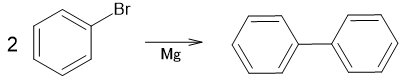

* トリフェニルメタノール精製の最後にヘキサンを用いて濾過した。このとき冷やしたヘキサンを使うのは目的生成物がヘキサンに溶解し、収率が下がるのを防ぐために溶解度を下げるためであると考える。

### 7.設問の回答

1. 1節参照

2. 同上

3. 臭化ベンゼンの分子量：157[g/mol]  
Grignard試薬にもちいた臭化ベンゼンは7.5[mL],臭化ベンゼンの密度は1.5[g/mL]である。滴下漏斗中の臭化ベンゼンを$X$[mol]とすると、

$$X=\cfrac{7.5\mathrm{[mL]}\times 1.5\mathrm{[g/mL]}}{157\mathrm{[g/mol]}}=0.0717\mathrm{[mol]}$$

この臭化ベンゼンがすべてGrignard試薬に変化し、全体の体積はTHF20[ｍL]に対し67.5[ｍL]滴下したと考えて87.5[mL]であり、ここに含まれるGrignard試薬は$X$[mol]である。このうち12[ｍL]をエステルとの反応に用いたため、エステルとの反応にもちいたGrignard試薬を$Y$[mol]とすると

$$Y=X\times \cfrac{12\mathrm{[mL]}}{87.5\mathrm{[mL]}}=0.00983\mathrm{[mol]}$$

安息香酸エチルの使用量は3.2節よ0.35[g],分子量は150.17[g/mol]より使用量を$W$[mol]とすれば

$$W=\cfrac{0.350\mathrm{[g]}}{150.17\mathrm{[g/mol]}}=0.00233\mathrm{[mol]}$$

以上から、Grignard試薬は安息香酸メチルに対し、

$$\cfrac{Y}{W}=\cfrac{0.00983\mathrm{[mol]}}{0.00233\mathrm{[mol]}}=4.22$$

と、4.22[mol]当量使用したことがわかる。  

4. Grignard試薬は強塩基性かつカルボアニオンを発するため、水からプロトンを引き抜き炭化水素となってしまう。またエーテルは酸素の孤立電子対により配位性を示し、Mgと配位することで生成したGrignard試薬を安定化する。したがってGrignard試薬の合成は乾燥させたエーテルを用いる。また、テトラヒドロフランは酸素の孤立電子対が立体障害を受けにくいため、ジエチルエーテルなど他のエーテルと比較してMgへの配位がおこりやすいという特徴がある。  
また、Mgの表面には通常酸化被膜があり、ジブロモエタンはこの酸化被膜を溶解することで活性化剤として働く。  

5.  
  * (a) 二酸化炭素  

  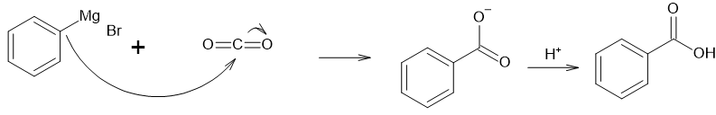

  * (b) スチレンオキシド  

  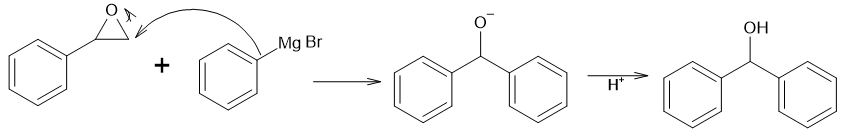

  * (c)ベンゾニトリル

  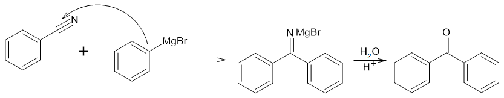

6. TLCにおいては極性の高い物質ほどシリカゲルと強く相互作用し、$R_f$値が小さくなると考えられる。また、Grignard試薬は塩基としても働くため、精製したトリフェニルメタノールと反応し、テトラフェニルメタンを生成する可能性がある。また、安息香酸エチルから脱離したエタノールも生成している可能性がある。以上の副生成物のうち、エタノールは極性が大きいため$R_f=0.5$のスポット、テトラフェニルメタンは無極性より$R_f=0.82$のスポットであると考える。

### 8.参考文献

* ボルハルト・ショア―現代有機化学(上)第６版　訳：村橋俊一　発行：（株）東京化学同人　発行年月日：2012/9/30  

* ボルハルト・ショア―現代有機化学(下)第６版　訳：村橋俊一　発行：（株）東京化学同人　発行年月日：2016/9/20  

* グリニャール反応の応用 著者：梅野正行・浜田三夫 　有機合成化学第 38 巻第 12 号 (1980)  

* グリニャール反応 Grignard Reaction | Chem-Station (ケムステ)  
https://www.chem-station.com/odos/2009/06/grignard-grignard-reaction.html  
閲覧日：2020/7/13  

* ウルツ反応 Wurtz Reaction | Chem-Station (ケムステ)  
https://www.chem-station.com/odos/2009/07/wurtz-wurtz-reaction.html  
閲覧日：2020/7/13  

* NMRの基礎知識【原理編】 | Chem-Station (ケムステ)  
https://www.chem-station.com/blog/2018/01/nmr.html  
閲覧日：2020/7/13

