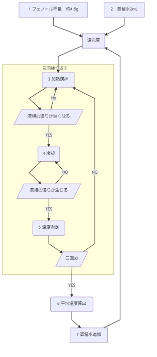
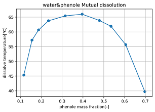
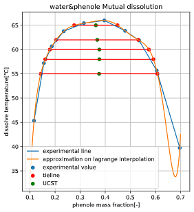
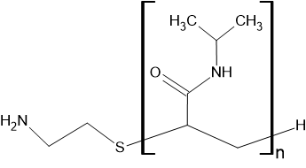

## 1 　緒言

今回の実験ではフェノール・水二成分系の相互溶解を
取り扱う。相互溶解とは、二成分系においてある温度では成分が相互に溶解せずに二相を形成する・二相に分かれる温度が組成に依存する、という現象である。温度依存に関しては、高温ほど相互溶解しやすく、ある一定温度以上ではどんな組成でも一相となる系・低温ほど溶解しやすく、ある一定温度以下では必ず一相となる系が存在し、水-フェノール系は前者にあたる。また、二相と一相の境界となる温度を前者の系では上部臨界可溶温度(UCST)、後者の系では下部臨界可溶温度(LCST)という。相互溶解においては組成・温度・系の状態(二相か一相か)を同時に記述するため、線図がよく用いられる。今回の実験では溶解温度の測定から線図を作成し、相互溶解について理解する。

##　 2 　実験方法

### 2.1 　実験器具

-   スタンド
-   クランプ
-   遠沈管(50mL)
-   温度計
-   シリコーンゴム栓
-   スターラー
-   スターラーチップ
-   駒込ピペット(2，5 ｍ L)
-   ピペットスタンド
-   ホットプレート
-   ステンバット
-   洗ビン

### 2.2 試薬

-   蒸留水
-   フェノール

### 2.3 実験方法

実験方法を以下のフローチャートに示す。今回は同じ実験を 10 通りの組成で行った。

1. フェノールを遠沈管に約 4.5g 秤量した。今回は 4.5888g のフェノールを用いた。また、この時遠沈管にスターラーチップを入れた。

1. 1 の遠沈管に、初回の組成となる 2 ｍ L の蒸留水を駒込ピペットで加え、温度計つきのゴム栓で蓋をした。

1. 2 の遠沈管を濁りが無くなるまで加熱攪拌した。

1. 濁りが無くなった時点から冷却を開始した。

1. 放冷中に再び濁りが生じた温度を測定した。

1. 3~5 を 3 回繰り返し、得られた三通りの温度の平均値をこの組成での溶解温度とした。

1. 三回目の測定が終わったのち、次の総容量となるように蒸留水を
   追加し、再び 3~5 の操作を行った。

1. 7 を合計 10 通りの組成で繰り返した。

総容量・追加量・質量分率の関係は以下の通りである。
フェノールの使用量は先述したとおり 4.5888[g]、水の密度は常温(25℃)での 0.997[g/mL]を用いた。

| 総容量[mL] | 追加量[mL] | 質量分率[-] |
|------------|------------|-------------|
| 2          | 1          | 0.697       |
| 3          | 1          | 0.605       |
| 4          | 1          | 0.535       |
| 5          | 2          | 0.479       |
| 7          | 3          | 0.396       |
| 10         | 5          | 0.315       |
| 15         | 5          | 0.235       |
| 20         | 5          | 0.187       |
| 25         | 10         | 0.155       |
| 35         | -          | 0.116       |

# 3.結果

各組成について溶解温度の平均をとり、表に記載したものを以下の表に、実験データに基づき作成した相互溶解線図を以下の図 2 に示す。  
線図から、上部臨界可溶温度は約 66.0℃ と読み取ることができる。  

| 溶解温度 |   組成 |
|---------:|-------:|
|    39.75 | 0.6969 |
|    55.67 | 0.6052 |
|    61.90 | 0.5348 |
|    63.87 | 0.4791 |
|    66.00 | 0.3964 |
|    65.43 | 0.3150 |
|    63.77 | 0.2346 |
|    60.67 | 0.1869 |
|    57.20 | 0.1553 |
|    45.33 | 0.1161 |

# 4.考察

各融解温度における組成を数値的に算出するため、この線図をラグランジュ補間を用いて11次関数で近似し、11次方程式の解として各温度の組成を求め、平均することで予想されるUCST組成を求めた。また、各温度の低フェノール組成・高フェノール組成・中点を上記のグラフにプロットしたものを以下の図に示した。ラグランジュ補間において、端点付近は実測値は通るものの大きく外れた関数となるため、UCST組成を求めるために選定した温度は55℃～65℃の範囲とした。  
各温度から求めた平均値から、UCST組成は約0.36~0.378の範囲にあることが予想される。この仮説は、文献値と比較しても差が小さいことから妥当であると言える。  

| 温度[℃] | 低フェノール 組成[-] | 高フェノール 組成[-] | 予想される UCST組成[-] |
|--------:|------------------------:|------------------------:|--------------------------:|
|      55 |                   0.143 |                   0.608 |                    0.3755 |
|      58 |                   0.161 |                   0.592 |                    0.3765 |
|      60 |                   0.179 |                   0.574 |                    0.3765 |
|      62 |                   0.204 |                   0.532 |                    0.3680 |
|      65 |                   0.276 |                   0.449 |                    0.3625 |
|  文献値 |                       - |                       - |                     0.366 |
  

# 5.課題

1. 3節参照
2. 3節参照
3. 4節参照
4. 線図よりフェノールに富む相の組成$x_r$,水に富む相の組成$x_p$をそれぞれ読み取ると、

$$x_r=0.60\\x_p=0.13$$

となる。100[g]のうちフェノールは25[wt%]であるため、各相の質量を$M_r,M_p$[g]とおくと

$$M_r\cdot x_r + M_p\cdot x_p = 25[g]$$
$$M_p = (100-M_r)$$

より、$M_r=25.5[g]$と求めることができる。

5. ポリN-イソプロピルアクリルアミドの構造式は以下の通りである。  

  

側鎖はNやOなどの電気陰性度の高い原子を持ち、水素結合や静電的相互作用などを受けやすい。低温ではそれらが支配的となり、水和しやすく一相となる。高温では水分子との相互作用に比べ、側鎖のイソプロピル基同士の疎水性相互作用が強く働き、ポリNイソプロピルアクリルアミドどうしで集合するようになり、二相を形成するようになる。これが微小凝集相である。

# 6.参考文献

