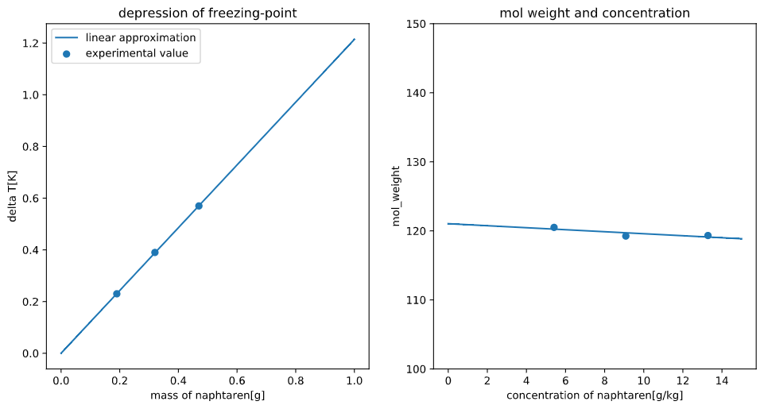

## 1.緒言

希薄溶液において、$W$[kg]の溶媒に溶質を$n$[mol]溶かすと質量モル濃度に比例して凝固点が$\Delta T$[K]下がる。この現象を凝固点降下といい、以下の式で表される。このとき、$K_f$は溶質に固有の比例定数であり、単位は[K・kg/mol]である。

$$\Delta T=K_f\cfrac{n}{W}~~~~~(1)$$

溶質のモル質量を$M$[g/mol],質量を$w$[g],質量濃度を$c$[g/kg]とすると以下の式で凝固点降下からモル質量を求めることができる。今回はこの関係を用いてナフタレンのモル質量を決定する。

$$M=\cfrac{K_fw}{W \Delta T}=\cfrac{K_f}{\Delta T}\cdot c~~~~~(2)$$

##　 2.原理

### 2.1 凝固点降下の発生原理

凝固点降下は、熱力学的に以下のように説明できる。まず、溶媒 A,溶質 B について化学ポテンシャルを考える。

$$\mu_A = \mu_A^* + RT ln x_A~~~~~(3)$$
$$\mu_B = \mu_B^{\circ} + RT ln x_B~~~~~(4)$$

このとき、理想希薄溶液を仮定しているため活量を組成で近似している。また、$\mu_A^*,\mu_B^{\circ}$はそれぞれの純成分の化学ポテンシャルである。圧力一定において、純成分 A の融点を$T$とすると、(3)より(5)が導ける。

$$lnx_a=\cfrac{\mu_A-\mu_A^*}{RT}~~~~~(5)$$

両辺を$T$で微分すると、

$$\cfrac{d lnx_A}{dT}=-\cfrac{\mu_A-\mu_A^*}{RT^2}~~~~~(6)$$

(6)にギブス-ヘルムホルツの式を当てはめ、(7)を得る。

$$\cfrac{\partial lnx_A}{\partial T}=-\cfrac{H_A^{(l)}-H_A^{(s)}}{RT^2}=-\cfrac{\Delta H_{disolve}}{RT^2}~~~~~(7)$$

ここで$H_A^{(l)},H_A^{(s)}$は液体・固体それぞれの状態の成分 A のエンタルピーである。式(7)を変形し、$x_A \sim 1$,$T_m \sim T$で積分する。この時、$T_m$は純 A 成分の融点である。

$$\int_{1}^{x_A}dlnx_a=\int_{T_m}^{T}-\cfrac{\Delta H}{RT^2} dT~~~~~(8)$$

$$lnx_a = -\cfrac{\Delta H}{R}\left(\cfrac{1}{T_m}-\cfrac{1}{T}\right) = -\cfrac{\Delta H(T-T_m)}{RT\cdot T_m}~~~~~(9)$$

凝固点降下$\Delta T=T_m-T$,分母において$T_m \simeq T$と近似する。また、$x_A+x_B=1,x_A\gg x_B$より、

$$lnx_A=ln(1-x_B) \simeq -x_B~~~~~(10)$$

したがって

$$x_B=\cfrac{\Delta H \Delta T}{RT_m^2}~~~~~(11)$$

$x_B$は B 成分のモル分率であるため、

$$x_B = \cfrac{w}{W\cdot M}~~~~~(12)$$

よって、

$$\Delta T=\cfrac{RT_m^2}{\Delta H}\cdot \cfrac{w}{W \cdot M}=K_f\cfrac{n}{M}~~~~~(13)$$

が導出できる。

## 3 実験方法

### 3.1 試薬

-   ナフタレン　 0.1 ～ 0.2g 　三包
-   ベンゼン　 40mL

###　 3.2 　実験器具

-   上皿天秤
-   メスシリンダー
-   温度計
-   ベックマン温度計
-   100mL 試験管
-   試験管(大)
-   共栓つき三角フラスコ(50 ｍ L)
-   攪拌棒

### 3.3 実験方法

1. ベンゼンをメスシリンダーで 40mL はかり、三角フラスコに入れた。このとき、ベンゼンを入れる前後でフラスコの質量を測定し、差をベンゼンの質量とした。

1. ナフタレンを 0.1~0.2g 秤量し、薬包紙に包んだものを三包作った。各重量を以下に示す。

| A       | B       | C       |
|---------|---------|---------|
| 0.19[g] | 0.13[g] | 0.15[g] |

3. ベックマン温度計を調整した。
4. 純ベンゼンについて、攪拌しながら氷で冷却した。また、30 秒毎にベックマン温度計の目盛りを読み、3 回連続で同じ値が計測されたときの温度を凝固点とした。さらに、時間短縮のため、最初は試験管を直接氷に入れて冷却したがある程度まで温度が下がってからは試験管を二重にして空気層を作り、冷却の速度を遅くした。
5. B のナフタレンを試験管に加え、4 と同様の計測を行った。その後、A→C の順にナフタレンを加え、同様の計測を行った。

## 4.結果

四種類のナフタレン量について、それぞれ凝固点降下を測定した。結果を以下の表に示す。  
また、各凝固点降下について(2)式で分子量を求めたものも以下の表に示す

| ナフタレン 質量$w$[g] | ナフタレン 質量濃度$c$[g/kg] | 凝固点降下 $\Delta T$[K] | モル質量 $M$[g/mol] |
|--------------------------:|---------------------------------:|-----------------------------:|------------------------:|
|                      0.13 |                            3.710 |                         0.23 |                  120.50 |
|                      0.32 |                            9.083 |                         0.39 |                  119.25 |
|                      0.47 |                            13.28 |                         0.57 |                  119.33 |

(ベンゼン使用量$W$=34.91[g],$K_f=5.12$[K・kg/mol])
また、上記の結果から二つのグラフを作成した。  

左はナフタレン質量に対し凝固点降下をプロットし、原点を通る直線で線形近似したものである。近似直線の傾きは 1.242 であり、これは(2)式を変形した以下の(14)式の左辺にあたる。

$$\cfrac{\Delta T}{w}=\cfrac{K_f}{MW}~~~~~(14)$$

右辺の$W$は既知であることから(14)からナフタレンのモル質量を算出すると、$M=118.06$となる。  
右のグラフは各凝固点降下と質量濃度からそれぞれモル質量を算出し、濃度に対してプロットしたものであり、この直線の y 切片がモル質量に当たる。(2)式より、この値は濃度によらず一定値になると推測でき、実際の傾きは-0.15 となった。  
以上から、それぞれの方法で算出したナフタレン分子量を以下の表にしめす。

| $w-\Delta T$プロット | $c-M$プロット | 文献値 |
|----------------------|---------------|--------|
| 118.06               | 121.04        | 128.17 |

## 5.考察

今回の実験では 4 で示した表の通り、すべての方法で文献値よりも小さい分子量が得られた。また、c-M プロットにおいて、濃度が大きくなるほど小さい分子量となり、近似曲線の傾きは負となった。これは、凝固点降下が質量モル濃度に比例するのは理想希薄溶液に限った現象であり、濃度が大きくなるにつれて非理想性が大きくなっていることが原因であると考えられる。

## 6.課題

1. 4 参照
1. (1),(2)式が成立する、つまり溶液が理想希薄溶液であり、凝固点降下度とモル濃度は比例するという前提のもとに分子量を算出している。$w-\Delta T$プロットは(1)式に基づいており、質量濃度と凝固点降下の比例定数に溶質の分子量が含まれることを利用している。$c-M$プロットにおいてはそれぞれの濃度において分子量を求めているため、仮にすべての濃度で正確な分子量が算出できればグラフの傾きは 0 となる。しかし、5 で述べたように濃度が大きくなれば非理想性も大きくなることから、y 切片を分子量として採用している。
1. 2.1 参照
1. ベンゼン 16.22g に安息香酸 0.237g を溶解した溶液の質量濃度[g/kg]

$$\cfrac{0.237[g]}{16.22[g]}=14.6[g/kg]$$

$K_f=5.12[K\cdot kg/mol]$,より、$\Delta T$と合わせて(2)式に代入すると分子量は

$$M=235.07[g/mol]$$

となる。これは安息香酸($C_7H_6O_2$)の分子量 122.12[g/mol]のほぼ二倍であることから、安息香酸の大部分はベンゼン中で二量体を形成していると考えられる。

5. デュマ法においては、気体の状態方程式

$$PV = nRT$$

を用いて、昇華しやすい物質の分子量を測定する。  
小さい穴をあけた蓋をして大気開放したフラスコ(体積$V[m^3]$,乾燥質量$w_1[g]$)に適当量の試料$W[g]$を入れ、沸点以上の一定温度$T[K]$に保ち、試料を完全に昇華させる。大気開放しているためフラスコ内圧は大気圧$P_0[Pa]$に等しく、過剰な試料はフラスコの孔から大気に噴出する。噴出が終わった時点でフラスコ内では気液平衡となっており、体積$V[m^3]$,圧力$P_0[Pa]$,温度$T[K]$の気体で満たされている。その後、試料が凝縮するまで放冷すると、内圧の低下によりフラスコ内に空気が戻り、質量$w_2[g]$となる。以上の値を用い、

$$P_0 V = \cfrac{(w_2-w_1)RT}{M}$$

として分子量$M[g/mol]$を算出することができる。

6. 
   * 熱電対法
   異なる金属を接合し、両端に温度差を与えると接合点付近に温度差に応じた電圧が発生する。これをゼーベック効果といい、熱電対法においてはこの電圧を測定することで温度を測定する。熱電対の測定温度は素材によって異なる。一般に白金など貴金属においては広範囲の温度測定が可能であるが、高価なため必要とされる温度範囲に適した素材を選定する必要がある。

   * 測温抵抗体
   電気抵抗の温度依存性を利用した温度の測定法である。白金やニッケル・銅などの金属や半導体は高温ほど電気抵抗が大きい。電気抵抗は定電流下での電圧の変化として測定できるため、測温抵抗体はこの性質を利用して温度を測定する。抵抗体に電流を流す導線抵抗を知っておく必要がある。