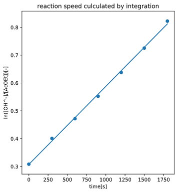

##　 1．緒言

今回の実験では、エステルの加水分解反応を例に反応速度解析を行う。反応速度は濃度の時間で、各成分の濃度・反応速度定数から式(1)のように表される。

$$A + B \longrightarrow Pにおいて\\ -\cfrac{d[A]}{dt}=k[A]^p[B]^q~~~~~(1)$$

このとき、各濃度の指数$p,q$,また全体の反応次数$p+q$は化学量論数に関係なく反応によって異なるが、今回は$p=q=1$の一次反応を仮定する。  
酢酸エチルのアルカリ加水分解は以下の化学反応式で表される。

この式から反応速度式を$p=q=1$の仮定の下立式すると、

$$-\cfrac{d[AcOEt]}{dt}=k[AcOEt][OH^-]~~~~~(2)$$

という二次反応となる。各成分における物質収支は初濃度を下付き文字 0 で表すと

$$[AcOEt] = [AcOEt]_0 - [AcO^-]~~~~~(3)$$
$$ [OH^-]=[OH^-]_0 - [AcO^-]~~~~~(4)$$

と書くことができる。これを(2)式に代入して、

$$\cfrac{d[AcO^-]}{dt} = k\left([OH^-]_0 - [AcOEt]_0\right)t + ln\cfrac{[OH^-]_0}{[AcOEt]_0}~~~~~(5)$$

という式を得る。この式の左辺を時間に対してプロットし、反応速度係数 k を求める。

## 2.方法

### 2.1 実験器具

《NaOH 調整》

-   ビーカー(50mL)
-   メスフラスコ(500mL)

《加水分解反応》

-   共栓付き三角フラスコ(500mL)
-   駒込ピペット
-   ホールピペット(20mL)
-   メスフラスコ(250mL)
-   ストップウォッチ
-   スターラー
-   磁気撹拌子
-   恒温槽
-   メスシリンダー(250mL)
-   加熱還流装置
    -   マントルヒーター
    -   リービッヒ冷却器
    -   平底フラスコ(500mL)

《滴定》

-   ホールピペット(10mL,25mL,50mL)
-   コニカルビーカー(100mL,8 個)
-   ビュレット(50mL)

《その他》

-   ピペットスタンド
-   安全ピペッター
-   漏斗
-   クランプ
-   スタンド
-   水浴

### 2.2 試薬

-   水酸化ナトリウム(2.0685g)
-   塩酸(0.1M,300mL 程)
-   酢酸エチル(0.4mL)
-   フェノールフタレインのエタノール溶液(0.1%)

###　 2.3 　実験方法

実験方法について以下のフローチャートに示す。また、今回の実験は NaOH 調整・標定、加水分解反応・反応液の滴定の 2 つに分かれているため、それぞれについて示す。

#### 2.3.1 NaOH 調整・標定

1. 50mL ビーカーに NaOH を約 2g 秤量した。今回は 2.0685g 使用した。これを少量の蒸留水で溶解させた。

1. 溶液を 250mL メスフラスコに移し、蒸留水で定容・攪拌した。

1. 定容した NaOH 水溶液のうち 60mL を 250mL メスフラスコにうつし、定容した。これを反応用とした。残りの溶液は標定用にビュレットに移した。

1. 反応用の NaOH 水溶液はメスフラスコのまま 30 分間 25℃ の恒温槽に浸した。

1. 0.1M の HCl 水溶液を 10mL,100mL のコニカルビーカーに移してフェノールフタレイン溶液を 2，3 滴加えた。これを被滴定液とした。

1. 5 の HCl 溶液に 3 の NaOH 溶液を、溶液に薄赤色の呈色がみられるまで滴下した。
   滴定は四回行い、平均値を滴定に要した NaOH 溶液の体積とした。

#### 2.3.3 加水分解反応

1. 酢酸エチル 0.4mL を 500mL 共栓付き三角フラスコに移し、250mL の蒸留水を加えて攪拌・溶解した。溶解したのちの溶液を 25℃ の恒温槽に 30 分間浸した。

1. 逆滴定に用いるため、0.1M の HCl 溶液を 25mL ずつ 8 個のコニカルビーカーに移した。

1. 酢酸エチルの入ったフラスコに 2.3.3-4 の NaOH 溶液を一度に加え、この時点を反応開始とした。反応開始後すぐに反応液 50mL を 2 のコニカルビーカーに注入し、フェノールフタレイン溶液を加えたのち 0.1M の HCl 溶液で滴定した。  
   また、反応液を 100mL 平底フラスコに移した。

1. 以後、300 秒おきに反応液を別のコニカルビーカーに移し、同様に滴定を行った。

1. 平底フラスコに移した反応液はリービッヒ冷却器・マントルヒーターを用いた加熱還流装置で 45 分間加熱還流を行い、放冷したのちに 3 同様の滴定を行った。この時の反応液を$t=\infty$とした。

## 3.結果

各反応時間において、滴定に要した NaOH 体積[mL]・余剰 HCl 物質量($\times10^{-3}$[mol]),反応溶液の各化学種の濃度($\times10^{-3}$[M]),$ln\frac{[OH^-]}{[AcOEt]}$について以下の表に示す。

| 反応時間 | NaOH 体積 | 余剰 HCl | $[OH^-]$ | $[AcO^-]$ | $[AcOEt]$ | $ln\frac{[OH^-]}{[AcOEt]}$ |
|---------:|----------:|---------:|---------:|----------:|----------:|---------------------------:|
|        0 |     21.90 |     1.99 |     10.2 |     0.725 |      7.46 |                      0.308 |
|      300 |     23.00 |     2.09 |     8.16 |      2.72 |      5.46 |                      0.401 |
|      600 |     23.55 |     2.14 |     7.16 |      3.72 |      4.47 |                      0.472 |
|      900 |     24.00 |     2.18 |     6.35 |      4.53 |      3.65 |                      0.553 |
|     1200 |     24.35 |     2.21 |     5.71 |      5.17 |      3.02 |                      0.638 |
|     1500 |     24.62 |     2.24 |     5.22 |      5.66 |      2.53 |                      0.725 |
|     1800 |     24.85 |     2.26 |     4.80 |      6.07 |      2.11 |                      0.822 |
| $\infty$ |     25.73 |     2.34 |     3.21 |      7.67 |     0.515 |                         -- |

また、時間に対し$[OH^-]$,$[AcOEt]$濃度をプロットしたグラフを図 2、$ln\frac{[OH^-]}{[AcOEt]}$をプロットしたグラフを図 3 に示す。

  

二つ目のグラフは最小二乗法により線形近似した回帰線を記入した。回帰線は以下の式で表される直線である。

$$y=2.807 \times 10^{-4}x + 0.3072~~~~(6)$$

(5)式と照らしあわせると、

$$k\left([OH^-]_0 - [AcOEt]_0\right)=2.807 \times 10^{-4}~~~~(7)$$

であると言える。$OH^-$,$AcOEt$初濃度の差は

$$[OH^-]_0 - [AcOEt]_0= 0.0027 [M]~~~~(8)$$

より、反応速度定数 k は

$$k=0.104~~~~(9)$$

と求めることができた。

## 4. 考察

図 4 の$[OH^-],[AcOEt]$の時間に対するプロットが二つの化学種において初濃度を除きほぼ同じ経過をたどること、図 5 のグラフが直線で近似できることより(5)が成立していると言えることからこの反応は p=q=1 の二次反応であると言える。また、塩基性触媒条件のエステル加水分解では求核剤となる塩基($OH^-$)は直接カルボニル炭素を攻撃し、$EtO^-$は脱離しやすいため塩基の求核攻撃が律速となる。ゆえに求核剤である$[OH^-]$,求電子剤である$[AcOEt]$についてそれぞれ一次、全体では二次反応となるという推定は妥当である。

## 5.課題

1. 3 節参照
1. 同上
1. 4 節参照
1. 反応速度定数は以下のアレニウスの式と呼ばれる温度の関数で表される。

$$k=Aexp\left(-\cfrac{E_a}{RT}\right)~~~~(10)$$

ここで$A,R,E_a$は定数であることから、高温では反応速度定数が大きくなり、短時間の反応で$T=\infty$に相当する反応率が得られる。

5. (2),(3),(4)の式に基づき、$[OH^-]_0>>[AcOEt]_0$の条件下で反応速度式を解く。上記の仮定より、$[OH^-]=const$、つまり疑一次過程と近似することができるため、

$$-\cfrac{d[AcOEt]}{dt}=k'[AcOEt]~~~~(11)$$

ここで$k'$は反応速度定数を$[OH^-]_0$で補正したものであり、

$$k' = k \cdot [OH^-]_0~~~~~(12)$$

といえる。移項して定数項を考えずに積分すると、

$$\int -\cfrac{1}{[AcOEt]}d[AcOEt]=\int k' dt~~~~~~(13)$$

$$ln \cfrac{[AcOEt]}{[AcOEt]_0} = -k't~~~~~(14)$$

$$\cfrac{[AcOEt]}{[AcOEt]_0}=e^{-k't}~~~~~(15)$$

$$[AcOEt] = [AcOEt]_0\cdot e^{-k't}~~~~~~(16)$$

のように算出できる。

6. $[OH^-]_0$>>$[AcOEt]_0$より、5で用いた仮定に合致するため式(15)を使用する。  
(13)より

$$k'=0.10[M]\cdot 0.20[M^{-1}s^{-1}]=0.02 [s^{-1}]$$

よって、(15)に代入すると

$$\cfrac{1}{2}=e^{-0.02\cdot t}$$

両辺の対数を取ると

$$-0.693 = -0.02 \cdot t$$

$$t = 34.65[s]$$

となる。

# 参考文献(1.6,1.7,1.8共通)

* http://edu.chemistry.or.jp/teibanjikken/shigh/fp/fp.htm
定番！化学実験　凝固点降下の測定

* 分析化学データの統計処理法 分析化学/21 巻 (1972) 1 号 小島 次雄

* (2013)13 山口大学工学部研究報告2成分系混合物の液液平衡に関する熱力学 小渕茂寿（理工学研究科環境共生系専攻）ほか

* 凝固点降下の実験  化学と教育 57巻12号(2009 年）酒井秀樹

* 高分子論文集66巻8号(2009)  ポリN-イソプロピルアクリルアミドの分子構造と水溶液挙動　長　昌史

* 化繊講演集第 66 集 ポリ（N-イソプロピルアクリルアミド）の分子構造と相挙動
吉﨑 武尚・長 昌史

* アトキンス物理化学(上)第10版　2017/3/10　(訳)中野元祐　東京化学同人発行

