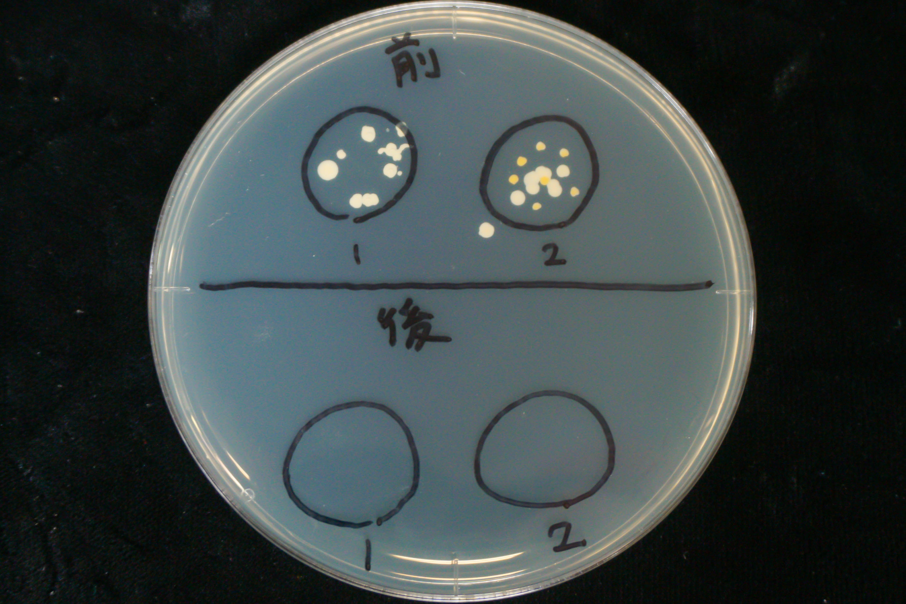
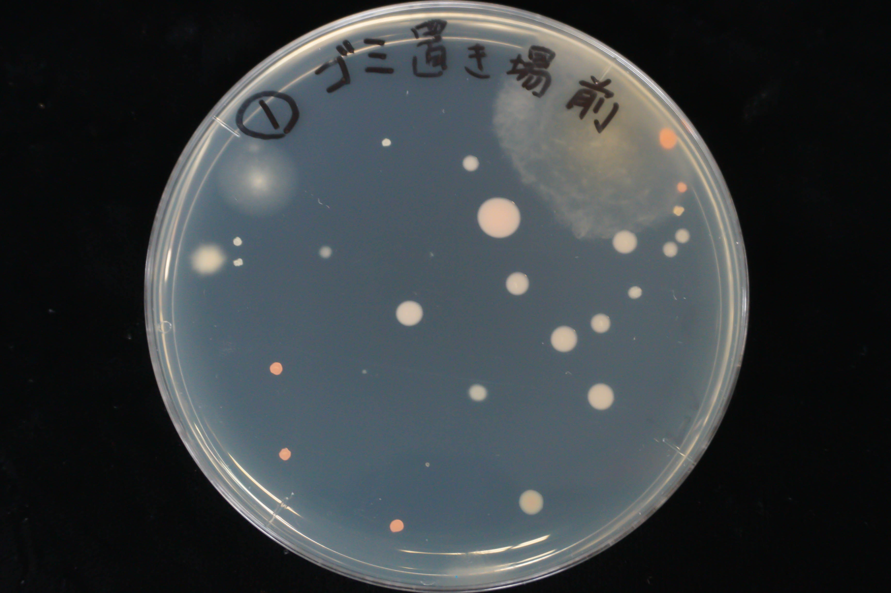
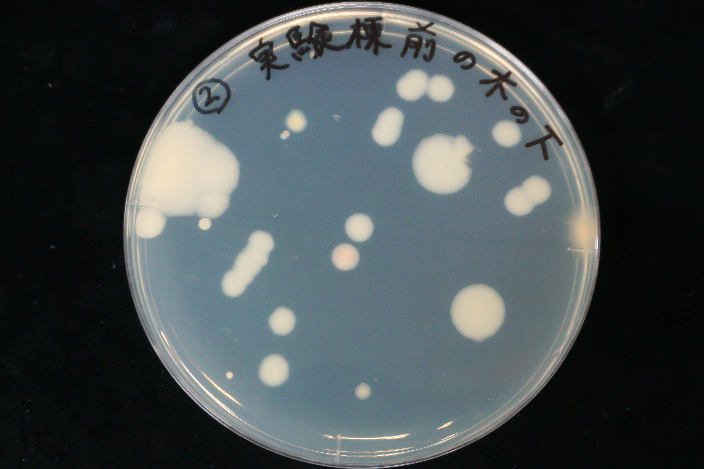

## 1．実験の目的

　今回のような生物系実験では、病原性を持ちうる細菌類を取り扱うことがあり、また手や空気中に常在している細菌類が実験に大きく影響する(コンタミネーション)。そのため、滅菌・無菌操作など他分野の実験には無い操作が不可欠となる。今回の実験は、身近な細菌である手指の常在菌・また空気中の浮遊細菌を培養することで生物系実験の基本操作である滅菌・無菌操作・細胞培養を習得する。  
また、昨今の新型コロナウイルス感染症の流行から、手指等の消毒が重要視されている。今回の実験ではオスバン液・アルコールによる手指消毒の効果を細菌培養により考察する。  

## 2.実験操作

### 2.1 試薬等

* LB平板培地(三枚)
* オスバン液
* 70%エチルアルコール

###　2.2 実験操作

#### 《手指の常在菌の培養》

まず、消毒を行わない状態でLB平板培地に指を押しつけ、オスバン液・70％エチルアルコールで消毒を行った状態でもう一度同じ操作をした。このとき、指を押しつけた場所が重ならないように培地に円状の印を4つ付け、上半分に無消毒・下半分に消毒済の指を押し付けた。同様の操作を二人で行い、計4条件のサンプルを採取した。これらすべての操作をクリーンベンチ内で行った。その後、30℃で培養した。

#### 《空中落下細菌の培養》

LB平板培地を野外に持ち出し、5分間シャーレの蓋を開放することで空中落下細菌を採集した。これを二か所で行い、採集したサンプルを37℃で48時間培養した。  
採集場所は実験棟裏のごみ置き場(サンプル1)・実験棟前の桜の木の下(サンプル2)の二か所であり、気象条件は曇り・ほぼ無風であった。

## 3.実験結果と考察

各実験における培養後のシャーレの様子を以下の図1~3に示す。  

{height=60mm}  

{height=60mm}  

{height=60mm}

図1の観察結果を以下の表に示す。

| サンプル | コロニーの特徴       | コロニー数 |
|----------|----------------------|------------|
| 1-消毒前 | 乳白色・円形～不定形 | 10         |
| 2-消毒前 | 乳白色・円形         | 7          |
|          | 黄色・円形           | 7          |
| 1-消毒後 | ―                    | 0          |
| 2-消毒後 | ―                    | 0          |

サンプル2-消毒前において見られた黄色・円形のコロニーは黄色ブドウ球菌、共通して見られた乳白色のコロニーは表皮ブドウ球菌のものであると考えられる。  
  
図2,3の観察結果を以下の図に示す。また、落下菌数の判定は衛生試験法の基準に基づき行ったものである。  

-----------------------------------------------------------------------------
 サンプル番号   採集場所    コロニー数  コロニーの種類                    判定 
------------  ----------  ---------- -------------------------------  -------
 1            ゴミ置き場   27          薄く広がった黄褐色のもの           A    
                                      橙色,円形,輪郭の明瞭なもの             
                                      乳白色,円形,輪郭の明瞭なもの           
                                      乳白色で境界の不明瞭なもの             

 2            桜の木の下   20          乳白色・境界の明瞭なもの           A    
                                      (複数のコロニーがつながったもの) 
-----------------------------------------------------------------------------

## 4.設問への回答

3節参照