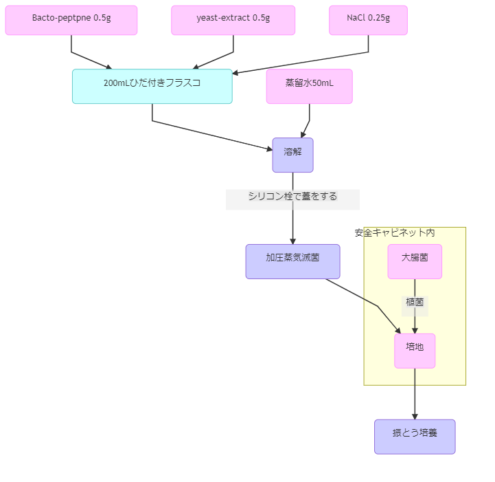
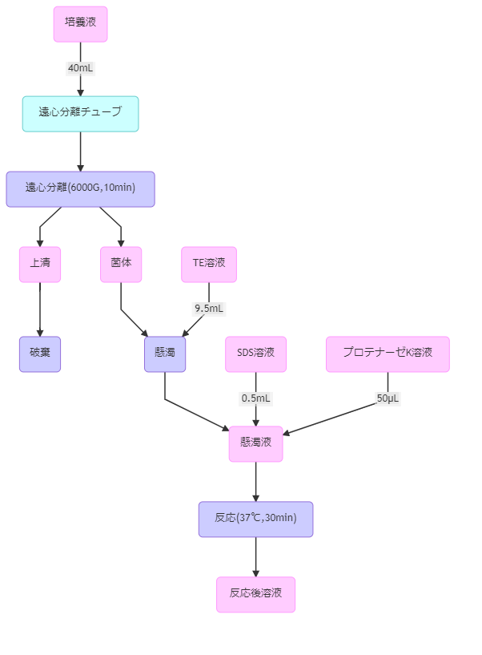
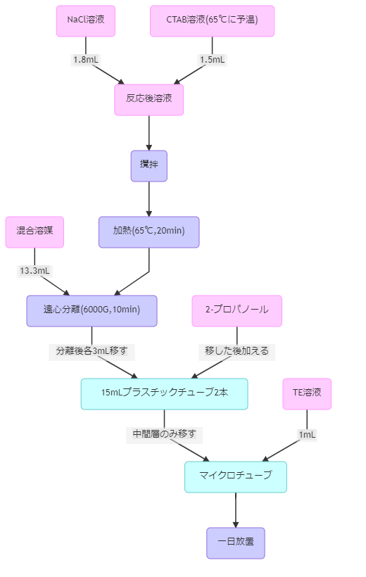
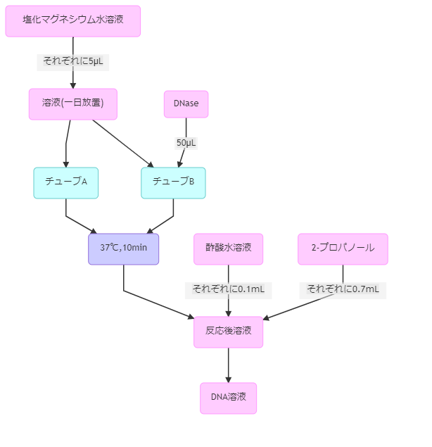
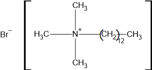
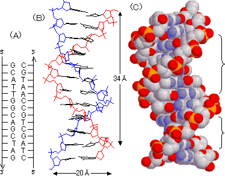

## 1. 実験の目的

この実験では、大腸菌の培養と細胞破砕・さらに核酸の調整を行う。細胞培養においては、調整・滅菌した培地に無菌的に菌を植えることが最も重要である。また、細胞内分子や核酸を取り扱う実験においては、これらの目的とする分子を細胞から取り出さなくては反応や解析を行うことができない。ゆえに細胞破砕法が用いられる。  
今回の実験はこれらの操作の意味を理解することを目的としている。また、調整した核酸溶液は 3.9 の PCR による遺伝子の増幅にもちいる。

## 2.実験操作

### 2.1 実験材料

- 培地

  - _Bacto-peptone_ :0.5g
  - _yeast-extract_ :0.5g
  - NaCl :0.25g

- 水溶液

  - TE 溶液(10mM Tris-HCl,1mM EDTA, pH=7.5)
  - SDS 溶液(10%)
  - NaCl 溶液(5M)
  - CTAB 溶液(10% セチルトリメチルアンモニウムブロマイド,0.7M NaCl)
  - \ce{MgCl2}溶液(1M)
  - \ce{CH3COONa}溶液(3M,pH=5.2)

- 有機溶媒

  - 2-プロパノール
  - クロロホルム―イソアミルアルコール混合溶液(24:1)

- 酵素溶液

  - プロピナーゼ K 溶液(20mg/ml)
  - DNase 溶液(10mg/ml)

- 大腸菌(_Esherichia coli_)
- 蒸留水

### 2.2 実験操作

今回行った実験操作を以下の図 1~4 のフローチャートに示す。桃色のノードは使った試薬等,青色は使用した器具,紫色は操作を示す。

{height=100mm}

1. 200mL ひだ付きフラスコに*Bacto-peptone*を 0.5g、_yeast-extract_ を 0.5g、NaCl を 0.25 入れ、50 ｍ L の蒸留水に溶解させた。

2. フラスコにシリコン栓で蓋をしたのち、120℃ で 20 分加圧蒸気滅菌を行い培地を滅菌した。

3. 滅菌したフラスコの口をバーナーで炙ってからシリコン栓を外し、同様にシリコン栓・フラスコの口を炙ってから培地に大腸菌を加え、逆の操作でシリコン栓で蓋をした。この操作は安全キャビネット内で行った。

4. 3 で植菌した培地を 37℃ に保ったまま 120rpm で一晩振とうし、大腸菌を培養した。

{height=90mm}

5. 4 の培養液を 40 ｍ L 遠心分離用のチューブに移し、6000G で 10 分間遠心分離した。

6. 菌体を崩さないように上清を破棄した後、底にたまった菌体に 9.5mL の TE 溶液を加え、軽く振って懸濁させた。

7. 懸濁液に SDS 溶液を 0.5 ｍ L、プロテナーゼ K 溶液を 50μL 加え、振り混ぜた後 37℃ で 30 分反応させた。

{height=90mm}

8. 7 の反応溶液に NaCl 溶液を 1.8mL,65℃ に予温した CTAB 溶液を 1.5mL 加え、攪拌の後 65℃ で 20 分反応させた。

9. 反応後の溶液にクロロホルム―イソアミルアルコール混合溶液を 13.3mL 加え、6000G で 10 分間遠心分離を行った。

10. 15 ｍ L のプラスチックチューブ二本に各 3mL ずつ 9 の溶液をうつし、それぞれに 2―プロパノールを 2 ｍ L 加えて混合した。

11. 三層に分かれたのち、上層を吸い出し中間層のみをそれぞれ別のマイクロチューブに移した。これにそれぞれ TE 溶液を加え、一晩放置した。

{height=80mm}

12. 11 のそれぞれのチューブに\ce{MgCl2}溶液を 5μL 加え、片方には DNase 溶液を 50μL 加え、37℃ で 10 分間反応させた。反応後の溶液にそれぞれ酢酸水溶液を 0.1mL,2-プロパノールを 0.7μL 加えて攪拌し、これを DNA 溶液とした。

## 3.観察結果と考察

- 操作 4 で一晩培養したのち、培地は黄褐色透明 → 同じ色で懸濁と変化していた。

- 操作５の遠心分離ののち、溶液は上精が黄褐色でやや懸濁、そこに白色の沈殿という状態であった。

- 操作７の後、再懸濁によって乳白色に濁っていた溶液は少し濁りが薄くなったが、同様に乳白色に濁っていた。

- 操作９の後、溶液はやや白濁した上層・白色固体の中間層・上層よりも濁りの薄い下層に分層した。

- 操作 10 の後、溶液中に白色の薄い膜のような固体が析出した。

- 操作 11 の後、両方の溶液は無色透明となっていたが、操作 12 の後、DNase を加えなかった溶液は白色の糸状のゲノム DNA の析出が見られたが DNase を添加した溶液では見られなかった。

## 4.設問の回答

1. 操作・薬品の意味

- _Bacto-peptone_,_yeast-extract_,NaCl
  → 培地に細菌成長に必要な炭素源・窒素源・電解質を供給する。

- TE 溶液(バッファー)
  →TrisHCl は以下の構造を持ち、後のタンパク質分解反応等において最適なｐ H を維持するために添加する。また、EDTA は\ce{Mg ^ 2+}に対するキレート剤で、核酸分解酵素 DNase が働く際に必要となる\ce{Mg ^ 2+}を捕捉することで核酸分解を止める働きがある。

- SDS 溶液
  →12 炭素からなるアルキル基が硫酸に結合した構造を取り、両親媒性である。両親媒性物質は界面活性剤として脂質二分子膜構造を破壊する。

- プロテナーゼ K 溶液
  → 大腸菌の細胞壁であるペプチドグリカンを破壊するタンパク質分解酵素である。

- CTAB 溶液
  →SDS 溶液と同様の両親媒性物質だが、正に帯電しているため負に帯電している DNA から糖やタンパク質を遊離させ、DNA を単離する働きがある。
  塩濃度が低いと DNA-CTAB 複合体が沈殿するため NaCl を加える。

- クロロホルム―イソアミルアルコール混合溶液(24:1)
  → 分液用の溶媒である。DNA は負に帯電していることから水層に移動し、脂質などは有機層に移動する。また、この溶媒はタンパク質を変性させる働きがあり、これにより変性したタンパク質が中間層に析出する。

- 2-プロパノール
  →DNA を塩析により析出させる。

- TE 溶液、\ce{MgCl2}溶液
  → 後に行う DNase による核酸の分解反応に最適な条件を作り出す。

- DNase
  → 比較対象実験として片方の DNA を分解し、析出したものが DNA だったのかを判別するのにもちいる DNA 分解酵素である。

2. 大腸菌の分類

|    分類法    | 大腸菌の分類 |
| :----------: | :----------: |
|    三界説    |  原生生物界  |
|    五界説    |   モネラ界   |
| 三ドメイン説 |  原生生物界  |
|  グラム染色  |     陰性     |

1. DNA の構造

DNA は下の図のような二重らせん構造をもち、生物に必要な遺伝情報(ゲノム)を四種類の塩基でコードしている。塩基は A と T、C と G が相補的に水素結合するような構造になっており、これにより一本の DNA を鋳型として全く同じ DNA を複製することが可能である。  
また、ゲノムは本来生物に必要なタンパク質のアミノ酸配列を記録したものであり、これが形質に影響を与えることから遺伝情報として扱われる。DNA からタンパク質を合成する過程を翻訳と言い、これも相補的な塩基を利用したものである。

{height=60mm}

## 5. 参考文献

図の出典

http://www.sc.fukuoka-u.ac.jp/~bc1/Biochem/nuclacid.htm  
核酸の構造
