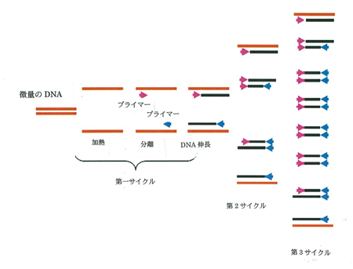
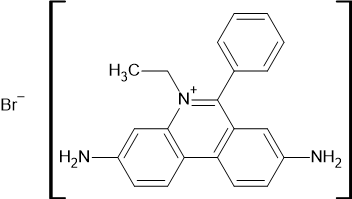
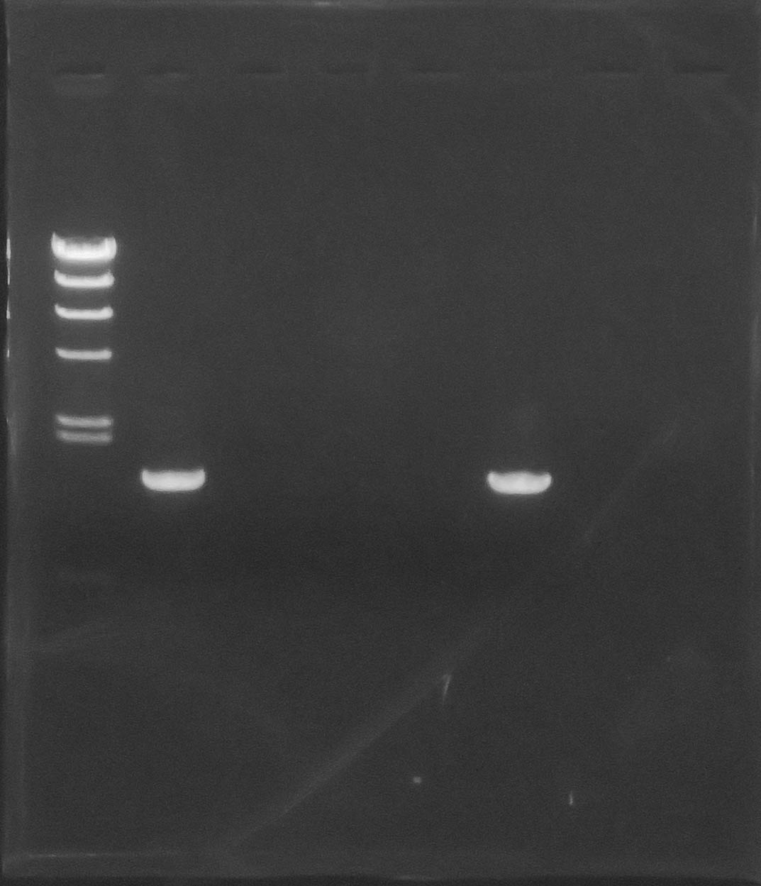
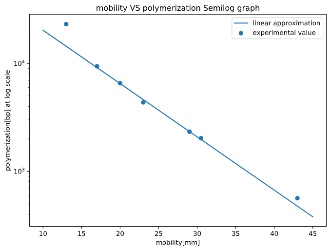

## 1. 実験の目的

今回の実験では PCR 法による DNA の増幅、電気泳動法による DNA の解析を行う。遺伝子工学においては目的の DNA 配列が最重要であるが、当然ながら DNA は肉眼で確認することが不可能である。PCR 法は**Polymerase Chain Reaction**の略であり、後述の電気泳動法による分析が可能な数まで目的の DNA を増やすために行う。  
まず、試料の二本鎖 DNA を熱により変性させて一本鎖とし、これに適切な温度でプライマーを結合させる。その後、DNA 伸長が可能な温度下で反応を行うと、試料 DNA を鋳型とした二本鎖 DNA(プライマーを持つ)が 2 セットできる。この変性 → プライマー結合 → 伸長を 1 サイクルとする。  
1 サイクル目で得られる DNA は目的の配列よりも長いものである。同様に 2 サイクル目を行うと、一組めで得られた二本鎖 DNA のそれぞれの鎖が新たな二本鎖 DNA の鋳型となり、片方の鎖が鋳型 DNA のものが 2 組、片方の鎖にプライマーが二つ、もう片方にはプライマーが一つの二本鎖 DNA が 2 組、計 4 組の二本鎖 DNA が得られる。3 サイクル目も同様に行うと両方の鎖にプライマーを二つづつ持つ目的の DNA が 4 組得られる。このようにして目的の DNA を増幅する方法が PCR 法である。

{height=60mm}

電気泳動法は DNA の分子量とアガロースゲル中の移動度の関係を用いて DNA を分離する方法であり、薄層クロマトグラフィーなどと同じ原理を用いているが、DNA が負に帯電していることを利用し電位勾配で DNA を泳動させていること、DNA の可視化のためにエチジウムブロマイド(EtBr)を用いることが特徴的として挙げられる。EtBr は以下の構造式で表され、DNA の二本鎖の間に入り込んで紫外線下で蛍光を発するため用いられる。

{height=30mm}

今回の実験では 3.8 で調整した大腸菌ゲノム DNA のうちホスファターゼ遺伝子の増幅を PCR にて行い、電気泳動で解析を行う。また、未知のサンプルにおいても DNA の増幅を行い、電気泳動の結果から微生物を同定する。

## 2. 実験手順

### 2.1 試薬

《PCR 反応溶液》

- 鋳型 DNA 溶液(3.8 で調整したものを 50 倍希釈したもの)
- 10x PCR 溶液
  - 100mM Tris-HCl(pH=8.3)
  - 500mM KCl
- 25mM \ce{MgCl2}溶液
- dNTP 溶液(各 2.5mM)
  - dATP,dTTP,dGTP,dUTP
- プライマー(各 10pmol/μL)
  - プライマー 1: 5'-ttgtcacggccgagacttatag-3'
  - プライマー 2:5'-ttatttcagccccagagcggc-3'
- *Taq*DNA ポリメラーゼ　 2.5U/μL
- 蒸留滅菌水

ホスファターゼ遺伝子の増幅(1)・未知サンプルの増幅(2)それぞれにおける PCR 反応溶液の組成は以下の表のとおりである。微生物同定においては、三種類のサンプルでそれぞれ PCR 反応を行った。

《電気泳動用試薬等》

- 電気泳動用緩衝液
  - 40mM Tris-acetate(pH=8.0)
  - 1mM EDTA
- λ*Hind*Ⅲ 　溶液
- 0.8％アガロースゲル
- 泳動用色素
  - ブロムフェノールブルー
  - グリセロール

\newpage

| 実験 | 試薬                  | 使用量[μL] |
| ---- | --------------------- | ---------- |
| 1    | 鋳型 DNA 溶液         | 1          |
|      | プライマー 1          | 5          |
|      | プライマー 2          | 5          |
|      | 10x PCR 溶液          | 5          |
|      | dNTP 溶液             | 4          |
|      | *Taq*DNA ポリメラーゼ | 1          |
|      | ce{MgCl2}溶液         | 3          |
|      | 蒸留滅菌水            | 25         |
| 2    | プライマー 1          | 7          |
|      | プライマー 2          | 7          |
|      | 10x PCR 溶液          | 7          |
|      | dNTP 溶液             | 5.6        |
|      | Taq\*DNA ポリメラーゼ | 1.4        |
|      | \ce{MgCl2}溶液        | 4.2        |
|      | 蒸留滅菌水            | 34.3       |
|      | 未知サンプル          | 1          |

\newpage

### 2.2 実験操作

2.1 の表の組成で調整した PCR 反応用溶液を、94℃:15 秒・60℃:15 秒・72℃:30 秒で 30 サイクル反応させた。その後、反応した PCR 溶液四種・3.8 で調整した DNA 溶液・λ*Hind*Ⅲ 溶液の計六種についてそれぞれ 10μL を 2μL の泳動用色素と混合し、100V で 20 分間泳動した。泳動後、UV ランプに当ててバンドの位置を確認・撮影した。各レーンとサンプルの対応は以下の通りである。

| レーン |      サンプル      |
| :----: | :----------------: |
|   1    |      λ*Hind*Ⅲ      |
|   2    | PCR 反応後サンプル |
|   3    | PCR 反応前サンプル |
|   4    |   未知サンプル 1   |
|   5    |   未知サンプル 2   |
|   6    |   未知サンプル 3   |

### 3 実験結果

電気泳動の結果は以下の図の通りであった。

{height=60mm}

重合度が既知である λ*Hind*Ⅲ の移動度は以下の通りであった。また、PCR により増幅した DNA の移動度は 34㎜ であった。

| 泳動距離[㎜] | 重合度[bp] |
| -----------: | ---------: |
|         13.0 |      23130 |
|         17.0 |       9416 |
|         20.0 |       6557 |
|         23.0 |       4361 |
|         29.0 |       2332 |
|         30.5 |       2027 |
|         43.0 |        564 |

### 4 設問の回答

##### ホスファターゼ遺伝子の増幅について

λ*Hind*Ⅲ の泳動距離を横軸・重合度を縦軸(対数軸)として片対数グラフにプロットした。(図 4)  
検量線の作成は泳動距離が 13㎜ のものを棄却した 6 点を最小二乗法により線形近似して求めたものであり、

$$y=-0.04939794x +4.80155882$$

の式で表された。以上の式と PCR により増幅した DNA の移動度より重合度$X$[bp]を算出すると、

$$log_{10}X=-0.04939794\times 13 +4.80155882=3.1220288$$
$$X=1324.42932752\fallingdotseq 1324$$

となる。

##### 微生物の同定について

レーン 6 に、PCR 反応後サンプルと同じ位置にバンドが見られたことから、未知サンプル 3 が大腸菌を含んでいたと考えられる。PCR 反応後サンプルは、大腸菌を溶菌させてはいるもののすべてのゲノム DNA を含んでおり、大腸菌をそのまま添加した未知サンプルとの条件の違いは溶菌の有無のみである。大腸菌はグラム陰性菌であり、細胞膜の外に直接ペプチドグリカン層が露出している。PCR の反応過程で熱や電解質などにさらされて自然にペプチドグリカン層が破壊され、プラスミドに直接アクセスできる状態が作り出されたと考えられる。
数あるゲノム DNA のうち特定の DNA のみが増幅されたのは使用したプライマーに適合する場所が一か所のみであったと考えられる。これは大腸菌が単純なプラスミド DNA を持つ原核生物であることに起因する。  
つまり、ヒトや植物といった真核生物において同様の PCR による DNA 増幅を行うと複数のバンドが確認されると推察できる。

{height=60mm}

### 5 参考文献

図の出典  
PCR 　日本 RNA 学会,https://www.rnaj.org/newsletters/item/471-furuichi-9
日本 RNA 学会 - ＜走馬灯の逆廻しエッセイ＞ 第 9 話 「数兆円の経済効果ーーＰＣＲの発見」"
