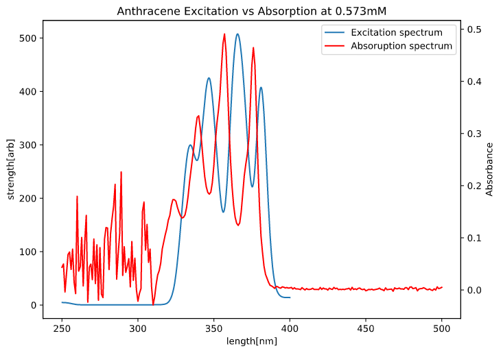

---
output:
    pdf_document:
        latex_engine: lualatex
documentclass: ltjsarticle
header-includes: 
  \usepackage[version=4]{mhchem}
  \usepackage{chemfig}
  \usepackage{siunitx}
  \usepackage[margin=1in]{geometry}
---

## 1.目的

　今回の実験では、固体中の局在電子・有機分子の光学遷移について理解する。光学遷移とは、原子に光エネルギー
を与えることで電子状態が変化することである。この際吸収する光の波長・また変化した(励起した)状態から元に戻る(緩和する)際に放出する光の波長は原子やその周囲の結合・結晶内の原子・イオンの影響(結晶場)の状態を反映しており、これらのスペクトルを解析することで電子状態を知ることができる。今回の実験では蛍光・励起スペクトルの測定から光学遷移について理解する。また、吸収スペクトルの測定から、後述のLabert-Beer則について理解する。

　
## 2.原理

### 2.1 ランタノイドの性質

今回取り扱う\ce{Eu},\ce{Tb}は焼結体中ではホストの陽イオンである\ce{K ^{+}},\ce{Ca ^{2}+}と置き換わるように存在する。\ce{Eu},\ce{Tb}が属するランタノイドの元素はすべて三価の陽イオンになりやすいという特徴を持つ。これは、すべてのランタノイドが共通して6s軌道に１つ,5d軌道に２つの電子を持つためであり、それぞれの元素の電子配置の違いは内殻の4d軌道に起因しているためである。4d軌道は内殻だが高エネルギーであるため、この順番で電子が充填されていく。参考として、\ce{Tb},\ce{Eu}の電子配置を以下に示す。

$$Eu:	[Xe] 4f^7 6s^2$$
$$Tb:	[Xe] 4f^9 6s^2$$

また、ランタノイドにおいて起こる電子遷移は4f-4f遷移と4f-5d遷移であり、これらはパリティ(対称性)が異なるため異なる性質を持つ。これについては2.4で後述する。

### 2.2 アントラセンの性質

アントラセンは以下のようにベンゼン環が三つ連なったアセンに属する物質である。  

$$ \chemfig{[:-120]*6(=*6(-=-=-=)-=-*6(=-=-=-)=-)} $$  

このような平面的で共役した$\pi$結合を持つ有機化合物は蛍光を発しやすい性質がある。また、アントラセンは以下図1のような赤外吸収スペクトルを持つ。  

{height=60mm}

### 2.2 ストークスシフトについて

電子遷移を模式的に表す図として、下記の配位座標モデルが代表的である。一つの原子における電子の基底状態・励起状態のエネルギーを表すのがそれぞれの曲線である。これは、電子は曲線上のエネルギーしか持つことができず、またある座標において電子のエネルギーが極小となることを示している。さらに、基底状態と励起状態で極小となる座標が異なるがこれは入射光によって原子核も影響を受けるためである。さて、電子がエネルギーを受け取り、励起したときのことを考える。電子の遷移は原子核の状態が変わる前に起こる。すなわち電子は配位座標上で真上方向に進み、励起状態の曲線とぶつかる点のエネルギー状態を取る。この遷移を垂直遷移といい、フランク-コンドンの原理に基づく。しかし、この状態は安定ではないため、極小に向かって緩和が起こる。この際発する余分なエネルギーがストークスシフトの原因となる。  

{height=60mm}

### 2.3 ラポルテの規則

ある遷移が許容か禁制かは以下の遷移確率の式から決定することができる。原子の波動関数($\psi_n({\bf r})$)は空間反転に対し対称性を持つが、主量子数により偶関数($e$)のような性質か奇関数($o$)の性質を持つかが異なる
これを式で表すと以下の通りである。

$$\psi_n({\bf-r})=(-1)^n\psi_n({\bf r})$$

軌道とは波動関数を空間上に写像したものに他ならないため、波動関数の偶奇性(パリティ)は軌道にも当てはまる。以下に示すものは模式図であるが、s軌道やd軌道が空間反転しても(ななめ下から見ても対角線上のななめ上からみても)同じ形状であり、p軌道とf軌道が空間反転に対し反転することがわかる。  
電子遷移確率は遷移双極子モーメント$\hat{d}$を用いて以下のように表される。($i,f$はそれぞれ遷移前、遷移後を表す。)

$$\int|C_{if}|=\int\langle\psi_i({\bf r})|\hat{d}|\psi_f({\bf r})\rangle d{\bf r}$$

$d$は${\bf r}$に関する奇関数であるため、偶関数・奇関数の数学的な性質を考えると遷移確率が0にならないためには右辺が奇関数とならなくてはならない。ここで、

$$o \times o \rightarrow e$$
$$e \times e \rightarrow e$$
$$o \times e \rightarrow o$$

より、遷移前・遷移後のパリティが異なる(4f→5dなど)は許容遷移となり、パリティが同じとき(4f→4fなど)が禁制遷移となることが理解できる。また、これらの規則はラポルテの規則と呼ばれる。

{height=50mm}

### 2.4 Lambert-Beer則について

上記のように、分子やイオンなどは光エネルギーを吸収する。吸収の度合は物質の濃度に比例しており、これをLambert-Beer則という。吸光度Aは入射光と反射光の強度の比の自然対数に―１を掛けたものである。これは光路長$l$[\si{\centi \meter}],モル濃度$c$[\si{\mole/L}]に比例し、この比例定数をモル吸光度$\epsilon$ [\si{L.mol^{-1}cm^{-1}}]で表す。これを式で表すと以下のようになる。

  $$A=-log\left(\cfrac{I}{I_0}\right)=\epsilon cl$$

## 3.実験方法

### 3.1 実験器具・装置

* ビーカー
* 石英セル(1㎜)
* メスフラスコ(10ｍL,20ｍL)
* 電子天秤
* 錠剤成形機
* 蛍光分光光度計
* 分光光度計

### 3.2 試薬
  
  《アントラセン溶液》

* アントラセン
* エタノール

   《焼結体》

* \ce{KCl} 
* \ce{CaS} 
* \ce{Tb4O7} 
* \ce{TbCl3.6H2O}
* \ce{EuCl3.6H2O}

### 3.3 実験方法  

#### 3.3.1 アントラセン溶液作製

1. アントラセンを秤量し、20mLメスフラスコに移した。

1. エタノールで定容したのち良く撹拌しこれを原液とした。

1. 原液を1mLホールピペットでとり、10ｍLメスフラスコに移しエタノールで定容し、攪拌することで以下に示す濃度のアントラセン溶液を作製した。  

| 目標濃度[mM] | 10倍希釈するとき[mg] | 10倍希釈しないとき[mg] | 実際の濃度[mM] |
|-------------:|---------------------:|-----------------------:|---------------:|
|          0.3 |                10.69 |                  1.069 |          0.289 |
|          0.6 |                21.39 |                  2.139 |          0.573 |
|          0.9 |                32.08 |                  3.208 |          0.856 |
|          1.2 |                42.78 |                  4.278 |          1.167 |
|          1.5 |                53.47 |                  5.347 |          1.461 |

#### 3.3.2 焼結体作成!!!

各焼結体について、ドーパントが 0.5[\si{\mole}%],総質量0.005[g]となるように使用量を以下の表のとおり決定した。  
   
| 焼結体           | ホスト[mg] | ドーパント[mg] | ドーパントの種類 |
|------------------|-----------:|---------------:|------------------|
| \ce{KCl}-\ce{Tb} |      4.938 |          0.062 | \ce{Tb4O7}       |
| \ce{KCl}-\ce{Eu} |      4.915 |          0.085 | \ce{EuCl3.6H2O}  |
| \ce{CaS}-\ce{Tb} |      4.910 |          0.090 | \ce{TbCl3.6H2O}  |
| \ce{CaS}-\ce{Eu} |      4.912 |          0.088 | \ce{EuCl3.6H2O}  |

1. 表の通り秤量したホスト・ドーパントそれぞれの物質を乳鉢に入れ、10分間よくすりつぶした。

1. 1の混合物を錠剤作製機で成形し、焼結した。焼結の条件は以下の通りである。
    * ホストが\ce{CaS}:700℃まで2時間で昇温,700℃で6時間保温,25℃まで6時間で冷却

    * ホストが\ce{KCl}:1100℃まで3時間で昇温,1100℃で6時間保温,25℃まで6時間で冷却 

### 3.4 スペクトル測定条件

焼結体の蛍光スペクトル測定における入射光の条件を以下の表にまとめる。  

| 焼結体           | 励起波長 [\si{\nano \metre}] | 蛍光開始波長[\si{\nano \metre}] | 蛍光終了波長[\si{\nano \metre}] |
|------------------|------------------------------|---------------------------------|---------------------------------|
| \ce{CaS}-\ce{Eu} | 450                          | 500                             | 800                             |
| \ce{CaS}-\ce{Tb} | 283                          | 350                             | 600                             |
| \ce{KCl}-\ce{Eu} | 345                          | 380                             | 550                             |
| \ce{KCl}-\ce{Te} | 283                          | 350                             | 600                             |

焼結体・アントラセン溶液それぞれについて一度蛍光スペクトルを測定しそのピークから最適励起波長を決定した。その後、入射光波長を最適励起波長に設定して励起スペクトルを測定し、最後にもう一度蛍光スペクトルを測定した。

## 4.結果

###　4.1　焼結体の蛍光スペクトル

\ce{Eu},\ce{Tb}それぞれについて、担体の異なる焼結体の蛍光スペクトルを一つのグラフにプロットした。これを以下に示す。

{height=60mm}  

{height=60mm}  

###　4.2　アントラセンのスペクトル

0.573[ｍM]アントラセン溶液の励起スペクトル・吸収スペクトルについて以下の図に示す。

{height=60mm}  

また、蛍光スペクトルについて以下に示す。  

{height=60mm}  

最後に、各濃度における吸収スペクトルを以下に示す。

{height=60mm}  

吸収ピーク波長は長波長側から以下の4つである。  
蛍光・吸収それぞれのピーク波長をまとめると以下のとおりである。

| 番号 | 蛍光波長(短波長から) | 強度   | 吸収波長(長波長から) | 吸光度 |
|------|----------------------|--------|----------------------|--------|
| 1    | 393                  | 106.4  | 376                  | 1.15   |
| 2    | 404.2                | 506.70 | 357                  | 1.22   |
| 3    | 427                  | 360.30 | 340                  | 0.85   |
| 4    | 452                  | 110    | 324                  | 0.45   |

## 5.考察

### 5.1 焼結体の蛍光スペクトル

Euをドープした試料はCaS,KClのホストの違いにより大幅にピーク波長が異なり、また幅の広い滑らかな山型のピークが見られたが、Tbはホストによらず大きなピークの見られる波長はおよそ540~580[nm]の範囲であり、Euに比べてホストの影響が小さかったと言える。これは4f軌道は5d軌道よりも内側にあるため、外部の結晶場の影響を受けにくくなっているためと考える。  
また、ピーク強度はEuのほうが大きく、これはEuの4f→5d遷移がパリティ許容遷移であることが原因であると推測する。逆に、本来パリティ禁制遷移である4f→4f遷移が観測されているのは結晶場の影響で原子軌道が歪み、波動関数同士が完全には打ち消しあわなかったためと推察する。  
Euの4f-5d遷移は\ce{Eu ^{2+}}に特徴的であるため、ホスト中でEuは二価の陽イオンとして存在していたと考える。

### 5.2 アントラセンの励起・吸収スペクトル

図4から、アントラセンの吸収・励起スペクトルは励起スペクトルに対し、吸収スペクトルはほぼ一定幅で左にずれているという傾向があることがわかった。ここから、吸収しやすい波長の光は励起させやすい光よりも短波長、すなわち高エネルギーであるという仮説が立てられる。これは、吸収スペクトル測定において溶媒であるエタノールがある程度の光を吸収していることが原因で、アントラセンのみによって吸収された光と波長がずれているためと考える。

###　5.3 アントラセンの吸収・蛍光スペクトルの関係

蛍光ピーク波長に対する格子エネルギーを求める。格子エネルギーは以下の式で表され、光速$c=2.998\times10^9$[\si{ms^{-1}}],プランク定数$h=6.626\times 10^{-34}[$\si{Js}]は定数である。

$$E=\cfrac{hc}{\lambda}$$

各吸収波長に対し、波長、格子エネルギー[\si{J}]、格子エネルギー[\si{eV}]を以下の表にまとめる。  

| 番号 | 吸収波長 | 吸収 エネルギー[$10^{-18}$ J] | 吸収 エネルギー[eV] | 励起光 波長 | 励起光 エネルギー[$10^{-18}$ J] | 励起光 エネルギー[eV] |
|-----:|---------:|---------------------------------:|-----------------------:|---------------:|-----------------------------------:|-------------------------:|
|    1 |      376 |                            5.283 |                  32.97 |          393.0 |                              5.055 |                    31.55 |
|    2 |      357 |                            5.564 |                  34.73 |          404.2 |                              4.915 |                    30.67 |
|    3 |      340 |                            5.843 |                  36.47 |          427.0 |                              4.652 |                    29.04 |
|    4 |      324 |                            6.131 |                  38.27 |          452.0 |                              4.395 |                    27.43 |

それぞれの吸収・励起スペクトルピークに対し、対応する遷移を以下の図に表した。  

{height=60mm}  

赤い矢印は吸収を表し、青い矢印は蛍光を表す。また、番号は表の番号と対応している。  
隣り合うピークのエネルギー差が振動順位のエネルギー差に対応する。蛍光・吸収それぞれについて隣り合う遷移のエネルギー差[eV]は以下の通りである。  

| 遷移(上表と対応) | 吸収エネルギー差[eV] | 蛍光エネルギー差[eV] |
|-----------------:|---------------------:|----------------------|
|              1→2 |               0.8742 | 1.755                |
|              2→3 |               1.6379 | 1.736                |
|              3→4 |               1.6060 | 1.801                |
  
吸収スペクトルの356,357[nm]のもの以外は比較的ばらつきの小さい値が得られたといえる。  
赤外分光は2.2節で示した図より$3000\mathrm{[cm^{-1}]}$～$400\mathrm{[cm^{-1}]}$の範囲であり、これはエネルギーに換算すると0.372[eV]~0.062[eV]となる。これは先ほど求めた電子遷移のエネルギーより大幅に小さいため、赤外分光法では遷移によるエネルギー変化を無視して分析を行うことができる。

### 5.4　Lambert Beerの法則について

357[nm]における吸光度と波長の関係を濃度ごとにプロットしたものが以下の図である。また、最小二乗法にて線形近似した直線を示してある。  

{height=60mm}  

2.4でしめしたLambert-Beerの法則より、モル吸光係数は

$$\epsilon = 8.36 \times 10^{3} \mathrm{[L/mol\cdot cm]}$$

と求めることができる。

## 6.課題

* 一日目:2.2節,3.3.1節,3.3.2節参照
* 二日目:2.1節,2.3節,5.1節参照
* 三日目:5.2節,5.3節,5.4節参照

## 7.参考文献
* 2.希土類元素-ランタノイドの性質　https://info.ouj.ac.jp
* 第一原理計算入門 光化学 https://www5.hp-ez.com/hp/calculations/page273
* NIST Chemistry WebBook, SRD 69-Anthracene https://webbook.nist.gov/cgi/cbook
* 有機化合物の構造と色　村中 厚哉　化学と教育 65巻5号（2017年）
* 蛍光体中のEu2+の結晶場分裂と最低励起準位の計算
 山本高詩 J. Illum. Engng. Inst. Jpn. Vol.79 No.11 1995
* 固体中の希土類イオンの発光　中沢叡一郎
* アトキンス物理化学(上)第10版　2017/3/10　(訳)中野元祐　東京化学同人発行
* 詳解 量子化学の基礎 2012/09/01 (著)類家正稔　東京電機大学出版局　発行  

図の出典  

* 図1　図下部に記載
* 図2　電子f軌道（原子軌道）https://pigboat-don-guri131.ssl-lolipop.jp/
* 図3　2018-021198号 蛍光体および発光装置 - astamuse　https://astamuse.com/ja/published/JP/No/2018021198
