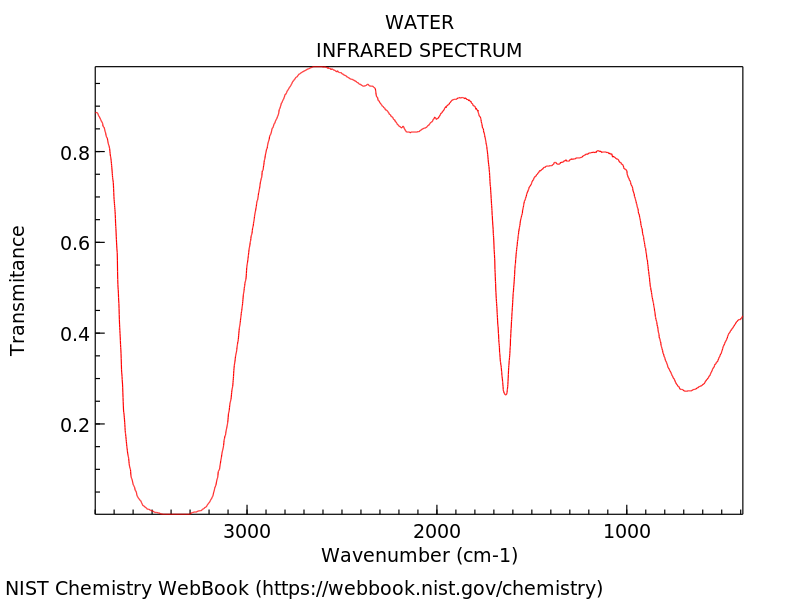
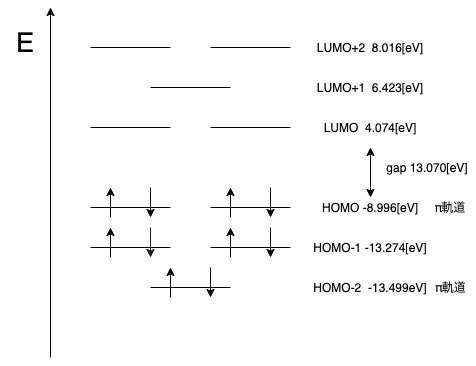
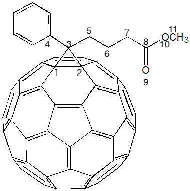
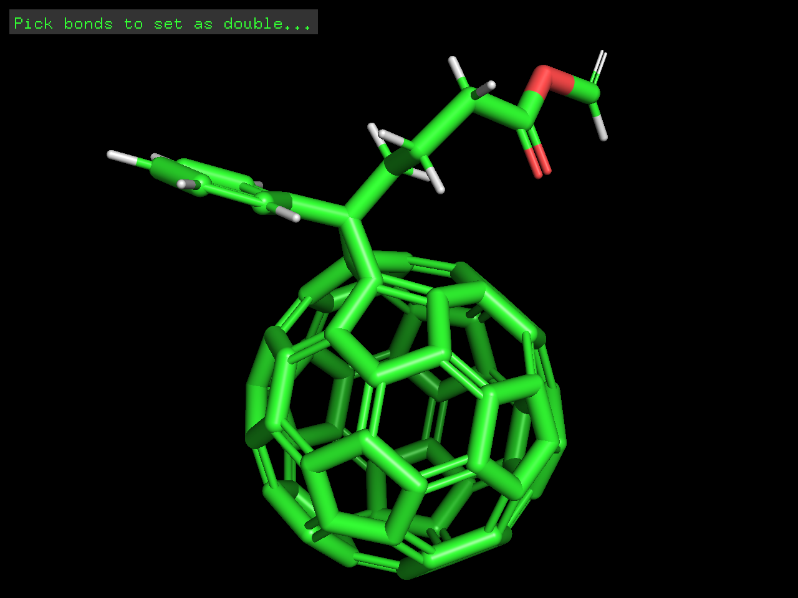
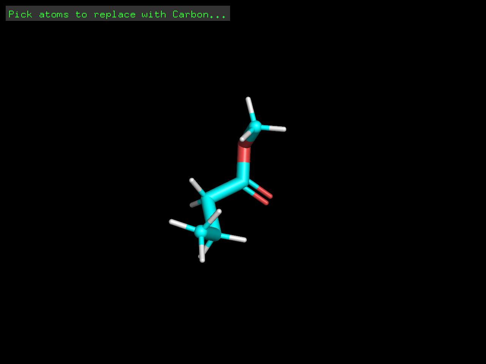

---
output:
  pdf_document:
    latex_engine: lualatex
documentclass: ltjsarticle
filters:
  - pandoc-crossref
header-includes:  
  \usepackage[version=4]{mhchem}
  \usepackage{amsmath}
  \usepackage[margin=1in]{geometry}
  \usepackage{array}
---

# 1.緒言

今回の実習では、量子化学計算を取り扱う。計算化学において、分子や原子の振る舞いはシュレーディンガー方程式に代表される基礎方程式を解くことで捉えることができる。しかし、これらの計算は複雑で、計算機をもってしても解析的に解くことはできない。そこで、今回用いるGaussianを含む多くの計算化学ソフトウェアでは、適切な近似が用いられる。  
計算化学は、フロンティア軌道論などの考え方で化学の中で重要な立ち位置を示している。フロンティア軌道論では、HOMO・LUMOといった反応性の高い軌道に注目することで反応機構を明らかにする。  

# 2.Gaussianというソフトウェアについて

今回用いたGaussianは、基底関数系(BASIS-SET)と近似法を複数の中から選ぶことができる。一般的に、適切な近似法と多くのき的関数を含む大きい基底関数系を用いれば、正確な分子モデリングを行うことができる。しかし、計算量が多くなるため今回の実験では近似法としてHartree-Fock法を用い、BASIS-SETのみを変更して実習を行った。  
Gaussianでは、選択された近似法とBASIS-SETを用いてモデルのもつエネルギーを計算し、これを最小化するように決定する構造最適化が可能である。今回はこれを用い、IR,NMRと言った分析のスペクトルをシミュレーションによって求めた。

# 3.実習内容について

今回の実習は水分子・ベンゼン・PCBMの三種類の分子について量子化学計算を行った。  

## 3-1 水分子の量子化学計算 

水分子の分子モデルを作成し、以下の５種類のBASIS-SETで構造最適化を行った。また、最適化前・実験値とこれらの最適化モデルをO-H結合長・H-O-H結合角,電気双極子モーメントについて比較を行った(表１)。また、BASIS-SETに6-31G(d)を用いたIRスペクトルのシミュレーション,HOMO・LUMOの可視化を行った。  
今回用いたSTO-3G,3-21G,6-31G(d),6-31G(d,p),6-31++G(2d,p)のBASIS-SETと実験値、最適化前の構造を比較した結果を添付の実習用紙に記載した。  
5つのBASIS-SETの中で最も実験値に近いものは、O-H結合長では3-21G,結合角では6-31G(d),電気双極子モーメントではSTO-3Gであった。  
また、まげ振動・対称伸縮振動・非対称伸縮振動におけるIRピーク波数$\nu_1,\nu_2,\nu_3$はそれぞれ1827[cm^-1],4071[cm^-1],4188[cm^-1]であった。これは、いかに示すNISTのデータと大きく離れていた。これは、水分子の構造が4.3(c)で述べるように局所最適化されたものであり、完全に安定な状態ではなかったためと考える。  

{height=60mm}  
HOMO,LUMOの可視化は添付した実習用紙の通り出会った。また、HOMO,LUMOのエネルギーギャップは19.35[eV]だった。

## 3-2 ベンゼンの量子化学計算

3-1同様に、ベンゼンでも構造最適化を行った。また、ベンゼンについてはC-C,結合長のほか、対称性に注目した。さらに、HOMO,LUMOのエネルギーを求めたのち、ZINDOを用いてUVスペクトルのシミュレーションを行った。  
最適化の結果、C-C結合長は1.386[Å],C-H結合長は1.075[Å]となった。また、六回対称性があることがわかった。HOMO-LUMOは以下の図のように、HOMO,H-1,LUMO,L+2が2重に縮退していることがわかった。  
{height=60mm}  
UVスペクトルシミュレーションでは、以下の表のようなスペクトルが得られた。  

|エネルギー[eV]|波長[nm]|f|
|----|----|----|
|6.284|197.29|0.8615|
|7.7413|160.16|0.0004|  

これは、以下のNISTのデータとも一致した。  
{height=60mm} 

## 3-3 PCBMの量子化学計算

$\ce{phenyl-C_61-butylic-acid-methyl-ester}$の構造最適化を行った。これは、シュレーディンガー方程式を解くのではなく、力学的な構造最適化(UFF)を行った。最適化された構造に関して、結合長,結合角,ねじれ角,表面電荷,電気双極子モーメントを求めた。また、HOMO,LUMOの可視化を行った。  
さらに、PCBMからフラーレンとフェニル基を取り除いた酪酸メチルについて、$\ce{C^13-NMR}$のシミュレーションを行った。なお、この時標準物質はTMS(トリメチルシラン)とした。

{height=60mm}  

{height=60mm}  

{height=60mm}  

PCBMのC-C結合長を以下の表に示す。  

|結合|長さ[Å]|
|----|------|
|$\mathrm{C_1-C_2}$|1.403|
|$\mathrm{C_2-C_3}$|1.553|
|$\mathrm{C_1-C_3}$|1.557|
|$\mathrm{C_8-C_9}$|1.265|  

また、$\mathrm{C_3-C_{11}}$の直線距離は7.459[Å]であった。また、結合角、ねじれ角についても以下に示す。  

|結合|角度[°]|
|----|------|
|$\alpha_1(\mathrm{C_1C_3C_2})$|58.62|
|$\alpha_2(\mathrm{C_4C_3C_5})$|117.44|
|$\alpha_3(\mathrm{C_7C_8C_9})$|118.15|
|$\tau_1(\mathrm{C_1C_3C_5C_6})$|-143.44|
|$\tau_2(\mathrm{C_3C_5C_6C_7})$|117.99|  

$\ce{C_3,C_8,O_9}$の電荷は以下の表の通りであった。この時の電荷はMulliken電荷であり、各原子が占有している電子の個数を表す。  

|原子|電荷[a.u.]|
|---|---------|
|$\ce{C_3}$|0.066|
|$\ce{C_8}$|0.619|
|$\ce{O_9}$|-0.540|  
\newpage
このことから、カルボニル基が分極して酸素原子が負、炭素原子が正の電荷を帯びていることが確認できた。また、電気双極子モーメントは3.513[Debye]だった。HOMOは$\ce{C_1,C_2,C_3}$の周辺と、フラーレン上のシクロプロパン環と垂直な面に局在しており、シクロプロパン環から離れるほど小さくなった。また、LUMOはフラーレンの赤道付近に多くあった。  

酪酸メチルの$\ce{C^13-NMR}$スペクトル字ミュレーションでは、以下の値が得られた。  

|原子|スペクトル強度[ppm]|
|-----------------|------|
|$\ce{C_5}$|11.2962|
|$\ce{C_6}$|19.9266|
|$\ce{C_7}$|37.3199|
|$\ce{C_8}$|179.0177|
|$\ce{C_11}$|47.1318|

# 4.課題の回答

## 4.1　Hartree-Fock近似について

Hartree-Fock法とは、多電子系の波動関数を一つの行列式で表す近似法である。この行列式はスレーター行列式といい、二粒子系では以下のように導出される。  

まず、$x_1$,$x_2$の座標に存在する二粒子を考える。二粒子系の波動関数は、それぞれの粒子の波動関数の積で近似することができる。
$$\Psi(x_{1}, x_{2})=\chi_{1}(x)_{1} \chi_{2}(x)_{2}$$

これをハートリー積というが、電子のようなフェルミ粒子では粒子は反対称性を持つ。つまり、電子の空間座標が入れ替わると波動関数の符号が逆転する。この性質を表すと以下の式となる。  

$$\Psi(x_{2}, x_{1})=-\Psi(x_{2}, x_{1})$$

以上２式を両立させるため、ハートリー積の線形結合をとったものがスレーター行列式である。すなわち、  

$$\begin{aligned} \Psi\left(\boldsymbol{x}_{1}, \boldsymbol{x}_{2}\right) &=\frac{1}{\sqrt{2}}\left\{\chi_{1}\left(\boldsymbol{x}_{1}\right) \chi_{2}\left(\boldsymbol{x}_{2}\right)-\chi_{1}\left(\boldsymbol{x}_{2}\right) \chi_{2}\left(\boldsymbol{x}_{1}\right)\right\} \\ &=\frac{1}{\sqrt{2}}\left|\begin{array}{ll}\chi_{1}\left(\boldsymbol{x}_{1}\right) & \chi_{2}\left(\boldsymbol{x}_{1}\right) \\ \chi_{1}\left(\boldsymbol{x}_{2}\right) & \chi_{2}\left(\boldsymbol{x}_{2}\right)\end{array}\right|\end{aligned}$$

がスレーター行列式である。  
また、Hartree-Fock近似は計算の簡便化のため、以下の近似を用いている。  

* ボルン-オッペンハイマー近似  
  ...原子核座標を一定のものとして扱う。  

* 平均場近似  
  ...電子間の相互作用は電子の座標によらず一定である。つまり、全ての電子は、他の全ての電子が作る平均場による相互作用を受けていると考える。  

特にこの平均場近似において、電子間の位置の相関である電子相関は考慮されていない。電子相関によるエネルギーは、実際の系のエネルギーからHartree-Fock法で算出したエネルギーを引いたものとして表される。  

$$E_{\text {corr }}=E_{\text {exact }}-E_{\mathrm{HF}}$$

## 4.2 BASIS-SETについて

今回用いたBASIS-SETはSTO-3G,3-21G,6-31G(d),6-31G(d,p),6-31++G(2d,p)の6種類である。それぞれについて、(a)意味・計算精度,(b)計算速度の二点から述べる。  
また、全ての基底関数系において、ガウス基底関数を用いる。ガウス基底関数とは、
$$\Phi(\mathbf{r})=R_{l}(r) Y_{l m}(\theta, \phi)$$
で表される1粒子系を仮定した波動関数である。  
基底関数系による計算速度の変化は基底関数の数の4乗に比例する。

* STO-3G  
  (a)この基底関数系は代表的な最小基底系であり、炭素原子の1s,2s,2p軌道を基底関数として波動関数を表す。式で表すと
  $$\psi_{\mathrm{STO}-3 \mathrm{G}}(s)=c_{1} \phi_{1}+c_{2} \phi_{2}+c_{3} \phi_{3}$$
  であり、それぞれの基底関数は
  $$\phi_{i}=\left(\frac{2 \alpha_{i}}{\pi}\right)^{3 / 4} e^{-\alpha_{i} r^{2}} \quad(i=1,2,3)$$
  である。  
  (b)使用している基底関数が少ないため、計算速度は他のものに比べて速い。

STO-3G以外の4つの基底関数系は、全てスプリットバレンス基底系に分類される。これは、価電子が形成する軌道(原子価軌道)に着目し、この軌道にのみ二種類の関数を用いる。X-YZGと表される基底関数系は、内殻軌道にX個、原子価軌道にはY個とZ個のガウス関数を縮約した関数を用いる。  

* 3-21G  
  (a)内殻軌道に3つのガウス関数を縮約した関数、価電子軌道には２つのガウス関数を縮約した関数と１つのガウス関数を用いる基底関数系である。  
  (b)今回用いたスプリットバレンス基底系の中では最も基底関数の数が少なく、計算が早い。

* 6-31G(d)  
  (a)3-21G同様スプリットバレンス型であり、内殻軌道に6つのガウス関数を縮約した関数、価電子軌道には3つのガウス関数を縮約した関数と１つのガウス関数を用いた基底関数系である。また、分極関数としてd軌道を混合することで水素以外の原子の分極を表している。このような分極関数は電気陰性度の大きい原子をもつ極性分子に適している。  
  (b)6-31Gのうちでは最も基底関数の数が少なく、計算も高速である。

* 6-31G(d,p)  
  (a)6-31G(d)に加え、分極関数にp軌道が加えられている。このp軌道は水素原子に適応される。  
  (b)d軌道、p軌道の分極関数の分計算速度が落ちる。

* 6-31G++(d,p)  
  (a)二種類の分極関数に加え、さらに電子分布の広がりを考慮して分散関数(diffuse関数)を追加している。分散関数は通常の基底関数よりも指数$\alpha$が小さく、より広がりが大きい。今回は水素原子、酸素原子双方に分散関数を付け加えている。分散関数を加えた基底関数系は、アニオンなど中心電荷の引きつけが弱く、電子分布が広がる分子に適している。  
  (b)上記に加え、分散関数の分計算速度が落ちる。基底関数が最も多いため、計算に時間がかかる。

## 4.3 構造最適化について

(a)  
与えられた初期構造に対して断熱ポテンシャルエネルギーを計算し、各電子の座標でエネルギー曲面を偏微分して勾配を求める。勾配が０になった点をエネルギーの極小値、その時の構造を最安定構造とする。  

(b)  
\ce{H2O},ベンゼン,PCBM  

(c)  
　Gaussianによる構造最適化は勾配により判断しているため、局所的には低エネルギーだが全体では最適構造ではない、という可能性がある。X線結晶構造解析は、電子によるX線の反射から分子中で電子密度の高い部位を求める。この電子密度の高い部位に原子があると仮定し、分子構造を求めるものである。  
溶液中では、溶媒分子との相互作用により分子構造が変化すると考える。例えば、水のような極性分子が溶媒の場合、分子構造が変化すると考える。

## 4.4  

(a)  
以降、添字$i$は始状態,$f$は終状態を表す.  時間に依存する摂動により、光学遷移が起こる系を考える。つまり、摂動によって始状態のハミルトニアン$\hat{H_0}$が
$$\hat{H}=\hat{H'}+\hat{H_0}$$
のように変化したと考える。摂動項$\hat{H'}$が角速度$\omega$で時間に依存して振動する時、始状態$i$から終状態$f$への遷移確率$T_{i \rightarrow f}$は終状態の結合状態密度$\rho_f$,遷移双極子モーメント$\left|\left\langle f\left|\hat{H}^{\prime}\right| i\right\rangle\right|$を用いて

$$T_{i \rightarrow f}=\frac{2 \pi}{\hbar}\left|\left\langle f\left|\hat{H}^{\prime}\right| i\right\rangle\right|^{2} \rho_f$$

のように表される。これをフェルミの黄金律という。また、スペクトルの発光強度$I_{i,f}$は始状態の結合状態密度$\rho_i$,と遷移確率に比例し,

$$I_{i,f}=K \rho_iT_{i \rightarrow f} h \nu$$

となる。また、吸収・放出波長に関しては光電効果の原則に従い、波長とエネルギー差は比例する。すなわち以下の式が成り立つ。
$$\Delta E =E_f-E_i=h\nu$$
このようにしてUV-Visなど、電子遷移の際の光吸収・放出スペクトル強度・波長がわかる。

# 5 参考文献

* NIST https://webbook.nist.gov/
* Self‐Consistent Molecular‐Orbital Methods. I. Use of Gaussian Expansions of Slater‐Type Atomic Orbitals  J. Chem. Phys. 51, 2657 (1969）
* 量子化学の基礎知識 | HPCシステムズ・計算化学ソリューション https://www.hpc.co.jp/chem/library/c_qc_basic/
* 詳解 量子化学の基礎　(著)類家正稔　(出版) 東京電機大学出版　2012/9/20
* JapaneseClass.jp Images of PCBM https://japaneseclass.jp/img/PCBM