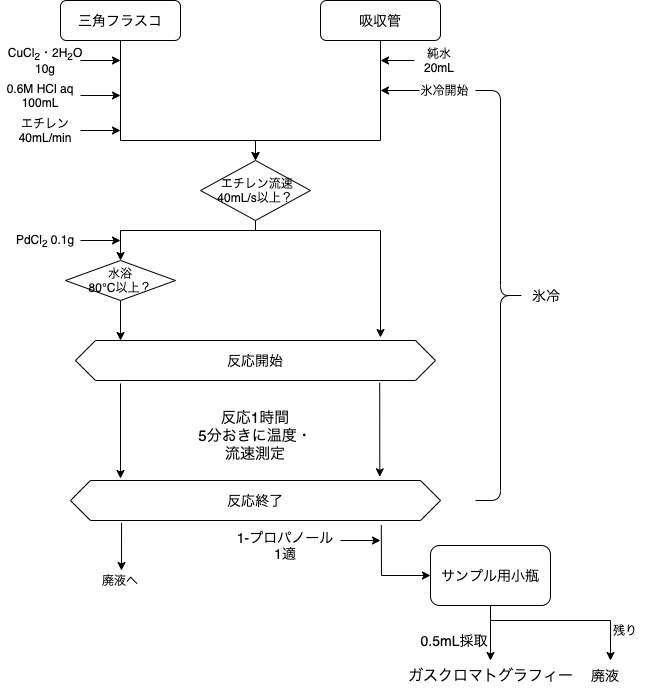
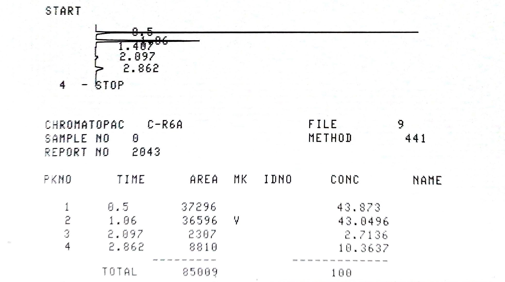

# 1.緒言  

有機化学反応においては、触媒として金属を用いるものが多くある。ヘキスト・ワッカー反応はこの代表例であり、パラジウム、銅の二種類の金属錯体を用いる均一系触媒反応である。今回はエチレンの酸化によるアセトアルデヒドの合成から、これらの触媒の働きについて学ぶ。 

# 2.原理  

#### 反応の概要

ヘキスト・ワッカー反応によるエチレンの酸化は以下の三段階の反応式であわらされる。  

$$\begin{aligned}
(1)&エチレンの酸化~~~\ce{C2H4 +H2O + PdCl2 -> CH3CHO + 2HCl +Pd^{0}}\\
(2)&パラジウムの再生反応~~~\ce{Pd^{0} + 2CuCl2 -> PdCl2 +2CuCl}\\
(3)&銅再生反応~~~\ce{C2H4 + 1/2O2 -> 4CuCl2 + 2H2O}
\end{aligned}$$  

このことから、エチレン一分子をアセトアルデヒドに変換するのにPdが1分子、そのPdを再生するのにCuが2分子必要であることがわかる。  
この反応をサイクル状で表すと以下の図の通りとなる。  

{height=80mm}

#### FID-GCによる分析法

今回用いたガスクロマトグラフは、水素炎イオン化型検出器(FID)を用いたものである。  
FIDでは、水素を酸素雰囲気下で燃焼させて水素炎を発生させる。カラムを抜け、分離が終わった物質が水素炎に近づくとイオンが発生し、このイオンにより発生する電流によって物質が検出される。  
信号の強さは発生するイオンの量により決まるため、概ね炭素数に比例した強度のピークが得られる。  

# 3.実験方法
## 3.1 試薬  

|試薬|濃度|使用量|実際の使用量|
|----|----|-----|------| 
|エチレン|-|-|-|
|$\ce{PdCl2}$|-|0.1g|0.1002g|
|$\ce{CuCl2*2H2O}$|-|10g|9.99g|
|塩酸|0.06M|100mL|100mL|
|1-プロパノール|-|-|0.0044g|  

* $\ce{CuCl2 * 2H2O}$は鮮やかな淡青色であり、塩酸に溶解させた溶液も同様の淡青色であった。
* $\ce{PdCl2}$は赤褐色の粉体であった。  

## 3.2 実験装置  

今回の実験では、以下のような反応器を用いた。 

{height=40mm}  

\newpage

## 3.3 実験操作  
実験操作のフローチャートを示す。

{height=80mm}  

1. 三角フラスコに$\ce{CuCl2 * 2H2O}$を10[g]測りとり、分注器を用いて塩酸を100mL加えて溶解させた。
2. 吸収管に純水を20mL入れ、反応器に接続して氷冷した。
3. 三角フラスコを反応器に接続し、エチレンを供給した。
4. エチレンの流量を石鹸膜流量計で測定し、40mL/min以上になった後に三角フラスコに塩化パラジウムを添加した。
5. 80℃以上の温度の水浴に浸し、反応を開始した。反応は1時間行い、5分おきに温度、流速を測定した。
6. 反応終了後、吸収管に残った液体にマイクロシリンジで1-プロパノールを一滴加え、混合したのちにサンプル用小瓶に移した。
7. 6の混合溶液を0.5µL、ガスクロマトグラフに打ち込んで分析した。 

# 4.結果  

##　実験中の観察結果  

* $\ce{PdCl2}$を$\ce{CuCl2 * 2H2O}$の塩酸溶液に溶かすと青緑色に変化した。
* 実験中、溶液は反応がすすむにつれて青緑色から緑色に変化した。

## ガスクロマトグラフィー結果  

ガスクロマトグラフ分析の結果を以下に示す。  

  

また、得られたピークについて帰属を以下に示す。  

|保持時間[min]|物質|ピーク面積比|
|-------|--------|---------|
|0.5|エチレン|37296|
|1.06|アセトアルデヒド|36596|
|2.097|アセトン|2307|
|2.862|1-プロパノール|8810|  

## 収率・添加率計算  

以下の計算には、式量として表の値を用いた。  

|物質|式量 [g/mol]|
|----|----------|
|$\ce{PdCl2}$|177.33|
|$\ce{CuCl2*2H2O}$|170.48|
|エチレン|28|
|アセトアルデヒド|44.05|  

\newpage
#### 使用モル数計算  

エチレン,$\ce{PdCl2}$,$\ce{CuCl2*2H2O}$それぞれの試薬の使用モル数を以下のように計算した。エチレンの平均流量に関しては５分おきに測定した流量の算術平均を用いた。  

* エチレン  
使用量[L]&emsp;:&emsp;$\cfrac{38.63\mathrm{[mL/min]}\times60\mathrm{[min]}}{1000\mathrm{[mL/L]}}=2.32\mathrm{[L]}$  

  標準状態の気体のモル体積$22.4\mathrm{[L/mol]}$を用いて計算を行った。  

  使用量[mol]&emsp;:&emsp;$\cfrac{2.32[L]}{22.4\mathrm{[L/mol]}}=0.104\times\mathrm{[mol]}$  

* $\ce{PdCl2}$  
使用量[mol]&emsp;:&emsp;$\cfrac{0.1002\mathrm{[g]}}{177.33\mathrm{[g/mol]}}=5.65\times\mathrm{10^{-4}[mol]}$  
  
* $\ce{CuCl2*2H2O}$  
  使用量[mol]&emsp;:&emsp;$\cfrac{9.99\mathrm{[g]}}{170.48\mathrm{[g/mol]}}=5.86\times\mathrm{10^{-2}[mol]}$

#### アセトアルデヒド生成量  

ガスクロマトグラフィーで得られた結果から、以下の式を用いアセトアルデヒドの生成量を求めた。  

$$(1-プロパノール\mathrm{[g]})\times\cfrac{アセトアルデヒド面積}{1-プロパノール面積}\times5.74$$

生成量[g]&emsp;:&emsp;$0.0044\mathrm{[g]}\times\cfrac{36596}{8810}\times5.74=0.105\mathrm{[g]}$  

また、式量から生成量[mol]を計算すると以下のような結果が得られた。  
生成量[mol]&emsp;:&emsp;$\cfrac{0.105\mathrm{[g]}}{44.05\mathrm{[g/mol]}}=2.39\times\mathrm{10^{-3}[mol]}$  

#### $\ce{Pd}$ターンオーバー数

Pd一分子あたりに生成したアセトアルデヒドの分子数を求めた。  

ターンオーバー数[-]&emsp;:&emsp;$\cfrac{2.39\times\mathrm{10^{-3}[mol]}}{5.65\times\mathrm{10^{-4}[mol]}}=4.21$  

また、ターンオーバー頻度は触媒1[mol]単位時間あたりに変換できる物質の分子数である。  

ターンオーバー頻度$\mathrm{[s^{-1}]}$&emsp;:&emsp;$\cfrac{4.21}{3600\mathrm{[s]}}=1.7\times\mathrm{10^{-3}[s^{-1}]}$ 

#### エチレン基準のアセトアルデヒド収率

全てのエチレンがアセトアルデヒドに転化した(収率100％)と仮定すると、反応式(1)のエチレンのカルボニル化反応より,アセトアルデヒドは$0.104\mathrm{[mol]}$生成するはずである。今回生成したアセトアルデヒドは$2.39\times\mathrm{10^{-3}[mol]}$であるため、  

収率[%]&emsp;:&emsp;$\cfrac{2.39\times\mathrm{10^{-3}[mol]}}{0.104\mathrm{[mol]}}\times100=2.30\mathrm{[\%]}$  

#### $\ce{Cu({II})}$の転化率

反応式(2)のパラジウムの再生反応より、パラジウム1分子を再生するのに銅2分子が必要であることがわかる。ここから、反応によって消費された銅のモル数は反応したパラジウムの2倍であると考える。  
また、アセトアルデヒド一分子の生成にパラジウムが一分子必要なため、  

反応した銅[mol]&emsp;:&emsp;$2.39\times\mathrm{10^{-3}[mol]}\times2=4.78\times\mathrm{10^{-3}[mol]}$  

転化率は供給量に対する反応量の割合であるため、  

転化率[%]&emsp;:&emsp;$\cfrac{4.78\times\mathrm{10^{-3}[mol]}}{5.86\times\mathrm{10^{-2}[mol]}}=8.16\mathrm{[\%]}$

# 5.考察  

今回、反応前後で溶液の色に変化が見られた。  
反応前の溶液の淡青色は$\ce{Cu^{2+}}$のアクア錯体によるものであると考える。また、反応がすすむにつれて溶液が緑色に変化したが、これは$\ce{Pd^{0}}$錯体の溶液が黄〜橙色であり、色が混ざったことにより緑色になっていると考える。また、反応がすすむにつれて$\ce{Cu^{2+}}$がPdの再生に使われて$\ce{Cu^{+}}$に変化したために青色が薄くなったと考える。  

また、今回の反応では溶媒に塩酸を用いた。これは、パラジウムと銅がルイス酸として働くため、中和して活性を失わないように強酸を用いたと考える。特に、パラジウム・銅はHSAB則に基づくとソフトルイス酸であるため、ハードな酸であるプロトンを加えたと考える。  
しかし、文献1によるとワッカー酸化の反応速度はpHが小さいほど遅くなり、さらに$\ce{Cl^-}$も反応を阻害するという結果が得られている。  
反応式(1)では生成物として塩酸が生じるため、過剰量の塩酸は平衡を左に偏らせると考える。  
したがって、今回の実験の溶媒に塩酸を用いることが適切かどうかは疑問が残る。これを検証するためには、塩酸濃度や酸の種類、また文献にあるような他の種類の酸を加えた対象実験を行う必要がある。

# 6.設問

### 1  

1.諸言参照

### 2  

質量測定においては、まれにシリンジの先から液滴が落下したり、天秤に異物が乗っていたりすることがあり、これにより質量が大幅に変化する可能性がある。体積測定は、このような状況が生じていないかどうかを確認するために行う。

### 3

Aldehyde-selective wacker-type oxidation of unbiased alkenes(US9586883B2
United States Patients)  

今回の実験と同様、パラジウム触媒と塩化銅触媒を用いたワッカー反応によりオレフィンを酸化し、カルボニル基を持つ化合物を生成した例である。酸化率(生成したアルデヒド、ケトンの割合)は89%であり、アルデヒドの収率は78％だった。この特許においては、窒素による求角攻撃を可能にするために窒素を含む触媒を添加している。その中でも$\ce{AgNO3}$は酸化率、アルデヒド収率共に高い値を記録した。また、Pd触媒として塩化Pdではなく$\ce{PdCl2(PhCN)}$を用いていた。これらの結果から、以下の二点について考察する。  

* アセトアルデヒドの収率向上については、今回は用いたオレフィンがエチレンであったことから、逆マルコフニコフ則にかかわらずアルデヒドが生成する。そのため、今回の条件においては酸化率をあげることが重要である。$\ce{AgNO3}$を用いることが窒素による求核攻撃を可能にする点で有効であることが上記の特許に示されていたため、窒素源触媒を添加することがアセトアルデヒドの収率向上に繋がると考える。  
* Pd基準ターンオーバー頻度の向上には、オレフィンと錯体を形成しやすいPd触媒が求められる。上記の特許においては$\ce{PdCl2(PhCN)}$を用いていた。また、酢酸パラジウムを触媒に用いた反応例も存在した。このことから、予めパラジウムを錯体にしておくことが有効であると考える。また、5に示した通り溶媒に塩酸を用いることはパラジウムの再生反応を阻害し、ターンオーバー頻度を下げると考えられる。
  
### 4

|ピーク|波数|帰属|振動の様子|
|-----|----|---|----|
|A|2900~3150|C-H伸縮|⇦C→-←H⇨|
|B|820~1500|C-H変角|C-H↑↓|
|C|1700~1820|C=O伸縮|⇦C→=←O⇨|  

伸縮振動には、全対称伸縮振動(⇨C→=→C⇨)と逆対称伸縮振動(⇦C→=←C⇨)がある。エチレンでは、これらの振動モードが別々のものとして1900$\mathrm{cm^{-1}}$付近と1500$\mathrm{cm^{-1}}$付近の二箇所に検出されているため、本来のC=C伸縮振動モードとして検出されていない。

### 5
* TCD
  キャリアガスと、成分を含むガスの熱伝導率の差を測定する測定法である。検出器にはフィラメントが設置されており、電圧を印加して加熱する。ガスによりフィラメントの温度が変化すると、抵抗値が変化することで電圧の変化が検出される。
* MS(EI)
  成分に電子ビームを当てることで、成分と同じ質量の分子イオンを生成する。このイオンをフラグメントイオンといい、このイオンの質量を計測することで検出する。
* FID
  2.原理を参照  

これら三種類の検出方法について、以下の表にまとめる。  

|検出方法|試料の破壊|対象物質|適応濃度|
|----|----|----|----|
|TCD|無|全ての化合物|ppb~|
|MS(EI)|有|イオン化が可能なもの(高分子などは不可能)|ppb~0.1%|
|FID|有|炭素原子を多く含むもの|ppm~|  

### 6

* ポリジメチルシロキサン  
  低極性のため、低極性の物質と吸着することで分離する。
  このことから、この物質を固定層とするGCでは、低極性物質の保持時間が長くなる。  
  {height=30mm}
* ポリエチレングリコール  
  分子中に水酸基を多く含むため高極性であり、極性の高い物質を強く吸着する。このため、高極性物質の保持時間が長くなる。  
  {height=30mm}

これらの固定層は両方とも極性による吸着率の違いを利用した分離を行う。これらを混合し、様々な極性の固定層を作ることが可能である。  

# 7.参考文献  

* http://www.perkinelmer.co.jp/tabid/2297/Default.aspx 
	ガスクロマトグラフの検出器には何があって、特徴は何？ | クロマト分析 日々のQ&A - PerkinElmer Japan
* https://www.jaima.or.jp/jp/analytical/basic/chromatograph/gc/ ガスクロマトグラフ（ＧＣ）の原理と応用 | JAIMA 一般社団法人 日本分析機器工業会 
* https://www.chem-station.com/blog/2005/05/ir.html IRの基礎知識 | Chem-Station (ケムステ)
* https://dbsearch.biosciencedbc.jp/Patent/page/ipdl2_JPP_an_2010139381.html 公開特許公報(A)_アセトアルデヒドの製造方法
* The Oxidation of Olefins with Palladium Chloride Catalysts  
  Dr. Juergen Smidt  Dr. W. Hafner  Dr. R. Jira  Dr. R. Sieber  Dr. J. Sedlmeier  Dr. A. Sabel  
  1962,2
* https://www.chem-station.com/odos/2009/06/wacker-wacker-oxidation.html  ワッカー酸化 Wacker oxidation | Chem-Station (ケムステ)
* Aldehyde-selective wacker-type oxidation of unbiased alkenes
  US9586883B2  United States
  Zachary K. WickensBill MORANDIRobert H. GrubbsKacper SkakujSarah M. BronnerCurrent Assignee California Institute of Technology CalTech
* https://www.an.shimadzu.co.jp/gc/support/faq/fundamentals/detector.html  検出器　GC分析の基礎 : 株式会社島津製作所
* ボルハルトショアー現代有機化学(第6版)[上]
  訳:村橋俊一  
  (株)東京化学同人
  2012/9/30
* ボルハルトショアー現代有機化学(第6版)[下]
  訳:村橋俊一  
  (株)東京化学同人
  2016/9/20