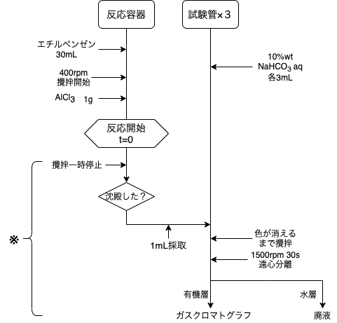
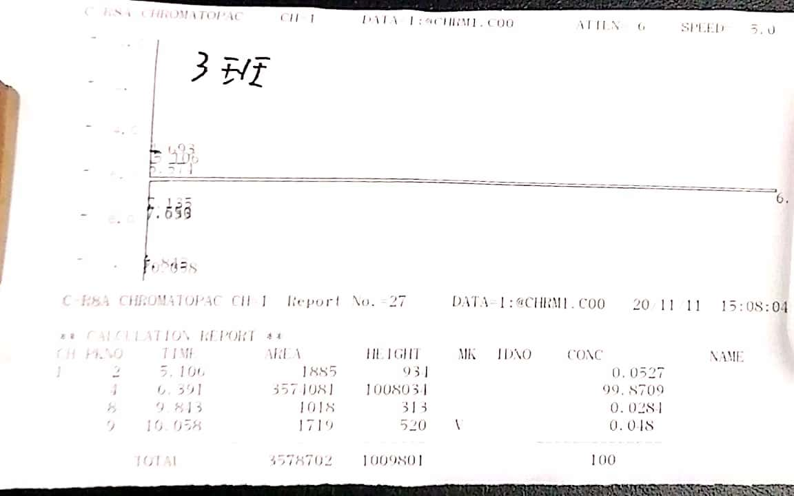
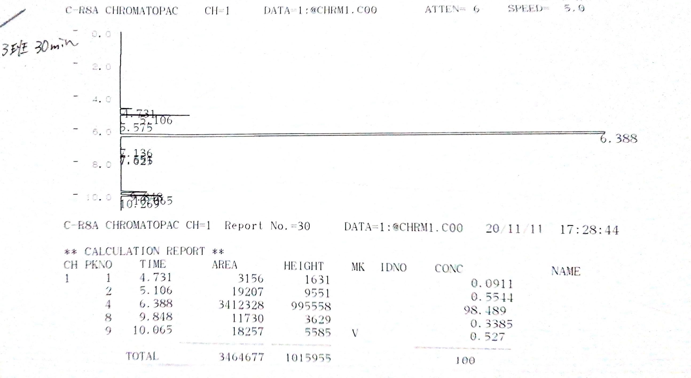
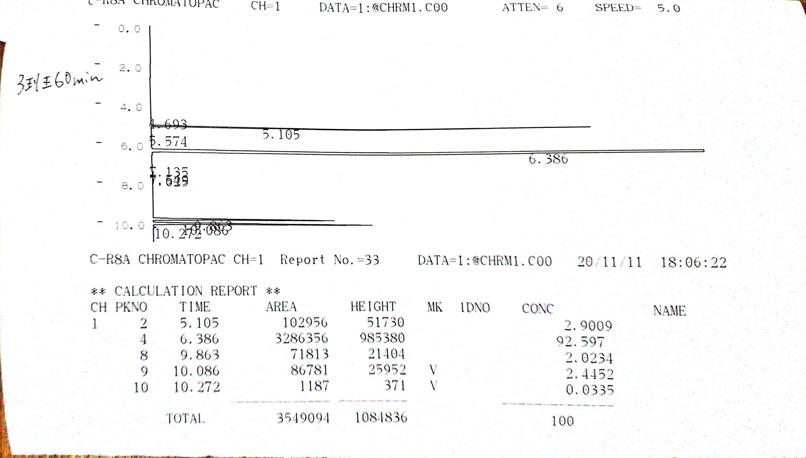
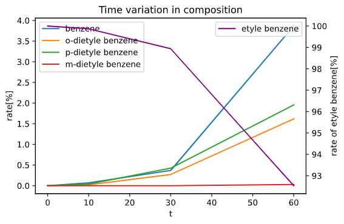

# 1.緒言  

今回の実験では、フリーデルクラフツ反応を取り扱った。この反応はベンゼンのアルキル化に広く工業的に応用されている反応である。また、触媒として塩化アルミニウムを用いる点で特徴的である。今回は、反応物としてエチルベンゼンを用い、ジエチルベンゼンを合成した。

# 2.原理  

今回取り扱うフリーデルクラフツ反応は、一般的に反応式(1)で表される。まず、ハロゲン化アルキルとルイス酸触媒である塩化アルミニウムが結合することでカルボカチオンが生成し、ベンゼンに対して求電子攻撃をする。これによりベンゼノニウム中間体が生成し、プロトンが脱離することでアルキル化が完了する。今回は、反応物としてエチルベンゼンを用い、第一段階で塩酸と反応させることでカルボカチオンの分極性錯体を生成する(反応式２)。この反応によりベンゼンが生じるため、今回はベンゼン、エチルベンゼン、ジエチルベンゼンの三種類の物質が関連する不均化反応となる。  

# 3.実験方法

## 3.1 試薬

試薬|濃度|使用量|
|----|----|-----|
|エチルベンゼン|-|30mL|-|
|$\ce{AlCl3}$|-|1g|
|$\ce{NaHCO3 aq}$|10 wt%|9mL|  

* $\ce{NaHCO3 aq}$は各試験管に3mLずつ使用した。
* エチルベンゼンの比重を0.866[g/mL],モル質量を25.98[g/mol],塩化アルミニウムのモル質量を133.34[g/mol]とすると、エチルベンゼンの使用量は0.245[mol],塩化アルミニウムの使用量は0.0075[mol]と計算された。  
  
#### 3.2 実験装置  

今回の実験では、以下のような反応容器を用いた。  

{height=60mm}

#### 3.3 実験操作  

実験操作のフローチャートを示す。

{height=80mm}  

1. 塩化カルシウム管を作成し、実験装置を組み立てた。
2. 反応容器にエチルベンゼンを入れ、400rpmで攪拌を開始した。
3. 試験管三本に$\ce{NaHCO3 aq}$をそれぞれ3mLずつ入れた。
4. 反応容器に$\ce{AlCl3}$を1g一度に加えた。この時点を反応開始とした。
5. 反応開始から10分後に一度攪拌を止め、固体が沈殿してから上澄を1mL採取し、試験管に移した。
6. 試験管に加えた液体が白色になるまで攪拌した。この攪拌が終わった時点で反応終了とした。
7. 1500rpmで30秒間遠心分離を行い、完全に有機層と水層を分離させた。
8. 分離した有機層のみをバイアルに移し、ガスクロマトグラフィーで分析した。
9. 6~8(図の※)をt=30min,60minでも同様に行った。  

t=30で採取したサンプルは、有機層を取り出す際に水層が混入した。  

# 4.結果

## 実験中の観察結果  

反応開始直後は白色の懸濁液だったが、開始2分30秒あたりから溶液が黄色に変色し始めた。反応開始22分ごろには濃い黄色になった。また、試験管で分液を行った際、$\ce{NaHCO3 aq}$と混合すると二酸化炭素と思われる気体が発生した。

## ガスクロマトグラフィー結果

t=10,30,60minの時のガスクロマトグラフィー結果を以下の図に示す。  

  
  
  

また、保持時間から各ピークの帰属を判定した。この結果と各ピークの面積をt=10,30,60minそれぞれについて以下の表に示す。  

##### t=14.50min  

|保持時間[min]|物質|ピーク面積比|
|-------|--------|---------|
|5.106|ベンゼン|1885|
|6.391|エチルベンゼン|3571081|
|9.813|o-ジエチルベンゼン|1018|
|10.058|p-ジエチルベンゼン|4719|  

##### t=36.38min  

|保持時間[min]|物質|ピーク面積比|
|-------|--------|---------|
|4.731|＊|3156|
|5.106|ベンゼン|9551|
|6.388|エチルベンゼン|3412328|
|9.848|o-ジエチルベンゼン|11730|
|10.065|p-ジエチルベンゼン|18257|  

##### t=63.23min  

|保持時間[min]|物質|ピーク面積比|
|-------|--------|---------|
|5.105|ベンゼン|102956|
|6.386|エチルベンゼン|3286356|
|9.863|o-ジエチルベンゼン|71813|
|10.086|p-ジエチルベンゼン|86781|
|10.272|m-ジエチルベンゼン|1187|  

* ＊のピークは、容器に付着していたアセトンであると考える。  
  
## 組成の時間変化 

ピーク面積比から、各反応時間におけるそれぞれの成分の組成を求めた。ピーク面積比は炭素数に比例するため、まず炭素数の補正を行い、全体との面積比を計算した。また、t=30で見られたアセトンと思われるピークは除外して計算した。  

|t|ベンゼン[%]|エチルベンゼン[%]|o-[%]|p-[%]|m-[%]|
|---|----|-----|----|---|----|
|14.50|0.070| 99.8|  0.023| 0.038|-|
|36.38|0.367| 98.2|  0.27|  0.42|-|
|63.23| 3.87| 92.5| 1.61 |  1.95| 0.027|

また、この時間変化をグラフに表すと以下の通りとなる。  

{height=60mm}  
　
# 5.考察  

4.結果で得られた、組成の時間変化から以下の考察を得た。  
t=10の時点では、検出されたベンゼンはo-ジエチルベンゼン、p-ジエチルベンゼンよりも多く、反応式２で表される錯体生成の方が支配的であったことがわかる。  
t=30ではジエチルベンゼンの方が多く検出されたことから、十分な錯体が生成したことによりアルキル化反応が支配的となったと考える。さらに、この段階では生成したベンゼンの内一部がアルキル化し、エチルベンゼンに戻る反応も同時に起きていると考える。  
t=60では再びベンゼンの方が多く検出された。またt=30からt=60の間でベンゼン、ジエチルベンゼンの割合は急激に増加し、エチルベンゼンの割合は急激に減少した。この点から、この反応の反応速度式は指数関数型であると考える。  
全体を通して、ジエチルベンゼンの異性体比率はo-体よりもp-体の方が高かった。これはエチル基の立体障害によりp-体の方がカルボカチオンによる攻撃が起こりやすいためであると考える。一方で、この反応はo-,p-配向性であるが、t=60の段階ではm-体が検出された。これは求電子試薬であるカルボカチオンの反応性が高いためであると考える。この考えは文献1記載の「Brownの選択性」により支持されるものである。  

また、反応溶液の色の変化は溶出したアルミニウムイオンのためと考える。  

# 6.設問  

### (1)  

1.諸言を参照  

### (2)  

5.考察を参照  

### (3)  

今回の反応では、反応式(2)の錯体生成反応で1分子の触媒が使われることから、発生するジエチルベンゼンと当量の塩化アルミニウムが必要であると考える。3.1より、エチルベンゼン・塩化アルミニウムの使用量はそれぞれ0.245[mol],0.0075[mol]である。t=60では、最初に加えたエチルベンゼンの内、3.56[%]がジエチルベンゼンとなったことからジエチルベンゼンは約0.00872[mol]生成したと考える。このことから、塩化アルミニウムは触媒として作用した他、実験中に一部が再生したと考える。

### (4)

アルキル基は活性o-,p-配向性であり、ベンゼンに導入されることで反応性をあげる働きがある。このため、同じベンゼン環に多数のアルキル基が導入されるポリアルキル化が起こりやすいため、多量のベンゼンを使用することでベンゼンの転化率を低く抑え、ポリアルキル化を防止する。  

### (5)  

A: 2-メチルフェニルエチルケトン
B: 2-クロロプロパン  

生成物は、アシル基がm-配向性であり、アルキル基がo,p-配向性であることから以下のような構造であると考える。  

{height=60mm}  

### (6)  

|物質|沸点[℃]|融点[℃]|
|----|---|----|
|ベンゼン|80.1|5.5|
|エチルベンゼン|136|9.5|
|p-ジエチルベンゼン|183.8|-42.83|  

沸点はベンゼン＜エチルベンゼン＜p-ジエチルベンゼンの順であった。これは分子量の順と一致する。有機化合物一般において、分子量と沸点は正の相関があるため、この３種類の物質においても同様の傾向が見られたと考える。  
融点はp-ジエチルベンゼン＜ベンゼン＜エチルベンゼンの順であった。p-ジエチルベンゼンは分子が細長い形をしているため、結晶化する際の軸が1-4の一方向に偏ると考える。そのため結晶構造が崩れやすく、融点が低いと考える。  

### (7)  

《可燃有機廃液》  

* AlCl3(濾過残渣)
* エチルベンゼン
* ジエチルベンゼン
* ベンゼン
* アセトン

《難燃有機廃液》  

* AlCl3(濾過残渣)
* エチルベンゼン
* ジエチルベンゼン
* ベンゼン
* アセトン
* 水

東北大学環境保全センターにおいては、可燃性廃液は噴霧焼却処理を行う。この処理の原理は、霧状にした廃液を火炎により燃焼させることである。水を含む難燃有機廃液は、高温熱分解を行う。  

# 7.参考文献  

* ボルハルトショアー現代有機化学(第6版)[上]
  訳:村橋俊一  
  (株)東京化学同人
  2012/9/30
* ボルハルトショアー現代有機化学(第6版)[下]
  訳:村橋俊一  
  (株)東京化学同人
  2016/9/20  
* https://www.chem-station.com/odos/2009/06/friedel-crafts-friedel-crafts-1.html  フリーデル・クラフツアルキル化 Friedel-Crafts Alkylation | Chem-Station (ケムステ)  
* http://www.env.tohoku.ac.jp/syori14.html 東北大学環境保全センター