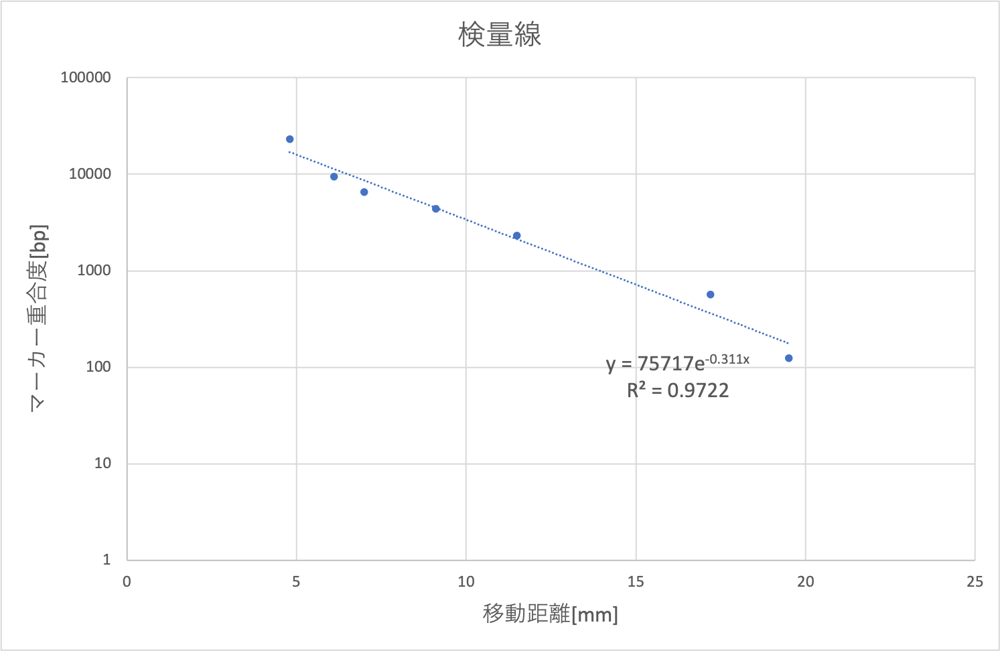
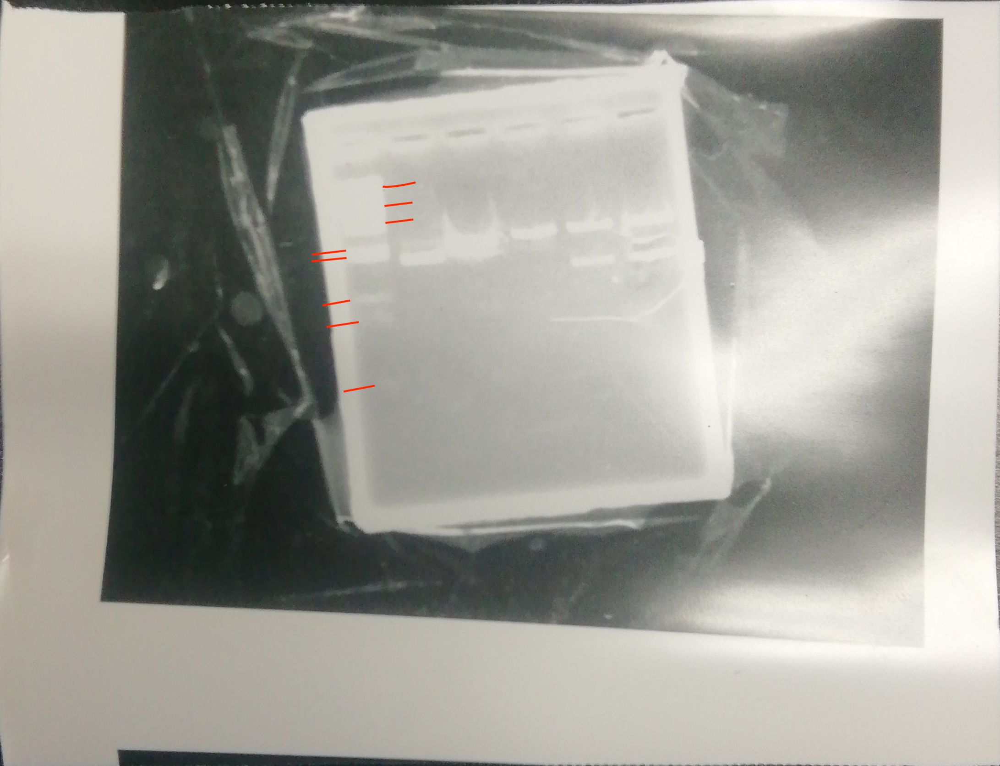

# 課題

### (1)

本テーマの操作を用いて, どのような応用が成されているか、ガイダンスの内容を 踏まえて、簡潔に記述せよ(400 字程度)。  

　　細菌の持つ遺伝情報は環状のプラスミドに保存されており、細菌はこれらの遺伝子を転写、翻訳、修飾することで生存に必要なタンパク質を合成する。  
今回の実験と同様に、細菌の持つプラスミドに特定の配列をコードした核酸をインサートすることができる。有用なタンパク質をコードした核酸をインサートすることで、そのようなタンパク質を合成する細菌を作り出すことができる。  
このように、細菌のタンパク質合成経路を用いて酵素、抗体などの有用なタンパク質を人工的に合成することができる。  
このようにして合成されるタンパク質は医薬品や研究用の抗体などに用いられる。特に、緑色蛍光タンパク質をはじめとする蛍光タンパク質は、抗体に結合させることで特定の細胞やウイルスの標識となる。また、抗体合成においては細胞を免疫することで得られる抗体はポリクローナル抗体となり、複数の構造を持つ抗体が混ざったものとなる。細菌によるタンパク質合成を用いることで、簡便にモノクローナル抗体を合成することができる。  

### (2)

抗生物質であるアンピシリンを含む寒天培地上でなぜコロニーが形成されるのか 説明せよ。  

今回用いたプラスミドは、全てアンピシリン耐性遺伝子を含んでいる。プラスミドの導入が成功した大腸菌はこの遺伝子によりβ-ラクタマーゼというタンパク質を産生することができ、抗生物質を無害化することができるためコロニーが形成される。  

### (3)

カラーセレクションの原理を説明せよ。  

今回、プラスミドAのマルチクローニングサイトはβ-ガラクトシダーゼというタンパク質をコードしているLacZという遺伝子の部分であった。  
今回、大腸菌はX-gal(4-クロロ-3-インドール-β-D-ガラクトシド)を含む培地で培養した。インサートが行われなかったプラスミドAを持つ大腸菌は、このX-galを分解することで青色の物質を産生し、青色のコロニーを形成する。  
一方で、インサートが行われたプラスミドを持つ大腸菌はX-galを分解できず、白色のコロニーを形成する。この色の違いを用いて形質転換が行われたプラスミドを抽出する方法がカラーセレクションである.  

### (4) 

ゲル溶解緩衝液とシリカビーズを用いたプラスミド精製について原理を説明せよ。  

負電荷を帯びたリン酸基を持つDNA、電気陰性度の大きい酸素原子を表面に持つシリカビーズは共に表面に多くの水分子を吸着する。ゲル溶解緩衝液には、水と親和性の非常に大きいカオトロピック試薬が添加されており、シリカビーズ・DNA表面から水分子を引き剥がす働きがある。この試薬によりDNAとシリカビーズが疎水性相互作用で引き合うことでDNAがシリカビーズに吸着され、プラスミドとゲルを分離することが可能である。  

### (5) 

出現したコロニーの中で何％が目的とするプラスミドDNAを保有するコロニーであるかを,計算過程も含めて記述せよ。  

(3)のカラーセレクションを用いると、白色のコロニーがインサートが成功したプラスミドを持つコロニーである。今回は図1のように97個のコロニーが出現し、全て白色だったため100%が目的とするインサートが行われたベクタープラスミドを保有していると考える。

### (6) 

出現したコロニーがすべて白色であると仮定した場合、プラスミド 1 μg あたり何 個のコロニーが形成されたか、計算過程も含めて記述せよ、ただし制限酵素の切 断効率は100%,ゲルからのDNAの回収効率は39%, 連結反応の効率は55%とす る。また制限酵素の切断によりプラスミドAの重合度は変化しないものとし, 塩基の 平均分子量は 308とする。  

まず、電気泳動を行った時点でのA,Bそれぞれのプラスミドの物質量を求める。(7)の検量線、泳動結果により、得られたプラスミドの塩基対数[bp],分子量[g/mol]は以下の通りであることがわかった。  

|プラスミド|塩基対数[bp]|分子量[g/mol]|
|--------|-----------|------------|
|A|2325.2|1432323.2|
|B(ベクター)|2118|1304688|
|B(インサート)|629.7|387895.2|  

また、各マイクロチューブに反応溶液が45µL,プラスミド溶液を5µL,泳動用色素を5µL加え、合計55µLの内、各ウェルに25µLずつ添加した。この55µLの溶液には、濃度150ng/µLのプラスミド溶液5µL分のプラスミドが含まれている。このことから、A,B各レーンに存在したプラスミドは  

$$150\mathrm{[ng/µL]}\times5\mathrm{[µL]}\times\cfrac{25}{55}=340.9\mathrm{[ng]}$$

と計算された。Bでは、ベクターとプラスミドそれぞれのバンドが見られた。各バンドに含まれるプラスミドの質量は分子量の比と一致するため、B(インサート)のプラスミドは

$$340.9\mathrm{[ng]}\times\cfrac{387895.2}{387895.2+1304688}=78.13\mathrm{[ng]}$$  

であったと考える。ゲルからのプラスミド回収効率は39[%]であることから、A,Bインサートのプラスミドはそれぞれ以下の物質量[mol]得られた。  

$$\begin{aligned}
A&~~~340.9\mathrm{[ng]}\times\cfrac{39}{100}\times\cfrac{1}{1432323.2\mathrm{[g/mol]}}=9.22\times10^{-14}\mathrm{[mol]}\\
B&~~~78.13\mathrm{[ng]}\times\cfrac{39}{100}\times\cfrac{1}{387895.2\mathrm{[g/mol]}}=7.86\times10^{-14}\mathrm{[mol]}
\end{aligned}$$  

これら全てのプラスミドが13[µL]の$dd\ce{H2O}$に溶け出したと考える。Aのプラスミドは13[µL]の内4[µL],Aのプラスミドは10[µL]を連結に使用したため、連結に用いたプラスミドはA,Bそれぞれ以下の通りである。  

$$\begin{aligned}
A&~~~9.22\times10^{-14}\mathrm{[mol]}\times\cfrac{4}{13}=2.83\times10^{-14}\mathrm{[mol]}\\
B&~~~7.86\times10^{-14}\mathrm{[mol]}\times\cfrac{10}{13}=6.05\times10^{-14}\mathrm{[mol]}
\end{aligned}$$  

AのプラスミドとBのインサートは物質量比1:1で連結するため、今回の実験では最大で$2.83\times10^{-14}\mathrm{[mol]}$のベクターが生じたと考える。しかし、連結効率が55[%]であることから実際に生じたベクターは

$$2.83\times10^{-14}\mathrm{[mol]}\times\cfrac{55}{100}=1.5565\times10^{-14}\mathrm{[mol]}$$

である。また、連結して生じたプラスミドの分子量はBのインサート部分とプラスミドAの合計であると考えたため、以下の値を用いた。

$$143233.2\mathrm{[g/mol]}+387895.2\mathrm{[g/mol]}=1820218.4\mathrm{[g/mol]}$$  

以上から、今回生じたプラスミドベクターの質量は

$$\begin{aligned}
1820218.4\mathrm{[g/mol]}\times1.5565\times10^{-14}\mathrm{[mol]}&=2833169\times10^{-14}\mathrm{[g]}\\&\fallingdotseq2.833\times10^{-2}\mathrm{[µg]}
\end{aligned}$$  

大腸菌の培養により得られたコロニーは(6)の通り97個で、全て白だったことから、プラスミド1[µg]あたりに得られるコロニーは  
$$\cfrac{97個}{2.833\times10^{-2}\mathrm{[µg]}}=3.42\times10^{3}\mathrm{[個/µg]}$$  

と計算できる。

### (7)

作成した片対数グラフを使用し, 制限酵素処理により生じた各 DNA断片の重合度を求めよ。  

切断されたプラスミドA、プラスミドB(ベクター・インサート)は(6)の通りである。電気泳動の結果は以下の図2であり、赤線を引いた重合度マーカーについて移動距離を測定し、片対数グラフを指数関数近似することにより検量線を得た。移動距離の測定結果を以下の表に、グラフと検量線を以下の図3に示す。また、移動距離はウェルの上部からバンドの上部までの距離とした。  

|マーカー[bp]|移動距離[mm]|
|-----------|----------|
|125|19.5|
|564|17.2|
|2332|11.5|
|4361|9.1|
|6557|7.0|
|9416|6.1|
|23130|4.8|  

### (8)

制限酵素処理したプラスミドAと未切断のプラスミドAの移動度の差が何に起因するか記述せよ。  

この移動度の差はDNAの幾何的な構造に起因する。  
切断酵素処理が行われたプラスミドAは、環の一部が切れることにより直鎖状を取る。一方で未切断プラスミドAは環状構造である。このような環状のプラスミドは、通常、高次の螺旋構造をとり、コンパクトに折り畳まれている。コンパクトな環状プラスミドはアガロースゲルの網目に絡まらないため移動度が大きく、直鎖状のDNAは網目に絡まるため移動度が小さい。

### (9) 

実際に実験に用いた制限酵素の認識配列と切断様式を記載せよ、またメチル化の影響を受ける配列と, その生物学的意義を記述せよ.  

今回用いた$HindI\hspace{-.1em}I\hspace{-.1em}I$,$Acc1$は、それぞれ以下のような６塩基を認識する。MはAまたはC、KはTまたはGである。  

$$\begin{aligned}
5'-AAGCTT-3'\\
3'-TTCGAA-5'
\end{aligned}
$$

$$\begin{aligned}
5'-GTMKAC-3'\\
3'-CAKMTG-5'
\end{aligned}
$$
$HindI\hspace{-.1em}I\hspace{-.1em}I$はA-A間を、Acc1はT-M間をそれぞれ切断する。$HindI\hspace{-.1em}I\hspace{-.1em}I$は1番目のA,3番目のGにメチル化が起きている時は影響を受けない(切断がおこる)が、2番目のA,RNA状態での5,6番目のUにメチル化が起きている時は切断が起こらない。$Acc1$は2番目のT、4番目のK,5番目のAにメチル化がおこる可能性があるが、いずれも影響がなく、切断がおこる。メチル化酵素は生物によって固有である。また、制限酵素はその生物種に含まれない異物としてのDNAを切断し、働かなくするための一種の防御機構である。そのため、制限酵素がメチル化により配列を切断できなくなる現象はDNAを守るための修飾であると考える。一方で、メチル化の影響を受けない(切断される)配列はその生物種では起こらないメチル化が起こったものと考える。各制限酵素について、名称、認識配列、切断様式、メチル化の影響を受ける配列、受けない配列を以下の表に示す。 

|名称|認識配列|切断様式|メチル化の影響あり|なし|
|---|--------|------|---------|------|
|$HindI\hspace{-.1em}I\hspace{-.1em}I$|$\begin{aligned}5'-AAGCTT-3'\\3'-TTCGAA-5'\end{aligned}$|A-A間|$\begin{aligned}^{6m}AAGCTT\\AAG^{5m}CTT\end{aligned}$|$\begin{aligned}A^{6m}AGCTT\\AAGC^{5hm}U^{5hm}U\end{aligned}$|
|$AccI$|$\begin{aligned}5'-GTMKAC-3'\\3'-CAKMTG-5'\end{aligned}$|T-M間|$\begin{aligned}GTMK^{6m}AC\\GTMKA^{5m}C\\GT^{5m}CGAC\end{aligned}$|-|

### (10)

制限酵素の1ユニット(U)は, 1時間で1μgの DNAを完全に消化できる酵素活性であると定義すると, 本実験でプラスミドAを完全に消化するためには最低何μlの制限酵素のが必要であったか、また本実験では最低何分の消化時間が必要であったかを計算過程も含めて記述せよ。  

本実験では、プラスミドAを0.75[µg]用いた。1ユニットは、酵素が一時間あたりに1[µg]の基質を反応させることができる量である。10ユニットでは一時間あたりに10[µg]反応させることができる。以上から、今回のプラスミドAを完全に分解するには  

$$1\mathrm{[µl]}\times\cfrac{0.75}{10}\mathrm{[µg]}\times\cfrac{60}{50}[min]=0.09\mathrm{[µL]}$$

必要である。さらに、最低限必要な時間は  

$$\cfrac{60\mathrm{[min]}}{10\mathrm{[µg]}}\times0.75=4.5\mathrm{[min]}$$
である。  

参考文献  
https://www.thermofisher.com/jp/ja/home/life-science/cloning/cloning-learning-center/invitrogen-school-of-molecular-biology/molecular-cloning/restriction-enzymes.html  制限酵素について学ぶ | Thermo Fisher Scientific - JP  

https://catalog.takara-bio.co.jp/product/basic_info.php?unitid=U100002660  制限酵素活性に対するメチル化の影響｜タカラバイオ株式会社