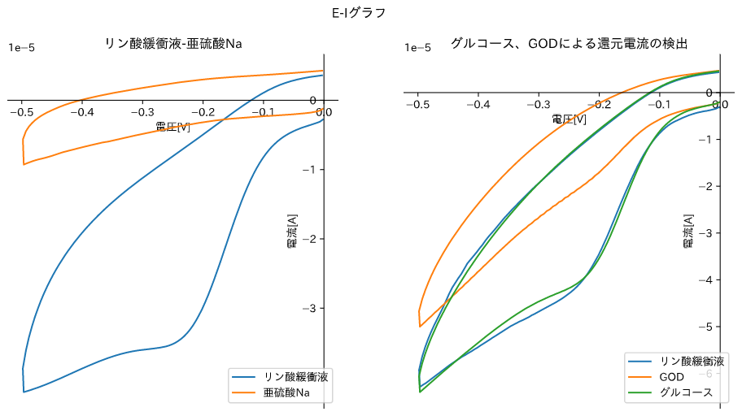
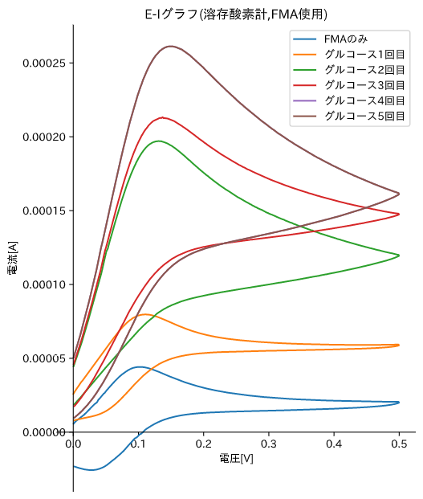
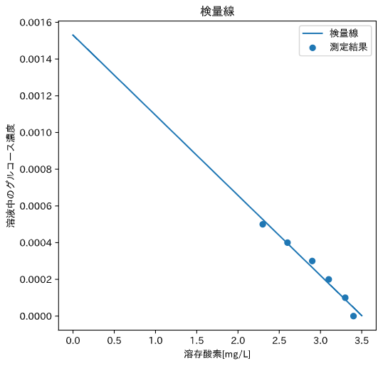

---
output:
  pdf_document:
    latex_engine: lualatex
documentclass: ltjsarticle
filters:
  - pandoc-crossref
header-includes: \usepackage[version=4]{mhchem}
  \usepackage{siunitx}
  \usepackage[margin=1in]{geometry}
  \usepackage{amsmath}
---

# 1.諸言

今回の実験では、代表的なバイオセンサーである酵素を用いたグルコースセンサーを実際に作成し、主に電気化学的側面から測定原理を学ぶ。  

# 2.原理

## 酵素の固定化  

今回作成するグルコースセンサーは、酵素反応に伴って生じる酸化電流・還元電流を測定する。そのため、センサーの装置内に酵素を固定しておく必要がある。酵素の多くはタンパク質であり、熱・酸・塩基などで変性するため、酵素活性に影響を及ぼさない固定化法が用いられる。代表的なものが以下の3つである。  

#### 担体結合法

固体表面に酵素を化学的に結合させる方法である。担体となる固体の表面をアミノ酸などで処理し、直接結合させる他、官能基を多く持つ架橋試薬を用いて結合させる方法がある。架橋試薬は担体・酵素間を結合する際に糊のような役割をはたす。結合にはジアゾカップリング、アルキル化、ペプチド結合などが用いられる。このような結合法は共有結合を用いるため強固に固定することが可能である。

#### 架橋法

酵素同士を結合させることで架橋構造を作り、大きな塊とすることで不溶化する。この際に上記のアルブミンのような不活性タンパク質を混合させることがある。

#### 包括法  

高分子ゲル中に酵素を閉じ込める方法である。基質は分子が小さいため、ゲルの穴を通って酵素と反応するが、熱や衝撃などからは酵素を守ることができ、酵素活性の保持に適している。しかし、酵素反応の律速段階はゲル中の基質の拡散となるため、正確な反応速度の測定には適さないという欠点がある。

## グルコースセンサーの原理  

電気化学反応を用いるグルコースセンサーは第一世代・第二世代に分けられる。双方に共通して、グルコースオキシダーゼ(GOD)を呼ばれるグルコースの酸化酵素を電極表面に固定し、反応させる。  
GODは酸素を消費して以下の反応を起こし、グルコースを酸化してグルコノラクトンを生成する。

$$\ce{C6H12O6 + O2 ->[GOD] C6H10O6 + H2O} $$  

溶存酸素計(ポテンショスタット)は、電極における酸素の還元反応

$$\ce{O2 + 2e- + 2H+ -> H2O2}$$

における還元電流を測定することで溶存酸素
量を測定する。酵素反応によって溶液中の酸素が消費されると、この還元電流が減少することからグルコースの濃度を測定することができる。  

第二世代のグルコースセンサーは、電子伝達にメディエーターと呼ばれる物質を用いる。GODは酸素以外にも、以下のようにメディエーターを用いてグルコースを酸化することが可能である。以下の反応式は、メディエーターとしてフェロセンメタノール(FMA)を用いた例である。  

$$\ce{C6H12O6 + 2FMA+ ->[GOD] C6H10O6 + 2FMA + 2H+}$$  

電極ではFMAが以下のように酸化されるため、酸化電流がみられる。

$$\ce{FMA -> FMA+ + e-}$$

酵素反応により$\ce{FMA+}$が消費されると、FMAが増加し、酸化電流が多く検出されるようになる。この電流の変化を検出するのがメディエーター型のグルコースセンサーである。  

# 実験方法  

## 試薬  

* グルコースオキシダーゼ(GOD,10mg/mL)
* D-グルコース
* D-フルクトース
* リン酸二水素カリウム($\ce{KH2PO4}$)
* リン酸二水素ナトリウム($\ce{Na2HPO4}$)
* 塩化カリウム
* グルタルアルデヒド(25wt%)
* 子牛血清アルブミン(BSA,5mg/mL)
* フェロセンメタノール(FMA)
* 亜硝酸ナトリウム  

各試薬の使用量・実使用量を以下の表に示す。  

|試薬|使用量|実使用量[mg]|
|----|------|------|
|リン酸二水素カリウム|850.56[mg]|-|
|リン酸二水素ナトリウム|887.25[mg]|880.5[mg]|
|塩化カリウム|1.864[g]|1.863[g]|
|1Mグルコース溶液|1.8016[g]|1.8064[g]|
|0.1Mグルコース溶液|0.18016[g]|0.1844[g]|
|0.1Mフルクトース溶液|0.18016[g]|0.1806[g]|
|亜硝酸Na|0.2[g]|0.2002[g]|
|FMA(純度97%)|11.137[mg]|10.90[mg]|  

また、式量は以下の値を用いた。  

|物質|分子式|式量|
|---|-----|-----|
|リン酸二水素カリウム|$\ce{KH2PO4}$|136.09|
|リン酸二水素ナトリウム|$\ce{Na2HPO4}$|141.96|
|塩化カリウム|$\ce{KCl}$|74.55|
|グルコース|$\ce{C6H12O6}$|180.16|
|フルクトース|$\ce{C6H12O6}$|180.16|
|FMA|$\ce{C11H12FeO}$|216.06|

## 実験器具・装置  

* スターラー
* 溶存酸素計(ポテンショスタット)
* ボルタグラム

今回用いたボルタグラムは、三電極型で作用電極に酵素処理した金電極、対電極に白金、参照電極にはAg/AgCl電極を用いた。  

<図を載せる>  

## 手順  

#### 操作1　リン酸緩衝液の調整  

1. リン酸二水素ナトリウム、リン酸二水素カリウム、塩化カリウムをそれぞれ秤量し、250mLの蒸留水で定容することでそれぞれ25mM,25mM,0.1Mのリン酸緩衝液を調整した。
   
#### 操作2 ナイロン薄膜の調整

1. 25wt%グルタルアルデヒド溶液に水を1mL加え、ナイロン片を浸して45分間放置した。  
2. 取り出したナイロン片を蒸留水で洗浄し、10mg/mLGOD溶液100µLとリン酸緩衝液1mLの混合液に浸して1.同様45分間放置した。
3. 取り出したナイロン片を蒸留水で洗浄し、リン酸緩衝液中で保管した。
   
#### 操作3　金電極の調整  

1. 1.5mLのエッペンチューブに、GOD,BSAをそれぞれ10µLずつ入れ、混合した。
2. 混合した溶液にグルタルアルデヒド溶液を10µL混合し、この液体をピペットマンを用いて金電極表面に塗布した。  

#### 操作4 ポテンショスタットによる測定  

1. 100mLビーカーにリン酸緩衝液50mLを入れ、酵素処理をしていない金電極、白金電極、参照電極を接続した。
2. 電圧範囲を0V~-0.5Vに設定し、変化速度を50mV/sとして測定を行った。
3. 2.の溶液に亜硫酸ナトリウムを加え、同条件で測定した。
4. 溶液を一度捨て、新しく50mLのリン酸緩衝液を用意した。
5. 2.と同様に測定を行った。
6. 5の溶液に0.1[M]グルコース溶液を2mL加え、測定を行った。
7. 6の溶液にGOD溶液を0.5mL加え、電流の測定を行った。  

####  操作5 ポテンショスタットによる測定(FMA使用)

1. 100mLビーカーにFMAを加え。少量のエタノールで溶解させた。
2. 1の溶液にリン酸緩衝液を50mL加え、操作3同様に電極を固定した。また、金電極は酵素処理したものを用いた。
3. 電圧範囲0.5V~-0.5V,変化速度を20mV/sとし、電流の測定を行った。
4. 1[M]グルコース溶液を0.5mL加え測定を行った。
5. 4を5回行った。
   
#### 操作6 グルコースセンサーの作成 

1. 溶存酸素計のプローブにリン酸緩衝液を1滴滴下し、操作2で調整したナイロン膜を被せ、ナイロンネットを被せて輪ゴムで固定した。
2. リン酸緩衝液50mLを50mLの蒸留水で希釈し、攪拌子とグルコースセンサーを挿入した。
3. 溶存酸素量を1分お気に測定し、値が安定した時点をt=0とした。
4. t=0の時点で0.1Mグルコース溶液を100[µL]加え、1分おきに溶存酸素量を測定した。
5. 値に変動がみられなくなったところで4と同量のグルコース溶液を加え、1分おきの測定を行った。
6. 5を合計4回行い、グルコース総投入量500[µL]となるまで測定を行った。
7. 測定結果のうち、グルコースを投入したあと値に変動がみられなくなった時の溶存酸素量をその濃度での溶存酸素量とし、溶存酸素量-グルコース濃度をプロットした。
8. 7のグラフに最小二乗法で回帰直線を引き、これを検量線とした。

#### 操作7 未知濃度グルコースの測定  

1.  操作6同様にリン酸緩衝液50mLを蒸留水50mLで希釈し、グルコースセンサーを挿入した。
2.  溶存酸素量を1分おきに測定し、値が安定したところで0.1Mフルクトース溶液を300[µL]加え、1分おきに5回測定を行った。
3.  次に、濃度未知のグルコース溶液を100[µL]加え、値が変動しなくなるまで1分おきに測定をおこなった。

# 4.実験結果  

#### ポテンショスタットの計測結果  

操作3でおこなった電気化学測定の結果を以下のグラフに示す。  

  

また、操作4で行ったFMAを用いた電気化学測定の結果を以下のグラフに示す。  

{height=100mm}

#### グルコースセンサーによる濃度測定  

グルコース添加量[µL]に対して、観測された溶存酸素量を以下の表に示す。  

|グルコース添加量[µL]|0|100|200|300|400|500|
|-----|---|----|----|----|---|----|
|溶存酸素[mg/L]|3.4|3.3|3.1|2.9|2.6|2.3|  

また、このグルコース添加量を溶液に対するグルコース濃度に変換し、作成した検量線が以下のグラフである。  

{height=60mm}

回帰直線は最小二乗法により決定した。回帰直線の式は以下の通りである。(y:溶液に対するグルコース濃度、x:溶存酸素)  

$$y=0.0015306-0.00043657x$$  

100[µL]加えた濃度未知のグルコース溶液は、回帰直線から0.35[M]と求めることができた。  

# 5.課題  

###### 課題1

* ナイロン膜  
  架橋試薬にグルタルアルデヒドを用いた担体結合法である。まず、ナイロン膜表面のアミノ基とグルタルアルデヒドを反応させ、酵素が結合できるようにした。そのグルタルアルデヒドと酵素が科学的に結合することで酵素を固定する。  
  グルタルアルデヒドは官能基が多いため、酵素を結合させておくのに有効である。今回は、ナイロン膜と酵素の両方に結合する糊のような役割である。

* 金電極
  架橋法である。今回は、不活性タンパク質ゲルとして子牛血清アルブミンを用いた。架橋に用いる分子は上記の担体結合法にも用いたグルタルアルデヒドである。

また、他の固定化法として代表的な包括法に関しては、2.原理を参照。

##### 課題2

操作4で得られたグラフは、溶存酸素計で測定したものである。そのため、グラフの形状は酸素の量に影響を受ける。大部分が電流・電圧共に負の部分にあった。これは、電極反応中では以下の還元反応が支配的であり、還元電流が観測されていると言える。
$$O^2 + 2e^{-}+ 2H^{+}\rightarrow H_2O_2$$
また、緩衝液よりも亜硝酸Naを加えた計測結果の方がグラフが上方向にシフトしており、還元電流の大きさが小さくなっていると言える。これは、酸素と亜硝酸Naが反応し、酸素が消費されることで溶存酸素が減少し、電極反応が起こりにくくなったために還元電流が減少したと言える。  
また、下のグラフについて、以下の二点が言える。  
まず、緩衝液とグルコースを加えた溶液のグラフがほぼ一致することである。このグラフは先述のとおり酸素の還元電位を示しており、溶存酸素量に影響を受ける。このことから、グルコースの有無は溶存酸素量に影響しないということが言える。  
二点目に、GODを加えると還元電位が減少した点である。これは、以下のGODによる酵素反応で酸素が消費され、電極での還元反応が起こりにくくなったためと考える。
$$\ce{C6H12O6 + O2 ->[GOD] C6H10O6 + H2O}$$  

また、両方のグラフにおいてグラフの電流が正になっている、つまり酸化電流が観測されていることがわかる。これは、酸素の還元によって発生した過酸化水素が酸化され、酸素に戻る際の酸化電流が検出されたものと考える。  

操作5で得られたグラフの大部分は電流、電圧共に正の部分にみられた。これは、溶液中にメディエーターとして加えたFMAが酸化する際の酸化電流を検出しているためと考える。GODによるグルコースの酸化は、酸化剤として$FMA^{+}$を用いることもできる。よって以下の反応
$$\ce{C6H12O6 + 2FMA+ ->[GOD] C6H10O6 + 2FMA + 2H+}$$
がおこるため酵素反応が活発になるとFMAが生じる。つまり、酵素反応が活発になると酸化電流が多く検出されるようになる。  
このことから、グルコースを投入するたびにグラフが上にシフトすることが説明できる。  
シフト幅はグルコース濃度が大きくなるほどに小さくなる。これは、基質過剰により反応の律速段階が基質の供給ではなく酵素反応になっているためと考える。

### 課題3

今回作成したグルコースセンサーは、(2)-操作3の電極反応を用いている。溶液中にグルコースが多いと酵素反応が活発になり、酸素が消費されるため還元電流が減少する。この溶存酸素計を用いる形式のグルコースセンサーを第一世代グルコースセンサーという。  
溶存酸素を測定するため、溶液中に酸素が溶解すると還元電流が多く検出され、感度に影響する。また、溶液中の酸素濃度の変動要因として温度が上げられる。  

### 課題4

酸素電極を用いたグルコースセンサーは上記のように、溶存酸素量に影響を受けるため感度が高くないのが短所である。一方でメディエーターを用いないため安価で作成できるというメリットがある。また、食品などにメディエーターが混入しない、という長所もある。  
メディエーター型は酸素電極を用いる第一世代と比べれば精度が高いが、メディエーターの劣化による精度の低下がデメリットである。  

### 課題5  

操作5で、フルクトースを加えた時は電流値の変動がみられなかったことから、GODはフルクトースとは反応しないと考える。GODは基質特異性を持つ酵素であるため、グルコースを選択的に酸化すると考える。この性質は、血糖値などの測定において他の糖の影響を受けない、という利点がある。  

### 課題6  

濃度未知のグルコース溶液について、検量線より求めたグルコース濃度が0.35[M]であった。これは、実際の値である0.27[M]よりも大きい値である。検量線において、後半の2ポイントについてはそれ以前よりも負の傾きが大きくなっていることがわかる。これは溶存酸素量の低下に対してグルコース濃度の差が大きいということであり、FMAを用いた測定結果から得られた基質過剰の時に酵素反応が進みにくくなる、というと知見と部分的に一致する。このことから、溶存酸素測定型のグルコースセンサーはグルコースの適応濃度範囲に限界がある、と言える。

# 6.参考文献

* https://www.toyo.co.jp/material/casestudy/detail/id=6923 電気化学測定　概説 - ポテンショスタット | 東陽テクニカ | “はかる”技術で未来を創る | 物性/ エネルギー