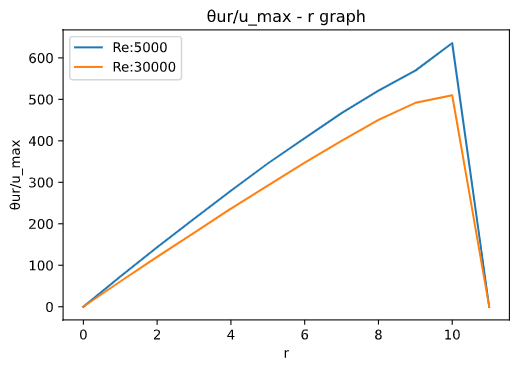
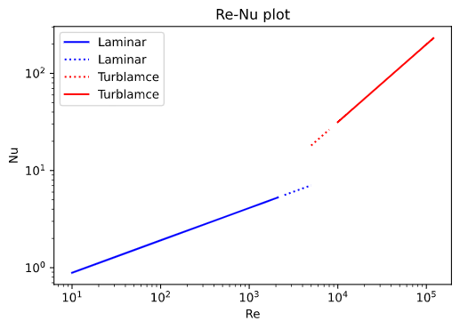

---
output:
    pdf_document: {latex_engine: lualatex}
documentclass: ltjsarticle
filters:
    - pandoc-crossref
header-includes: '\usepackage[version=4]{mhchem} \usepackage{chemfig} \usepackage{siunitx} \usepackage[margin=1in]{geometry}'
---  
  
  
##  1.緒言
  
  
今回は、三重管式熱交換器を用い、熱伝達機構に関する実験を行った。三重管式熱交換器は、外側の管に高温流体・内側の管に低温流体を流し、低温流体を加熱する装置である。この時、外管の流体から内管壁への対流伝熱・内管壁での伝導伝熱・内管壁から内管の流体への対流伝熱という三種類の伝熱機構が組み合わさっている。  
今回の実験では高温流体を水蒸気・低温流体を空気として、空気の流速を変化させて実験を行い、これら三種類の伝熱機構の寄与について分析した。  
  
##  2.理論
  
  
#####  伝導伝熱
  
  
伝導伝熱は、固体内部での伝熱機構であり、今回は内管壁の内部における伝熱機構がこれに当たる。伝導伝熱において、伝熱により伝わる熱量は温度勾配と伝熱面積に比例し、この時の比例定数が熱伝導率である。式で表すと以下の通りである。
  

  
  
  
式中のは温度を表す。この式はフーリエの法則と呼ばれる。
  
#####  対流伝熱
  
  
対流伝熱は固体と流体の界面における伝熱機構であり、内管壁と空気、蒸気と内管壁の間での伝熱に当たる。強制対流伝熱と自然対流伝熱の二種類があるが、今回は低温・高温それぞれの流体を逆向きに流して強制対流としているため、強制対流伝熱として扱う。  
対流伝熱により伝わる熱量は、伝熱面の面積と温度差に比例し、この比例係数が熱伝達係数である。式で表すと以下のようになり、これをニュートンの冷却法則という。  
  

  
  
  
熱伝達係数と伝熱係数、代表長さをまとめて、以下のヌセルト数(Nu)という無次元数で表す。
  

  
  
  
Nuはレイノルズ数(Re)、プラントル数(Pr)から算出され、流動状態によって以下のような実験式が当てはまる。  
  
【層流(Re≦2100)】  

  
  
  
【乱流(10000≦Re≦10000) :McAdamsの式】

  
  
  
今回の実験では、この二式を用いてNuを算出し、Nuから熱伝達係数を求めた。  
  
#####  総括伝熱係数
  
  
先述の通り、今回の熱伝達機構は伝導伝熱、対流伝熱を組み合わせたものである。各機構における伝熱量から全体の熱伝達係数を算出することができ、この値を総括伝熱係数という。
  
* 蒸気から内管外壁への対流伝熱
  
  

  
  
  
* 内管外壁から内管内壁への伝導伝熱
  
  

  
  
* 内管内壁から空気への対流伝熱
  
  

  
  
  
総括伝熱係数を用いると、
  

  
  
  
これは、模式的に表すと図1のようになり、総括伝熱係数は以下の式のように表される。  
  

  
  
  
{height=60mm}  
  
##  3.実験方法
  
  
#### 　実験装置
  
  
今回使用した実験装置は以下の模式図で表される。
蒸気はボイラによりおよそ100[℃]に加熱され、三重管のうち外側の二つに送られる。最も外側の管は、外気により蒸気が冷えないようにするためのものである。また、空気流量はバルブにより調節した。空気を流すと、管に装着したオリフィスにより圧力損失が生じ、マノメーターに液柱差が生じる。予め、必要なRe数における流速から適切なオリフィスとその流速で生じる液柱差を算出し、その値に合致するように流量を調節した。
また、内管壁の素材は銅であった。  
  
{height=60mm}
  
また、各装置定数は以下の表の通りである。
  
|項目|記号|値|
|---|----|--|
|管長||1.3[m]|
|内管の外径||25[mm]|
|内管の内径||22[mm]|
|管壁(銅)の熱伝導率||398|
  
####  実験方法
  
  
今回はRe数を5000,10000,20000,30000の4条件で実験を行った。この際の実験手順を以下に示す。また、2,3において実際に操作を行ったのはRe＝30000のみであり、その他のRe数におけるデータは他班のものを用いた。
  
#####  1　流量の選択
  
  
各Re数における空気の管断面平均流速,流量を式(11),(12)から求めた。次に各オリフィスにおける液柱差を以下の式(13)で求め、が5[cm]以上20[cm]以下となるオリフィスを選択した。式におけるは大気圧であり、今回は760[mmHg]として算出した。または流す空気の温度であり、293[K]とした。は各オリフィスに固有の定数である。
\newpage

  
  
  

  
  
  

  
  
  
算出に用いた各種定数は以下の表の通りである。  
  
|項目|記号|値|
|----|----|----|
|P|大気圧|760[mmHg]|
||流入する空気の温度|293[K]|
||空気の粘度|1.86[Pa・s]|
||空気の密度|1.18|
  
各Re数について、管断面平均流速、流量、使用したオリフィス、そのオリフィスにおける液柱差を以下の表に示す。  
  
|Re|5000|10000|20000|30000|
|--|----|-----|-----|-----|
||3.582|7.165|14.33|21.44|
||||||
|使用したオリフィス|A3|A4|A5|A5|
||11.9|11.3|7.1|15.9|  
  
#####  2　凝縮水生成速度測定
  
  
実験装置の凝縮水出口に質量既知のビーカーを置き、凝縮水が溜まり始めたタイミングで時間の測定を開始した。ビーカーに凝集水が3分の２ほど溜まったのちに時間の測定を辞め、ビーカーの質量を測った。質量差と時間から凝縮水の生成速度を算出した。この操作を3回行い、誤差の少ない2個のデータの平均値を凝縮速度とした。  
  
#####  3 空気出口温度測定
  
  
2と並行して、装置出口の空気の温度を測定した。まず、空気出口側の熱電対を管壁に当たるようにし、その点から1mm内側の点を中心からの距離(x)＝11[mm]の点として温度を測定した。その点から熱電対を1[mm]管の中心に向かって動かし、x＝10[mm]の点の温度を測定した。このようにx＝-1[mm]の点まで13点の温度を測定し、うちx＝-1[mm]を除いた12点のデータを用いて以降の分析を行った。また、出口温度測定開始前後に入口温度を2回測定し、2回の平均を入り口温度とした。  
  
##  4.結果
  
  
Re＝5000,10000,20000,30000のそれぞれの凝縮速度の測定結果を以下の表に示す。  
  
|Re|5000|10000|20000|30000|
|----|--|----|-----|-----|-----|
|凝縮速度()|6.102|9.993|18.19|23.88|
|入り口温度(測定開始時)[℃]|24.4|26.3|24.4|21.6|
|入り口温度(測定終了時)[℃]|24.8|26.3|24.7|22.3|  
  
また、温度分布の測定実験について、各位置での測定結果をいかに示す。(単位：[℃])  
  
|管壁からの距離[mm]|5000|10000|20000|30000|
|----|----|----|----|-----|
|11|98.1|93.6|85.1|75.0|
|10|94.8|87.6|77.2|71.8|
|9|84.0|78.8|74.0|69.7|
|8|80.9|76.6|72.3|67.8|
|7|78.9|75.4|69.8|66.0|
|6|77.3|73.8|68.3|64.8|
|5|76.4|72.6|67.2|63.7|
|4|75.4|71.8|66.2|63.1|
|3|74.6|71.2|65.3|62.1|
|2|74.1|71.0|64.8|61.8|
|1|73.9|70.7|64.6|61.7|
|0|73.6|70.9|64.5|61.7|
  
  
  
##  5.課題
  
  
課題6をのぞくものについてRe=5000,30000について分析を行った結果を以下の表に示す。また、課題6については四種類のRe数について分析した。  
計算にあたり、３で示した装置定数に加えて以下の表の定数を用いた。  
  
\newpage  
  
|項目|記号|値|単位|
|---|----|---|--|
|蒸気の温度|V|100|℃|
|熱伝導率(水,100℃)||0.682||
|密度(水,100℃)||958.38||
|粘度(水,100℃)||0.2821||
|水の蒸発潜熱||2257||
|熱伝導率(空気)||2.72||
|粘度(空気,20℃)||||
|粘度(空気,20℃,壁)||||
|密度(空気,20℃)||1.20||
|比熱(空気,50℃)||1.006||
|熱伝導率(銅)||398||
|Pr数(空気,50℃)|Pr|0.702|-|
|重力加速度||9.8||
  
  
  
#####  課題1
  
  
4の蒸気凝縮速度より、以下の式(14)で蒸気の失った熱量を算出した。この時、蒸気は100度の蒸気から100℃の液体になったと考え、蒸発潜熱のみを考慮した。  
  

  
  
  
#####  課題2
  
  
4で測定した出口温度の分布から出口温度の平均を算出した。温度分布は(15)式のような1/n乗則(Re=5000でn=6,Re=30000でn=7)を仮定し、図2ののグラフ,図3のグラフを描画した。次に(16)式の積分を図積分を用いて計算し、平均温度を算出した。
  

  
  

  
  
  
{height=60mm}  
  
{height=60mm}
  
#####  課題3
  
  
入口と出口の空気の温度差から、空気に供給された熱量を(17)式で算出した。  
空気の比熱は入り口、出口の平均温度における値を利用し、空気の密度は20[℃]における値を用いた。  
  

  
  
  
#####  課題4
  
  
課題1で求めた,課題4で求めたから熱損失量を求めた。
  

  
  
  
#####  課題5
  
  
今回の熱伝達機構が全て対流伝熱によって行われていると考えると、総括伝熱係数は(19)式で表される。今回は外表面基準の値を算出した。  
まず、蒸気と空気の温度差を求める必要があるが、入り口と出口で空気の温度が異なるため、この温度差には分布が生じる。そのため、温度差として、(20)式の対数平均温度差を用いた。 ,は図4のように入り口、出口それぞれの蒸気と空気の温度差である。今回は蒸気温度を100[℃]として対数平均温度を算出した。  
  

  
  
  

  
  
  
#####  課題6
  
  
2の(4),(5)式に基づいてNu数を求め、(3)式で空気の熱伝達係数を求めた。結果を表に示す。また、Nu数とRe数の関係は以下の両対数グラフのようなものであった。  
プロットするにあたり、(4),(5)の式の通り層流域はRe≤2100,乱流域は10000≤Re≤100000としで実線で表した。(4)式はRe=5000まで、(5)式はRe=5000からRe=10000までの値でもNu数を算出したため、これらは点線で表した。  
さらに、Nu数の算出に必要なプラントル数(Pr数)は以下の(21)式で求めた。  
  

  
  
  
{height=60mm}  
  
|Re|5000|10000|20000|30000|
|----|----|----|----|----|
||8.71 |3.90  |6.78| 9.38|
  
  
#####  課題7
  
  
蒸気側熱伝達係数を以下の(22)式で求めた。  
  

  
  
  
#####  課題8
  
  
(10)式の総括伝熱係数は、今回の実験では以下の(23)式になる。この式を用いて総括伝熱係数の理論値を算出した。  
  

  
  
  
第一項は管壁から空気への対流伝熱、第二項は管壁内の伝導伝熱、第三項は蒸気から管壁への対流伝熱である。これらを順に①、②、③とし、それぞれの値を表に示す。また、Re＝5000については層流として計算したものと、乱流として計算したもの両方のデータを示す。  
課題6を除く全ての課題について、回答を以下の表に示す。
  
|課題|項目|記号|Re=5000|Re=30000|
|---|----|----|----|----|
|1|蒸気の失った熱量[kW]||0.138 |0.539 |
|2|出口温度[℃]||81.0| 66.6|
|-|入口温度[℃]|| 24.6 | 21.95|
|-|出入温度の平均[℃]|-|52.8| 44.3|
|3|空気に供給された熱量[kW]||0.0845|0.276|
|4|熱損失量[kW]| |0.0532| 0.263|
|-|対数平均温度差[℃]||40.9| 52.6|
|5|総括伝熱係数[]||2.02|5.14|
|7|蒸気側熱伝達係数[]|| 5697| 3615|  
  
  
  
|課題|層流/乱流|項目|Re=5000|Re=30000|
|---|----|----|------------|-------------|
|6|層流|①|130.45|-|
|6|乱流|①|50.79|12.11|
|8|-|②|4.01|-|
|7|- |③|1.76|2.77|
|8|層流||0.767|-|
|8|乱流||1.97|8.26|
|5|-||2.02|5.14|
  
##  6.考察
  
  
課題6,7,8における総括伝熱係数の各項①,②,③の計算結果から、この伝熱機構における寄与が最も大きい機構は管壁から空気への対流伝熱であると考える。  
課題8,課題5の結果を比較すると、Re=5000の時は乱流として計算した方が実験値と近い理論値が得られたため、この時の流動状態は乱流であったと推測できる。  
また、Re＝5000,Re=30000それぞれにおいてを比較するとRe=30000の方がの差が大きいことがわかった。これは理論値と実験値を比較した際の熱伝達効率のロスは、Re数が大きい時の方が大きいということを示している。この理由について、流速が大きい時は完全に熱が伝わる前に空気が管外に放出されているため、十分に加熱されていないと考える。  
  
##  7.結言  
  
  
今回の実験を通して、対流・伝導伝熱機構について理解を深めることができた。また、データ解析手法も習得することができ、とても有意義な実験であったと思う。  
  
##  8.参考文献
  
  
化学工学-解説と演習-(改訂第三版)　（株）朝倉書店　（編集）多田豊　（発行）2008/3/25
  
  