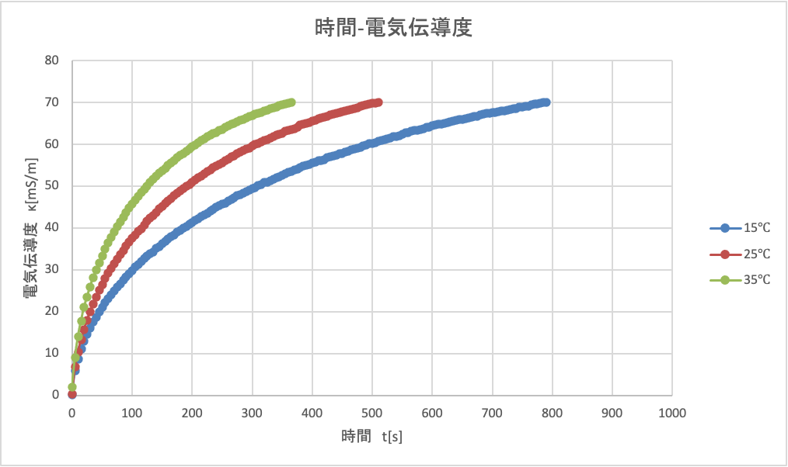

---
output:
  pdf_document:
    latex_engine: lualatex
documentclass: ltjsarticle
filters:
  - pandoc-crossref
header-includes:  \usepackage[version=4]{mhchem}
  \usepackage{amsmath}
  \usepackage{chemfig}
  \usepackage{siunitx}
  \usepackage[margin=1in]{geometry}
---

# 1.緒言

今回の実験では、回分型反応器・流通型反応器それぞれについて反応特性を学ぶ。反応としては無水酢酸の加水分解反応を取り扱い、回分型では主に温度条件の変化が反応速度に及ぼす影響について実験を行い、流通型では物質の滞在時間について考察する。また、流通型においては反応器の段数が滞在時間に及ぼす影響を、二種類の段数での測定結果を比較することで考察する。

# 2.理論

## 無水酢酸の加水分解と電気伝導度

今回は、液相均一反応として酢酸の加水分解を用いた。反応式は以下の通りである。

$$\ce{(CH3CO)2 + H2O ->[k] 2CH3COOH}~~~~(1)$$

今回は大過剰の水を用いるため、この反応は疑一次反応とみなせる。反応速度定数を$k$とすると、無水酢酸の消費速度$r_A$は酢酸濃度$C_A$を用いて以下の式で表される。

$$-r_A =-\cfrac{dC_A}{dt} =kC_A~~~~(2)$$

また、無水酢酸1分子から酢酸は2分子生成するため、酢酸の生成速度$r_R$は以下の式で表される。

$$r_R = 2kC_A~~~~(3)$$

今回、酢酸濃度を測定するために電気伝導度$\kappa$を用いる。これは、酢酸が以下の解離平衡を持つためである。

$$\ce{CH3COOH <=> CH3COO-  +  H+}~~~~(4)$$

電気伝導度$\kappa$と酢酸濃度$C_R$の関係は以下の式で表される。以降の解析でもこの式を用いる。

$$C_R = 37570 \kappa^2 +25.64\kappa~~~~(5)$$

## 回分式反応器

回分式反応器での時間$t$における無水酢酸濃度は、(2)式を微分方程式として解くにより以下のように求めることができる。

$$C_A(t)=C_{A0}\exp{(-kt)}~~~~(6)$$

ここで、$C_{A0}$は無水酢酸の初期濃度である。化学量論を考えると、時刻$t$における酢酸濃度$C_R(t)$は以下の式の通りとなる。  

$$C_R(t)=2C_{A0}\{1-\exp{(-kt)}\}~~~~(7)$$

両辺を$2C_{A0}$で除算して移項のち、対数をとると以下の式が得られる。

$$kt=\ln{\left(1-\cfrac{C_R(t)}{2C_{A0}}\right)}~~~~(8)$$

右辺を$t$に対してプロットすると、左辺のような原点を通る直線の式が得られると考えられる。この直線の傾きがその温度における反応速度定数である。

## アレニウスパラメーターの算出

反応速度定数$k$は活性化エネルギー$E_a$,頻度因子$k_0$を用いて以下の式で表される。

$$k=k_0 \exp{\left(-\cfrac{E_a}{RT}\right)}~~~~(9)$$

両辺の対数をとると、

$$\ln{k}=\ln{k_0}-\cfrac{E_a}{RT}~~~~(10)$$

(10)式より、$\ln{k}-\frac{1}{T}$プロットは切片が$\ln{k_0}$,傾きが$\frac{E_a}{R}$の直線となるため、活性化エネルギー$E_a$,頻度因子$k_0$を求めることができる。

## 流通式反応器

流通式反応器では、流体が反応器内に存在する時間に分布が生じる。これを滞在時間分布という。  
この時間分布を扱うため、以下のような無次元時間を用いる。
$$ \tau =\cfrac{\sum V_m}{v_{T0}}~~~~(11)$$
$$\theta = \cfrac{t}{\tau}~~~~(12)$$
これを求めるために、反応を起こさない物質であるトレーサーを用いる。これがトレーサー応答法である。
$N$段の完全混合槽で、第$m$槽の体積を$V_m$,流速を$v_{T0}$とすると、第$m$槽のトレーサー濃度$C_m$は

$$V_m\cfrac{dC_m(t)}{dt}=v_{T0}\{C_{m-1}(t)-C_m(t)\}~~~~(13)$$

滞在時間分布関数は,$C_{av}$は第1槽めにトレーサーが均等に分布した際の濃度である。この滞在時間分布関数より、

$$E_m(t)=\cfrac{C_m(t)V_T}{C_{av}\tau V_1}~~~~(14)$$

$$E_m(\theta)=\tau E_m(t)~~~~(15)$$

これを無次元化すると,

$$\cfrac{V_m dE_m(\theta)}{V_T d\theta}=E_{m-1}(\theta)-E_m(\theta)~~~~(16)$$

これを$\theta=0,E_1(0)=V_T/V_1,E_m(0)=0$
として解く.反応槽の体積が全て等しいときを考えると滞在時間分布は

$$E_m(\theta)=\cfrac{N^m}{(m-1)!}\theta^{m-1}\exp{(-N\theta)}~~~~(17)$$

$$E_N(\theta)=\cfrac{N^N}{(N-1)!}\theta^{m-1}\exp{(-N\theta)}~~~~(18)$$
となる。今回は1槽,3槽で実験を行い、濃度測定は出口で行うため(18)式に$N＝1,3$を代入した
$$E_1=\exp{(-\theta)}~~~~(19)$$
$$E_3=13.5\theta ^2 \exp{(-3\theta)}~~~~(20)$$
を用いる。この滞在時間分布関数を用いて、流出液酢酸濃度は

$$C_A(\theta)=C_{A0}\exp{(-k\tau \theta)E(\theta)}~~~~(21)$$

と書ける。
なお、今回は、滞在時間と反応時間と等しいとみる、マクロ混合を仮定する。
# 3.実験方法

## 3.1　実験装置

今回の実験では、回分型、流通型(1,3段)の三種類の槽型反応器を用いて実験を行った。概略を以下に示す。  

{height=60mm}  

回分反応器については、邪魔板つきのガラス製の反応容器を用い、中に攪拌翼と電気化学セルを入れた。また、攪拌翼の回転スピードはおよそ500[rpm]とし、高さを調節して電気化学セルに当たらないようにした。電気化学セルは伝導度計・測定用PCに接続されており、5秒間に1回の頻度で溶液の温度・電気伝導度を測定した。反応容器内の液体温度が一定となるように、反応容器の液面は水浴の液面よりも下になるように調整した。  

{height=60mm}  

流通式反応器は、一段と三段について実験を行った。水道水には塩素などが溶解しており、電気を通すため一度イオン交換カラムを通してから反応器に流した。また、水道の流量は時間によって変化しうるため一度オーバーフローに貯めてから反応系に流した。流量測定はマノメーターによって行い、マノメーターの高さの差$\Delta H\mathrm{[cm]}$と流速$\nu\mathrm{[m/s]}$の間には以下の式が成り立つ。

$$\Delta H = 3.512\times 10^{-5}\nu^2 + 3.789\times 10^{-5}\nu~~~~(一槽,22)$$
$$\Delta H = 4.310\times 10^{-5}\nu^2 + 9.505\times 10^{-5}\nu~~~~(三槽,23)$$

この式を利用して、流速を求めた。  
また、電気化学セルは最後の反応器の出口付近に設置されているため、出口濃度の測定が可能である。  

## 3.2 実験方法

実際に行った実験手順を以下に示す。

### 回分式反応器における実験

この実験では、以下の１〜５に示す手順の実験を15℃,25℃,35℃の三種類の温度条件で三回行った。
 
1. 水を約400[mL]はかり、ガラス製反応容器に入れた。
2. 水浴内でしばらく放置し、定常状態になるのを待った。定常状態は、1分おきに温度を測定し、三回連続で同じ温度が観測された時点で定常状態とした。
3. 反応器内が定常状態になった後、無水酢酸を試験管に5mLとり、反応容器に入れて反応を開始した。この時、試験管に残った液滴は反応容器に入れず、一度に入った量で反応を行った。また、無水酢酸を入れた時点でt＝0とし、温度と電気伝導度の測定を開始した。
4. 5秒おきに温度・電気伝導度を計測し、PCソフトG-LOG2で記録した。また、3分おきに温度・電気伝導度を確認、記録した。電気伝導度が70[mS/m]となった時点で計測を終了した。 

### 流通式反応器における実験

この実験では、以下の１〜4に示す手順の実験を1槽,3槽でそれぞれ一回ずつ行った。

1. 反応器に水を流し、マノメーター高さ・各槽の液面の高さが一定になるように調整した。マノメーター高さ・各槽液面・水温を1分おきに測定し、三回連続で同じ値が記録された時点で定常状態とし、この時をt=0[s]とした。
2. 無水酢酸を試験管に5[mL]とり,反応容器に入れて反応を開始した。回分式と同様、試験管に残った液滴は反応器に入らないようにした。また、三槽の実験では一番上流がわの反応器に入れた。
3. 5秒おきに温度・電気伝導度を計測し、PCソフトG-LOG2で記録した。また、3分おきに温度・電気伝導度を確認・記録した。測定は1槽・3槽両方で15分間行った。
4. 測定終了後、反応器内に残った水を全て抜いて体積を測定し、これを反応器体積とした。

## 3.3 実験条件

使用した試薬の量、液温などの実験条件をそれぞれの実験について述べる。

### 回分式反応器

|設定温度[℃]|無水酢酸残存量[％]|水量$\mathrm{[cm^2]}$|
|------|-------|------|
|15|1.516|398.5|
|25|1.396|395.5|
|35|1.460|393.0|

### 流通式反応器

|段数$N$|反応器有効体積$V\mathrm{[cm^2]}$|無水酢酸残存量[％]|
|----|----|----|
|1|1530|2.36|
|3|1420|2.66|

全ての実験に置いて、試験管中の無水酢酸残存量が規定量の5[mL]に対し5%以下であるため、以下の解析においては無水酢酸の使用料を5[mL]とした。

# 4.結果

## 4.1　回分系における実験結果

各温度で、時間ごとの電気伝導度をプロットした$t\mathrm{[s]}-\kappa\mathrm{[mS/m]}$グラフを以下の図3に示す。  

{height=60mm}

また、3分おきの温度・電気伝導度は各設定温度につき以下の通りである。  

|設定温度|時間|温度|電気伝導度|
|-------|----|---|---|
|15|0|14.8|0.142|
||3|15.1|37.7|
||6|15.1|52.3|
||9|15.1|61.8|
||12|15.0|70.4|
|--------------|-----------|---------|---------|
|25|0|24.4|0.112|
||3|24.8|49.4|
||6|24.9|61.3|
||9|24.8|70.2|
|--------------|-----------|---------|---------|
|35|0|34.2|0.164|
||3|34.7|50.4|
||6|34.8|67.3|

## 4.2 流通系における実験結果

1槽・3槽それぞれについて、時間ごとの電気伝導度をプロットした$t\mathrm{[s]}-\kappa\mathrm{[mS/m]}$グラフを以下の図4に示す。  
\newpage
{height=60mm}

# 5.解析

4.1の結果を用いて解析を行い、酢酸の反応速度定数$k$、アレニウス型反応速度式のパラメーターである頻度因子$k_0$,活性化エネルギー$E_a$を決定した。また、4.2の結果と4.1から求めたパラメーターを用いて滞在時間分布を求め、時間ごとの無次元酢酸濃度$C_{R,calc}/C_{A0}$を算出した。さらに、無次元酢酸濃度に関して理論値と実験値の差異を評価関数を用いて検討した。また、以降の解析において、以下を定数として用いた。  

|項目|記号|値|単位|
|---|---|---|---|
|無水酢酸密度|$\rho$|1067|$\mathrm{[kg/m^3]}$|
|無水酢酸分子量|$M$|0.10209|$\mathrm{[kg/mol/]}$|
|絶対零度|-|-273.15|[℃]|

## 回分系の解析

1. 3で示した実験条件から、各反応器の体積$V_T$、初期無水酢酸濃度$C_{A0}$,平均反応温度$T$は以下の通りである。  
   
   |設定温度[℃]|体積$V_T\mathrm{[m^3]}$|初期無水酢酸濃度$C_{A0}\mathrm{[mol/m^3]}$|平均反応温度$T[K]$|
   |---|---|---|---|
   |15|$3.99\times 10^{-3}$|131.1363|288.2378|
   |25|$3.96\times 10^{-3}$|132.131|298.0012|
   |35|$3.93\times 10^{-3}$|132.9715|307.8371|
2. 伝導度$\kappa$から(5)式に基づき酢酸濃度$C_R(t)$を算出した。
3. (8)式のプロットを各温度について求めた。また、原点を通る直線で線形近似した。その結果を以下に示す。  
   
   {height=60mm}  
   
   {height=60mm}  
   
   {height=60mm}  

   また、各温度についての反応速度定数$k$は以下の表の通りであった。

   |設定温度|反応速度定数$k_T\mathrm{[s^{-1}]}$|
   |------|----------------|
   |15|0.001443|
   |25|0.002359|
   |35|0.003543|

4. 3より求めた反応速度定数の自然対数と$\frac{1}{T}$をプロットし、アレニウスプロットを作成した。  
   
   {height=60mm}  

   このプロットから求めた頻度因子$k_0$,活性化エネルギー$E_a$は以下の表の通りである。  

   |項目|記号|値|単位|
   |----|----|----|----|
   |活性化エネルギー|$E_a$|33830.50|[J/mol]|
   |頻度因子|$k_0$|1969.23|$$\mathrm{[s^{-1}]}$$|

## 流通系の解析

1. 回分系と同様、反応器段数$N$,反応器の総体積$V_T$,流量$v_{T0}$,初期無水酢酸濃度$C_{A0}$,平均水温$T$,平均滞在時間$\tau$を算出した。結果は以下の表に示すものであり、以降の解析にはこの値を用いた。  

|段数$N$|総体積$V_T$|流量$v_{T0}$|初期無水酢酸濃度$C_{A0}$|平均滞在時間$\tau$|
|-----|-----|-----|-----|-----|
|1|0.00153|5.823$\mathrm{\times 10^{-6}}$|34.16|262.76|
|3|0.00142|5.780$\mathrm{\times 10^{-6}}$|36.80|245.67|  

流量は、マノメーターの高さの差を用いてゴールシーク法で求めた。

2. 時間$t$,反応器体積$V_T$,流量$v_{t0}$を用いて無次元時間$\theta$を求めた。式は(11),(12)式を用いた。
3. 伝導度$\kappa$と(5)式で酢酸濃度$C_{R,exp}$を求め、初期濃度で割ることで無次元酢酸濃度$C_{R,exp}/C_{A0}$を求めた。
4. (19),(20)式から滞在時間分布を求めた。
5. (21)式から無次元無水酢酸濃度の理論値を算出した。また、化学量論を加味した以下の式から、無次元酢酸濃度の理論値を算出した。  
   $$C_R(\theta)=2C_{A0}\{1-\exp{(-k\tau\theta)}\}E(\theta)$$
6. 5で求めた無次元無水酢酸濃度、無次元酢酸濃度の理論値と4で求めた酢酸濃度の実験値を一つのグラフ上にプロットしたものを以下に示す。  
   
   {height=60mm}  

   {height=60mm}
   
7. 以下の評価関数を計算し、それぞれの実験の正確さを評価した。ここでkは段数である。一段、三段それぞれの場合において求めた評価関数を以下に示す。  
   $$S(k)=\sum^n_{i=1}\{C_{R,exp}(\theta_i)/C_{A0}-C_{R,calc}(\theta_i,k)/C_{A0}\}^2~~~~(24)$$

|段数|評価関数の値|
|---|----------|
|1|0.0691|
|3|0.09|  
双方とも0.1を超えなかったことから、実験値と理論値に有意な差異はなかったと考える。

# 6.課題および考察

## B

酢酸濃度に関しては、段数が多い方が分布の偏りが小さく、高いピークが見られた。また、両方の分布においてピークは左に偏っていた。
## C

槽列モデルについて、段数を1,3,5,10として式(18)をプロットした。  

{height=60mm}

## D

C同様、N=1,3,5,10の槽列モデルを考えた。マクロ混合における反応率$x_A$は、式(18)の滞在時間分布$E(\theta)$,(6)の回分反応器における反応物濃度$C_{A,batch}$から以下の式で表される。

$$x_A=1-\cfrac{1}{C_{A0}}\int_0^{\infty}C_{A,batch}(\theta)E(\theta)d\theta~~~~(25)$$

変形すると、

$$x_A=-\cfrac{1}{C_{A0}}\int_0^{\infty}\exp{(-k\tau \theta)}E(\theta)^2d\theta~~~~(26)$$

となる。これを各段数において計算して求めた反応率を以下の表に示す。また、計算には実験から求めた値として、$k=1.59\times 10^{-3}\mathrm{[s^{-1}]}$,$\tau = 260\mathrm{[s]}$を用いた。  
\newpage  

 |$N$|$x_A$|
 |---|-----|
 |1|0.510|
 |3|0.456|
 |5|0.341|
 |10|0.108|

## E

一段槽型反応器での以下の反応を考える。
$$\ce{A -> R}~~~~(27)$$
$$r_A = -kC_A^n~~~~(28)$$

反応次数$n=1,2$,混合状態(ミクロ,マクロ)の4通りについて、反応率$x_A$・反応速度定数と滞在時間の積の間の関係について調べた。各条件において、反応率は以下の式で表される。

《n=1,ミクロ》
$$x_A=-\cfrac{r_A\tau}{C_{A0}}=\frac{k\tau}{k\tau +1}~~~~(29)$$

《n=1,マクロ》
$$x_A=-\cfrac{1}{C_{A0}}\int_0^{\infty}\exp{(-k\tau \theta)}E(\theta)d\theta~~~~(30)$$

《n=2,ミクロ》
$$x_A = \cfrac{2C_{A0}k\tau+1}{C_{A0}k\tau}+\sqrt{\left(\cfrac{2C_{A0}k\tau +1}{2C_{A0}k\tau}\right)^2-1}~~~~(31)$$

《n=2,マクロ》
$$x_A=1-\alpha\exp{(\alpha)E_1(\alpha)}$$
$$\alpha=\cfrac{1}{kC_{A0}\tau}$$
$$\begin{cases}E_1(\alpha)=a_0+a_1\alpha+a_2\alpha^2+a_3\alpha^3+a_4\alpha^4+a_5\alpha^5-ln(\alpha)\\
E_1(\alpha)=\cfrac{\alpha^2+a_1\alpha+a_2}{\alpha^2+b_1\alpha+b_2}\cfrac{\exp{-\alpha}}{\alpha}\end{cases}~~~~(32,33)$$

縦軸に反応率、横軸に$k\tau$をとったグラフを以下に示す。また、横軸の範囲は0以上8以下である。  

{height=60mm}

グラフから分かる通り、n=1におけるミクロ・マクロ混合での反応率は一致した。マクロ混合における式に、滞在時間分布関数として(19)式,濃度$C_A$として(6)式を代入すると、式は以下のようになる。
$$x_A=1-\int_0^{\infty}\exp{(-k\tau \theta)}\cdot \exp{(\theta)}d\theta~~~~(34)$$
これは指数関数の積分として解析的に解くことが可能であり、今回のグラフの範囲では

$$x_A=1-\cfrac{1}{k\tau +1}~~~~(35)$$

となり、ミクロ混合を仮定した際と一致する。

# 結言

今回の実験の目的である、流通型・回分型反応器それぞれの反応特性について理解を深めることができた。

