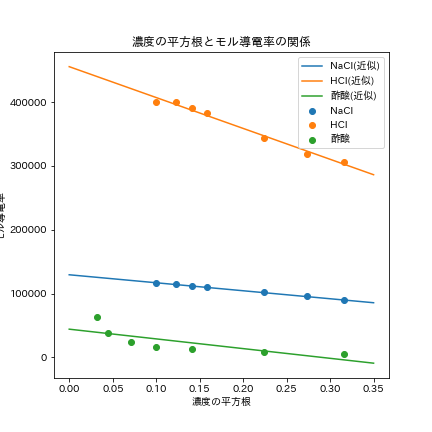

### 課題1

NaCl,HCl,酢酸について、濃度と電気伝導率[S cm^2/mol]の関係を以下のグラフに示す。  

  

### 課題2

課題1同様、NaCl,HCl,酢酸について、濃度の平方根と電気伝導立電気伝導率[S cm^2/mol]を以下のグラフに示す。また、このグラフにおいて最小二乗法を用いて回帰分析を行った。それぞれの物質について、回帰直線の切片・傾き・r^2値を以下の表に示す。  

|物質|切片(*10^4)|傾き(*10^5)|r^2|
|----|---|---|---|
|NaCl|12.9|1.25|0.995|
|HCl|45.5|4.84|0.984|
|酢酸|4.42|1.52|0.596|  

### 課題3

課題2の表より、それぞれの物質の極限モル電気伝導率を以下に示す。

|物質|極限モル電気伝導立(*10^4)|
|----|---|
|NaCl|12.9|
|HCl|45.5|
|酢酸|4.42|  

### 課題4,課題5

NaCl,HClについて、それぞれの陽イオン、陰イオンの極限モル電気伝導率を以下の表に示す。なお、各イオンの輸率は表に示した値を用いた。  

|物質|輸率(-,+)|陰イオン|陽イオン|陰イオン極限モル電気伝導率(*10^4)|陽イオン極限モル電気伝導率(*10^4)|
|----|-----|----|----|----|----|
|NaCl|(0.6038,0.3962)|Cl-|Na+|7.79|5.11|
|HCl|(0.1790,0.8210)|Cl-|H+|7.74|37.4|  

### 課題6

##### (1)

課題2で示したグラフ・回帰系数より、強電解質・強酸では濃度の平方根とモル電気伝導率が比例していた。一方、酢酸のような弱電解質では比例関係が成り立たず、低濃度では電気伝導率が急激に上昇した。これは、以下の式に示す酢酸の解離平衡が低濃度ほど右に偏り、電荷を媒介するイオンが増えたためであると考える。一方、強電解質や強酸では完全電離が仮定できるため、イオン濃度が電解質濃度に比例し、コールラウシュの平方根則が成り立つと考える。  

##### (2)

課題4,5の表より、NaClとHClでCl-の極限モル電気伝導率は変わらなかったものの、Na+とH+では異なった。このことから、極限モル電気伝導率はイオン種に固有の値であると推定できる。また、H＋の極限モル電気伝導率が極めて高いのは、プロトンジャンプという機構によると考える。プロトンジャンプは以下の3段階に分けられる。
1.プロトンが近接する水分子と結合を形成する。
2.結合された水分子の持つ水素分子が解離し、プロトンとなる。
3.2でできたプロトンが近接する水分子に結合する。  

このように連鎖的に結合を形成・切断することで、プロトンは水分子中を素早く移動することができる。このため、プロトンは極限モル電気伝導率が大きくなると考える。  

### 課題7