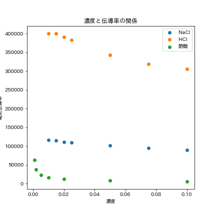
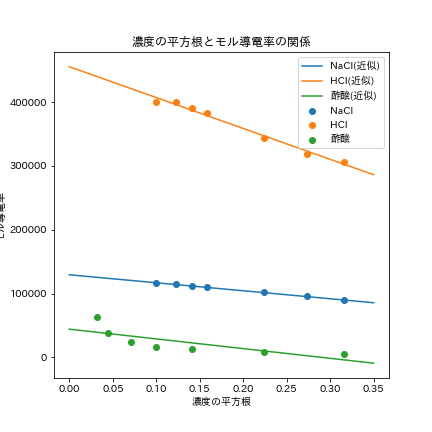
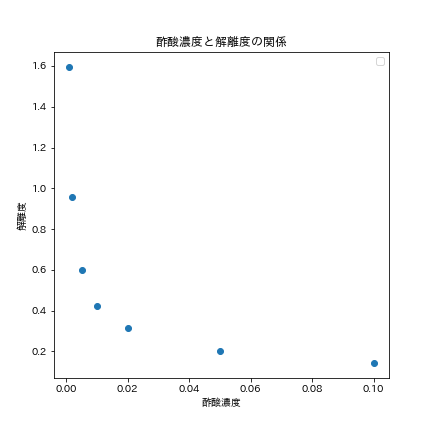
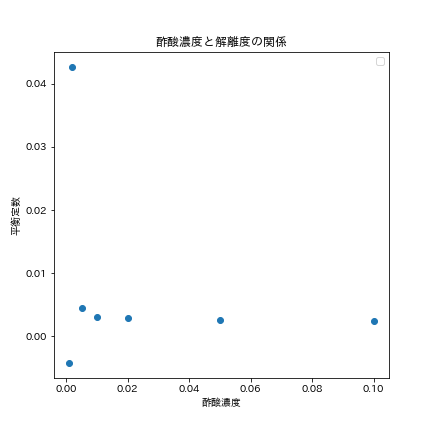

# 1.目的

種々の電解質水溶液の導電率を測定し、濃度との関係を考察することでDebye-Huckel-Onsagerの式について理解する。  

# 2.原理

#### モル電気伝導率

電気伝導率とは、溶液の導電率を濃度で割ったものであり、通常$\kappa$で表され単位は$\mathrm{[(\Omega\cdot cm)^{-1}]}$である。  
これは,1$\mathrm{[cm^2]}$の断面積を持つ抵抗の長さあたりの抵抗値の逆数である。また、抵抗の逆数を[S]という単位で表すことがある。モル電気伝導率は,電解質濃度1$\mathrm{[g/cm^3]}$あたりの電気伝導率であり、記号$\Lambda$で表される。これをモル濃度$C\mathrm{[mol/L]}$に換算し、イオンの価数zを加味すると、

$$\Lambda=1000\kappa/zC$$

となる。

#### 電解質水溶液の電気伝導度

モル電気伝導率は電解質の性質、濃度と関係がある。これは、Debye-Huckelの理論から導かれるものであり、強電解質では$\Lambda \propto\sqrt{C}$である。これは、コールラウシュの平方根則といい、より詳しくは以下のDebye-Huckel-Onsagerの式で表される。  

$$\Lambda=\Lambda_0-(A+B\Lambda_0)\sqrt{C}$$

$\Lambda_0$は極限モル電気伝導度といい、$C\rightarrow0$での電気伝導度である。弱電解質では、$C\rightarrow0$で急激に伝導度が上昇する。これについては後に考察する。  
完全電離している電解質水溶液中では、陽イオンと陰イオンが別々に存在しており、それぞれが電荷移動の媒体となっていると考えることができる。つまり、イオン同士の相互作用がない無限希釈では、各イオンの電気伝導度の線形和が溶液全体の電気伝導度となる。つまり、溶液の極限モル電気伝導率は定数$\tau_0^+,\tau_0^-$を用いて以下の式で表すことができる。  

$$
\Lambda_0=\Lambda_0^-+\Lambda_0^+=\Lambda_0\tau_0^- + \Lambda_0\tau_0^+$$  

この定数$\tau_0^+,\tau_0^-$をイオンの輸率といい、イオン種ごとに固有の値である。

# 3.実験方法

#### 試薬

* NaCl溶液
* HCl溶液
* $\ce{CH3COOH}$溶液

NaCl,HClについては濃度を0.01,0.015,0.02,0.025,0.05,0.1[mol/L]の7通り、$\ce{CH3COOH}$については0.001,0.002,0.005,0.01,0.02,0.05,0.1[mol/L]の7通りの条件に設定し、それぞれ導電率を測定した。  
また、先に蒸留水の導電率を測定し、各溶液の電気伝導度を算出する際はこの値で補正した。  

# 4.結果

NaCl,HCl,酢酸について、濃度と電気伝導率$\mathrm{[S\cdot cm^2/mol]}$の関係を以下のグラフに示す。  

{height=80mm}

### 課題1

4節参照

### 課題2

課題1同様、NaCl,HCl,酢酸について、濃度の平方根と電気伝導率$\mathrm{[S\cdot cm^2/mol]}$を以下のグラフに示す。また、最小二乗法を用いて回帰分析を行った。それぞれの物質について、回帰直線の切片・傾き・$r^2$値を以下の表に示す。  

{height=80mm}

|物質|切片($\mathrm{\times 10^4}$)|傾き($\mathrm{\times 10^5}$)|$r^2$|
|----|---|---|---|
|NaCl|12.9|1.25|0.995|
|HCl|45.5|4.84|0.984|
|酢酸|4.42|1.52|0.596|  

### 課題3

課題2の表より、それぞれの物質の極限モル電気伝導率を以下に示す。

|物質|極限モル電気伝導率($\mathrm{\times 10^4[S\cdot cm^2/mol]}$)|
|----|---|
|NaCl|12.9|
|HCl|45.5|
|酢酸|4.42|  

### 課題4,課題5

NaCl,HClについて、それぞれの陽イオン、陰イオンの極限モル電気伝導率($\Lambda^{\infty}_{+}$,$\Lambda^{\infty}_{-}$)を以下の表に示す。(単位：$(\mathrm{[S\cdot cm^2/mol]})$)なお、各イオンの輸率は表に示した値を用いた。  

|物質|輸率(-,+)|陰イオン|陽イオン|$\Lambda^{\infty}_{-}(\mathrm{\times 10^4})$|$\Lambda^{\infty}_{+}(\mathrm{\times 10^4})$|
|----|-----|----|----|----|----|
|NaCl|(0.6038,0.3962)|$\ce{Cl-}$|$\ce{Na+}$|7.79|5.11|
|HCl|(0.1790,0.8210)|$\ce{Cl-}$|$\ce{H+}$|7.74|37.4|  

\newpage

### 課題6

##### (1)

課題2で示したグラフ・回帰系数より、強電解質・強酸では濃度の平方根とモル電気伝導率が比例していた。一方、酢酸のような弱電解質では比例関係が成り立たず、低濃度では電気伝導率が急激に上昇した。これは、以下の式に示す酢酸の解離平衡が低濃度ほど右に偏り、電荷を媒介するイオンが増えたためであると考える。  

$$\mathrm{CH}_{3} \mathrm{COOH} \rightleftharpoons \mathrm{CH}_{3} \mathrm{COO}^{-}+\mathrm{H}^{+}$$
一方、強電解質や強酸では完全電離が仮定できるため、イオン濃度が電解質濃度に比例し、コールラウシュの平方根則が成り立つと考える。  

##### (2)

課題4,5の表より、NaClとHClで$\ce{Cl-}$の極限モル電気伝導率は変わらなかったものの、$\ce{Na+}$と$\ce{H+}$では異なった。このことから、極限モル電気伝導率はイオン種に固有の値であると推定できる。また、$\ce{H+}$の極限モル電気伝導率が$\ce{Na+}$より極めて高いのは、プロトンジャンプという機構によると考える。プロトンジャンプは以下の3段階に分けられる。
1.プロトンが近接する水分子と結合を形成する。
2.結合された水分子の持つ水素分子が解離し、プロトンとなる。
3.2でできたプロトンが近接する水分子に結合する。  

このように連鎖的に結合を形成・切断することで、プロトンは水分子中を素早く移動することができる。このため、プロトンは極限モル電気伝導率が大きくなると考える。  

### 課題7  

極限当量モル電気伝導率$\Lambda_0$は、各イオンの極限モル電気伝導率の線形和で表されるため、$\Lambda_0$は以下の式で求めることができる。  

$$\Lambda_0=(3.496+0.409 )\mathrm{\times10^{-2}[S\cdot m^2/mol]}=3.905\mathrm{\times 10^{4}[S\cdot cm^2/mol]}$$  

実際の伝導率はイオン濃度に比例するため、極限当量伝導率と解離度の関係は以下の式となる。  

$$\Lambda=\Lambda_0\alpha$$

酢酸濃度と解離度の関係を表すグラフを以下の図に示す。  

{height=80mm}  

この値から、平衡定数を求めた。平衡定数K,解離度$\alpha$,濃度$C$の関係は以下のオストワルトの希釈律で近似した。  

$$K=\frac{c \alpha^{2}}{1-\alpha}$$  

濃度・平衡定数の関係を以下のグラフにしめす。  

{height=80mm}  

以上の結果から、弱電解質においては低濃度で解離定数が急激に上昇し、それに伴って解離度も上昇することがわかった。これは、課題6-(1)で示した弱電解質の極限モル導電率がコールラウシュの平方根則に当てはまらないことの裏付けになる。  
また、濃度0.001[mol/L]で解離定数が負になったことについては、低濃度では微量に含まれる他の化学種の存在が無視できなくなり、通常の解離平衡で近似できなくなるためと考える。

# 6.参考文献  

* アトキンス 物理化学（下） 第10版/P. W. Atkins/	2017/09/01  /東京化学同人