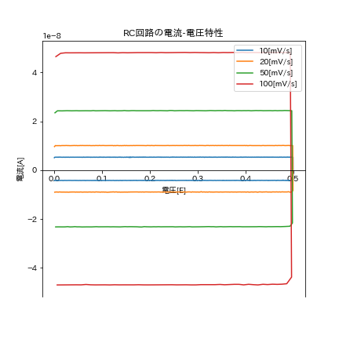
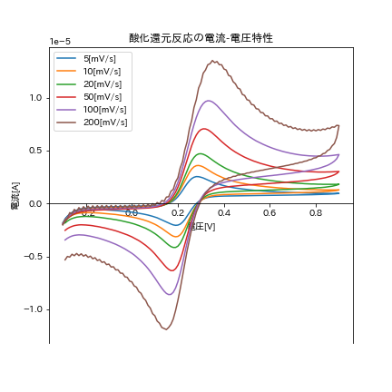
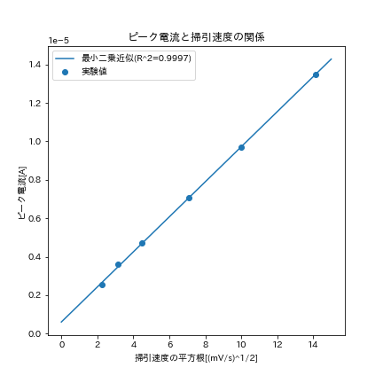
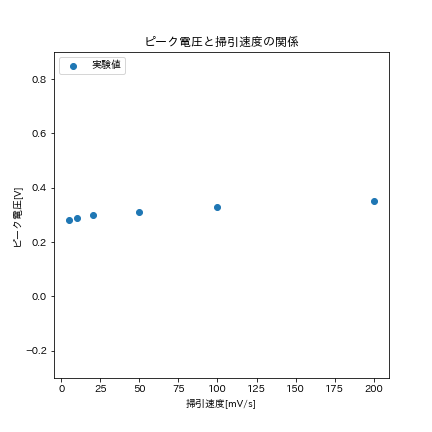
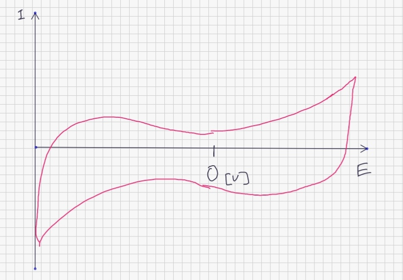

# 1.目的

本実験では、電気化学測定によく用いられる測定法であるサイクリックボルタモグラムについて、RC直列回路・酸化還元反応の二つの例を通じて学ぶ  

# 2.原理

### RC直列回路の特性

RC直列回路は、R[Ω]の抵抗とC[F]の容量を持つコンデンサーを直列に繋ぎ、電圧E[V]を印加した回路である。  
この時、抵抗における電位差を$E_R$,コンデンサーにおける電圧降下を$E_C$とすると、オームの法則より以下が成り立つ。  

$$E=E_R+E_C$$

これを、電荷$q$の式に書き換えると

$$E=R\cfrac{dq}{dt}+\cfrac{q}{C}$$

となる。傾き$v\mathrm{[V/s]}$の一定速度(掃引速度)で変化する電圧を印加すると、電流は  

$$I=vC\left[1-\exp\left(\cfrac{-E}{vRC}\right)\right]$$  

のように掃引速度に比例して変化することがわかる。本実験では、掃引速度を変えて測定を行い、電流値と比較することでこの性質を確かめた。  

###　サイクリックボルタモグラムの原理

サイクリックボルタモグラム(CV)は、電圧を一定速度で掃引し、その電圧で変化する電流の値を測定するものである。測定する系の反応を以下の式で表す。  

$$\mathrm{Ox + ne^- \rightleftharpoons　Red}$$

CVでは、還元体が酸化される反応、つまりアノード反応を正とする。また、Oxが酸化体、Redが還元体を表す。電位を正の方向に上げていくとアノード反応が促進され、正方向の電流が観測される。これを酸化電流という。一方、電位を逆方向にあげるとカソード反応(還元反応)に伴う電流が観測される。電流は電極表面でのOx,Red濃度に依存しているが、ピーク位置と酸化還元電位には解離がある。これは電極表面にある程度Ox,Redが蓄積しないと電流が観測されないためである。酸化側のピーク電流はRedの沖合濃度$C_R^*$,ファラデー定数$F$,拡散係数$D$,電極表面積$A$, 電位掃引速度$v$を用いて以下の式で表される。

$$I_p=269n^{3/2}AD_R^{1/2}C^*_Rv^{1/2}$$

CVは三本の電極を持つポテンショスタットという装置を用いる。  
今回の実験では、酸化還元反応が可逆系であることを仮定する。可逆系では上に示した式より、

* ピーク電流は掃引速度の平方根に比例すること
* ピーク電圧は掃引速度によらず一定であること

の二点が言える。  

# 3.実験方法  

#### 試薬

1.0mM $\ce{K4[Fe(CN)6]}$ + 0.1[M]$\ce{KCl}$水溶液

#### 装置の設定・使用した電極  

使用した電極を以下の表に示す。  

|電極|素材|
|---|---|
|作用極|カーボンディスク電極(直径:0.3cm,面積0.07065\mathrm{[cm^2])|
|参照極|Ag/AgCl 電極(+0.199 V vs. SHE)|
|対極|白金フラッグ電極|  

また、初期電位、アノード限界電位・カソード限界電位をそれぞれ以下のように設定した。  

|初期電位[V]|アノード限界電位[V]|カソード限界電位[V]|
|-------|--------|--------|
|+0|+0.9|-0.3|  

この装置を用いて、電位掃引速度200[mV/s],100[mV,s],50[mV/s],20[mV/s],10[mV/s],5[mV/s]の6通りの条件で測定を行った。  
また、RC回路では電位掃引速度100[mV,s],50[mV/s],20[mV/s],10[mV/s]の4通りの条件で測定を行い、ポテンショスタットに直接回路基板を配線した。

# 4.結果

#### A. RC直列回路の電気特性

RC直列回路の特性について、以下の図に示す。  

{height=80mm}  

#### B. 酸化還元反応のCV

実験から測定した電流・電圧特性のグラフを以下の図に示す。  

{height=80mm} 

## 5A. 課題

### (1)

4節参照  

### (2)

各掃引速度ごとに電流の平均値を求め、これを$Cv$とした。また、電流と掃引速度が比例するという関係から、各掃引速度でコンデンサーの静電容量$C$を求めた。結果を以下の表に示す。  

|掃引速度|電流の平均値($\mathrm{\times 10^{-8} }$)|コンデンサー容量$\mathrm{\times 10^{-10} }$|
|-------|----------|-------------|
|10|5.31|5.31|
|20|1.01|5.03|
|50|2.43|4.87|
|100|4.80|4.80|

この値から、コンデンサー容量は概ね5.0[F]であると推定できる。  

## 5B. 課題  

### (1)

4節参照  

### (2)

##### (i)
$I_p$vs$\sqrt{v}$グラフを以下に示す。また、最小二乗法を用いた一次近似も同グラフに示す。  

{height=80mm}  

一次近似の$R^2$値が0.999だったことから、ピーク電流と掃引速度は比例していると言える。また、回帰直線について傾き、切片を以下の表に示す。  

|傾き|切片|
|----|----|
|9.117e-07|6.039e-07|  

今回用いたフェロシアン化物イオンの酸化還元反応を以下に示す。  

$$\left[\mathrm{Fe}^{\mathrm{II}}(\mathrm{CN})_{6}\right]^{4-}\rightleftharpoons\left[\mathrm{Fe}^{\mathrm{III}}(\mathrm{CN})_{6}\right]^{3-}+\mathrm{e}^{-} $$  

ここで、拡散係数$D$を求めるにあたり、還元体(Red)の沖合濃度$C^*_R$を一定とし、酸化還元反応は電極付近でしか起こらないと仮定する。つまり、$C^*_R$は試薬のフェロシアン化物濃度と一定と考える。よって、

$$C^*_R=1.0\times 10^{-3} \mathrm{[mol/L]}$$

また、電極は直径0.3[cm]の円形であると考えると電極面積$A$は

$$A=0.07065\mathrm{[cm^2]}$$

式3は

$$I_p=269n^{3/2}AD_R^{1/2}C^*_Rv^{1/2}$$

であるため、回帰直線の傾きが$269n^{3/2}AD_R^{1/2}C^*_R$に当たるが、左辺の単位が$\mathrm{[mV/s]^{1/2}}$である。よって、右辺を$10^{-3/2}$倍し、n=1としてこれに$A,n,C^*_R$を代入すると、  

$$9.117\times10^{-10.5}=269\times0.07065\times10^{-3}\times D_R^{1/2}$$

よって、$D_R=2.30\times 10^{-16}$

### (ii)

可逆反応においては、ピーク電位は熱力学的に決定される酸化還元電位のみによって決まり、掃引速度にかかわらず一定となる。

### (iii)

掃引速度とピーク電位の関係を表すグラフを以下に示す。  

{height=80mm}  

グラフからわかる通り、掃引速度にかかわらずピーク電圧はほぼ一定である。よって、今回のフェロシアン化物イオンの酸化還元反応は可逆系であると言える。  

### (3)

ピーク電流は沖合濃度に比例するため、溶液の濃度を定量評価する際にはピーク電流値が指標となる。一方、ピーク電圧は熱力学的に決定される酸化還元電位に依存しており、溶液温度を固定すれば化学種に固有の値である。この二点をそれぞれ評価することで、溶液濃度を定量評価、溶質の種類を定性評価することが可能である。  

### (4)

KClが支持塩として働き、水に通電することで電気分解が起こり、水素と酸素が生じると考える。  
水の電気分解では以下の反応が発生する。

$$\ce{2H2O -> O2 + 4H+ + 4e-}~~~~~~(アノード)$$
$$\ce{2H+ + 2e- -> H2}~~~~~~(カソード)$$  

フェロシアン化物イオンの酸化還元において、水の電気分解に起因するピークが見られなかったことから、水に関連する酸化還元反応はフェロシアン化物よりも大きい電位差が必要となると推測される。また、反応電子数も多いことからピーク電流も大きくなると考える。よってこの系のCVは以下の図のようになると考える。  

{height=80mm}

### (5)

アスコルビン酸は酸化還元電位が+0.32~+0.34の強い還元剤であり容易に酸化される。一方で、酸化体であるデヒドロアスコルビン酸を還元する還元剤は系内に存在しない。つまり、このアスコルビン酸の酸化は、逆反応である還元が起こらない不可逆系である。故に還元に伴って観測される還元電流が見られないと考える。

# 6.参考文献  

* https://www.jaima.or.jp/jp/analytical/basic/electrochem/cur/ 電流−電位測定に基づく化学分析法の原理と応用 | JAIMA 一般社団法人 日本分析機器工業会
xs