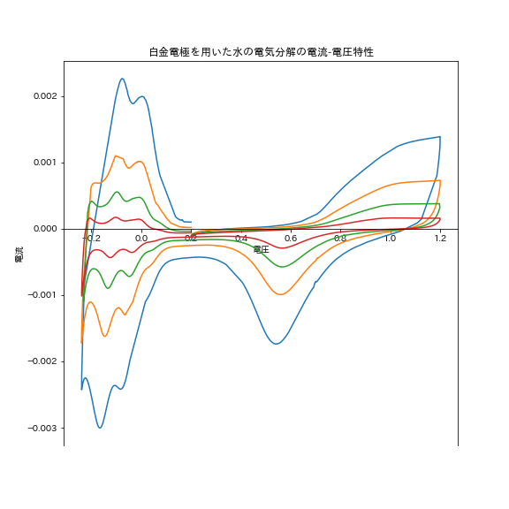
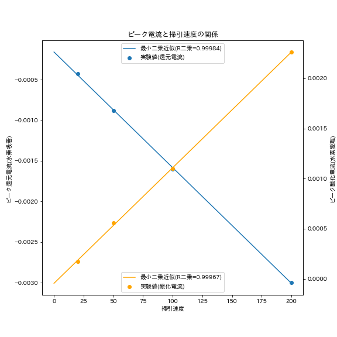

## 1.目的

本実験では、白金電極を用いた水の電気分解について、サイクリックボルタンメトリを用いた電気化学測定を行った。この実験を通して、電気化学測定の手法に加え、燃料電池について電気化学的に理解を深めた。白金触媒の仕組みについても電気化学測定から考察した。  

## 2.原理  

#### 電気分解

アノード・カソードそれぞれの反応式を以下に示す。

$$\ce{2H2O -> O2 + 4H+ + 4e-}~~~~~~(アノード)$$
$$\ce{2H+ + 2e- -> H2}~~~~~~(カソード)$$

#### 白金の触媒作用

今回用いた白金電極は、水素の酸化還元反応において最もよく用いられる触媒電極である。白金は水素や酸素などの気体分子と解離吸着することが知られている。  
解離吸着とは、金属の表面付近で気体分子の共有結合が一度切断され、金属-気体原子間の結合が形成される。気体が発生する時は、金属-気体原子間の結合が切断され、気体分子が生成する。この過程を反応式で表すと以下の4種類の反応となる。また、  

《アノード》
$$\ce{Pt-H -> Pt + H+ + e-}$$
$$\ce{Pt + H+ + e- -> Pt-H}$$

《カソード》
$$\ce{Pt + H2O -> Pt-O + 2H+ + 2e-}$$
$$\ce{Pt-O + 2H+ + 2e- -> Pt + H2O }$$  

# 3.実験方法  

#### 試薬

0.25M $\ce{H2SO4}$水溶液

#### 装置の設定・使用した電極  

使用した電極を以下の表に示す。  

|電極|素材|
|---|---|
|作用極|白金|
|参照極|Ag/AgCl 電極(+0.199 V vs. SHE)|
|対極|白金ワイヤ電極|  

また、初期電位、アノード限界電位・カソード限界電位をそれぞれ以下のように設定した。  

|初期電位[V]|アノード限界電位[V]|カソード限界電位[V]|
|-------|--------|--------|
|+0.2|+1.2|-0.24|  

この装置を用いて、電位掃引速度200[mV/s],100[mV,s],50[mV/s],20[mV/s]の4通りの条件で測定を行った。  

## 4. 結果

得られたCVの結果を以下のグラフに示す。  

{height=80mm}  

## 5.課題

### (1)

図1中に示した4種類のピークについて、該当する反応を以下の表に示す。  

|ピーク|反応|反応式|
|-----|----|----|
|A|水素脱離|$\ce{Pt-H -> Pt + H+ + e-}$|
|B|酸素吸着|$\ce{Pt + H2O -> Pt-O + 2H+ + 2e-}$|
|C|水の脱離|$\ce{Pt-O + 2H+ + 2e- -> Pt + H2O }$|
|D|水素吸着|$\ce{Pt + H+ + e- -> Pt-H }$|  

### (2)

水素吸着波(A,D)について、ピーク電流値を電位掃引速度ごとに以下にまとめる。  

|掃引速度|水素脱離ピーク(A)|ピーク電位(A)|水素吸着ピーク(D)|ピーク電位(D)|
|-------|--------------|--------------|-----|----|
|200|0.0023|-0.103|-0.003|-0.165|
|100|0.0011|-0.098|-0.0016|-0.143|
|50|0.00056|-0.103|-0.00088|-0.127|
|20|0.00017|-0.076|-0.00043|-0.122|  

また、掃引速度とピーク電流値について、以下のグラフに示す。青線は左側の軸に対応しており、水素吸着ピーク電流に当たる。また、黄線は右側の軸に対応しており、水素脱離ピークに当たる。  

{height=75mm}  

どちらのプロットも回帰分析を行い、決定係数($R^2$値)を記載した。直線とよく一致していることから、掃引速度とピーク電流値は比例していると言える。  
このことから、実験1.14の結果より表面吸着が可逆的であると考える。

\newpage

### (3)

水素発生ピークが-0.24[V],酸素発生と見られるピークが1.2[V]の点に見られたことから、電気分解に必要な電位差は1.46[V]であると言える。  
理論的に水の電気分解に必要な電位差は1.23[V]である。これは、系内で余分なエネルギーが必要となっていることを意味する。エネルギーのロスは過電圧といい、以下の3通りに分類される。  

1. 活性化過電圧
2. 抵抗過電圧
3. 拡散過電圧

活性化過電圧は電極反応に起因する。電極では、酸化還元のみならず白金との吸着過程で電子の移動が生じる。この電子移動に余分なエネルギーが必要なため、過電圧が生ずる。  
抵抗過電圧は導電抵抗に起因する。本来、水は絶縁体であり、電解質溶液も導電抵抗があるため過電圧が生じる。  
拡散過電圧は、電極表面における反応物の不足・生成物の過剰に起因する。  
これらの過電圧により、理論電圧よりも大きな電位差が必要となる。  

### (4)  

燃料電池は酸化還元反応に伴う電子移動から直接起電力を取り出すことができ、最高で83%の高い変換効率を持つ。  
これは、酸化と還元がそれぞれアノード・カソードで個別に起こっており、外部回路でエネルギーを直接取り出すことができる。  
一方、熱機関では燃料を一度燃焼させ、熱エネルギーを得てからこの熱エネルギーを電気エネルギーに変換する。このエネルギー変換において損失が発生するため、エネルギー変換が一段階少ない燃料電池が効率の面では優位である。  
例えば、燃料電池の変換効率は標準ギブスエネルギーと標準エンタルピーを用いて以下の式で表すことができる。  

$$\cfrac{\Delta G^0}{\Delta H^0}=\cfrac{-237\mathrm{[kJ/mol]}}{-286\mathrm{[kJ/mol]}}=0.83$$
 
一方、高熱源を2000K,低熱源を298Kとすればカルノー効率は  

$$\cfrac{2000-298}{2000}=0.85$$  

となる。そのため、一概に熱機関よりも燃料電池の方が効率が良いとは言えない。しかし、エネルギー変換に伴う損失が少ないという点が燃料電池の利点である。

# 6.参考文献

* アトキンス 物理化学（下） 第10版/P. W. Atkins/	2017/09/01  /東京化学同人
* https://www.jaima.or.jp/jp/analytical/basic/electrochem/cur/ 電流−電位測定に基づく化学分析法の原理と応用 | JAIMA 一般社団法人 日本分析機器工業会