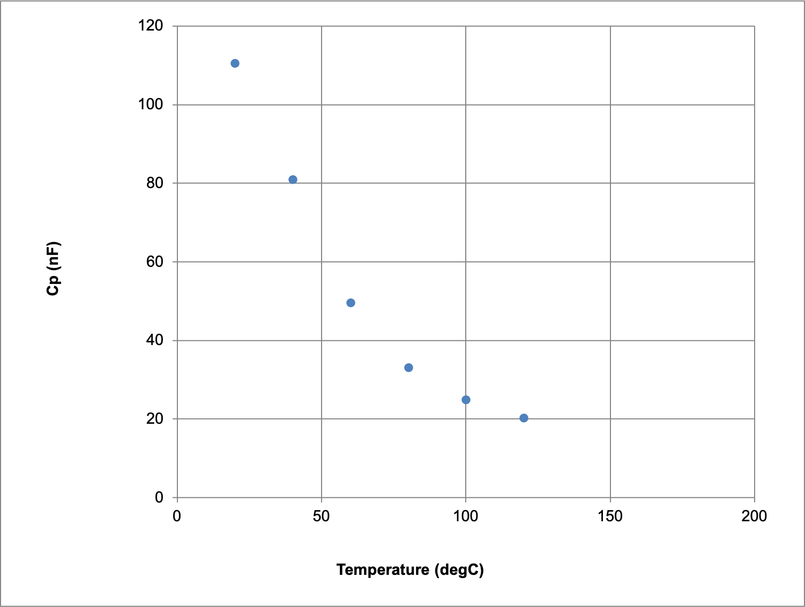
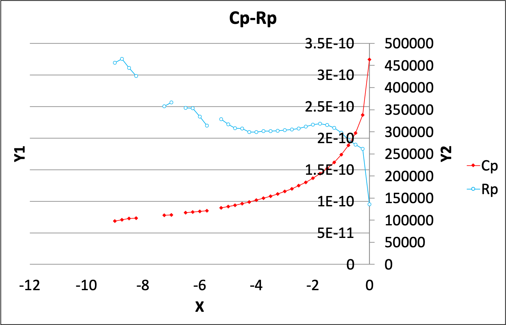
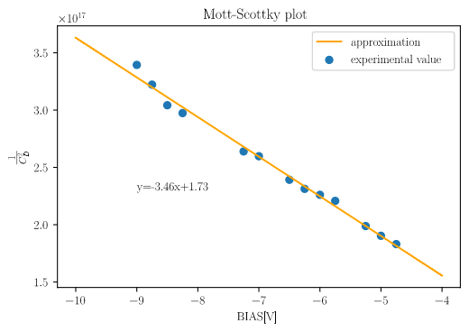

## 1.諸言  

今回の実験では、半導体であるSi,誘電体であるBTOの電気物性を容量-電圧特性を用いて測定した。ドナーを含むSiについては式(1)に基づくMott-Schottkyプロットよりドナー密度を求めた。  
$$\cfrac{1}{C_D^2}=\cfrac{2[V_0-V-\frac{kT}{e}]}{e\epsilon_s\epsilon_0 N_D}~~~~(1)$$
また、BTOはキュリーワイス則により電気特性が温度によって変化する。今回は、作成したBTO薄膜のリークが大きかったため、BTOを用いた市販のコンデンサーの測定を温度を変えながら行い、電気特性と温度の関係について理解を深めた。さらに、実験Aで作成したBTO薄膜について、電気特性を測定し、薄膜を評価した。  

## 2.実験方法  

#### 試料  

Si(n)半導体の電気測定には、以下のような試料を用いた。  
Au上部電極とSi(n)半導体間はショットキー接合となっており、今回の測定ではこの部分の静電容量を測定した。Si(n)とCu基板はInGaペーストで接着されており、Si(n)とInGa間はオーミック接合である。また、印加電圧は直流(BIAS)を-10[V]から0[V],さらに10kHz,$\mathrm{V_{RMS}=20mV}$の交流電圧を印加した。  

#### 測定装置  

今回用いたLCRメーターは、薄膜などの測定対象に直流・交流両方の電圧を印加し、この時に発生するインピーダンスを測定することで測定対象の電気特性を測定する装置である。インピーダンス$Z$は、以下の式で表される。
$$Z=\cfrac{\Delta V}{\Delta I}$$
測定対象をどのような回路素子に置き換えるかを設定することで、静電容量、抵抗といった様々な特性を測定することができる。  
この置き換えた仮想的な回路素子を等価回路といい、今回は静電容量C[F]のコンデンサーとR[Ω]の抵抗を並列に繋いだRC並列回路を等価回路に用いた。また、光による電子遷移を防ぐため試料に当たる光を遮断した状態で測定を行った。  

## 3.結果  

#### BTO比誘電率の温度依存性  

温度を20℃ごとに上昇させながらBTOの比誘電率を測定した結果を以下の図1に示す。  

{height=70mm}  

#### Siキャパシタンス測定  

市販のSi(n)半導体について、印加電圧を変化させた時の抵抗、静電容量を以下の図2に示す。  

{height=70mm}  

Mott-Schottkyプロットを以下図3に示す。欠損データは除外してプロットした。  

{height=70mm}  

回帰直線は最小二乗法により作成した。

## 4.課題と考察

#### 考察

作成したBTO薄膜には、1.12のSEMによる観察でも見られたように亀裂が多くあった。このことから、基板上に一部薄膜が付着していない部分が存在したと考えられ、その部分が導線のような働きをしてリークが生じたと考える。

#### (1)  

図2の回帰直線の傾きは$-3.46\times 10^{-4}$だった。  
Mott-Scottkyプロットは式(1)の左辺の$\cfrac{1}{C_D^2}$を縦軸、横軸に印加電圧$V$をプロットしたものである。このプロットの傾きは$\cfrac{-2}{e\epsilon_s\epsilon_0 N_D}$となるため、既知の値である$e,\epsilon_s,\epsilon_0$を用いてドナー密度$N_D$を算出することができる。  電気素量$e=1.602\times10^{-19}\mathrm{[C]}$,真空の誘電率$\epsilon_0=8.85\times10^{-12}\mathrm{[F/m]}$,Siの比誘電率$\epsilon_s=11.7$を代入すると、ドナー密度は  

$$N_D=3.49\times10^{14}\mathrm{[cm^{-3}]}$$

となった。今回用いたSi半導体のドナー密度は$1.9-2.4\times10^{14}\mathrm{[cm^{-3}]}$であり、オーダーが一致した。  

#### (2)  

今回のBTOを用いた市販のコンデンサーにおける測定では、温度が上昇するにつれて比誘電率が低下することがわかった。しかし、本来のBTOのキュリー温度である120[℃]では比誘電率の低下が見られなかった。これは、市販のコンデンサーでは高温条件下で比誘電率の低下を防ぐために添加物が加えられているためと考える。この添加物はディプレッサーといい、代表的なものにCaTiO3,PbTiO3,BiTiO3などがある。  
これらはBTOのBaサイトをCa,Pb,Biなどで置換することで結晶構造に変化を起こし、相転移温度を変化させる。
この仕組みについては原子の熱振動によるX線、電子線散乱の大きさの度合いを表すデバイ-ワラー因子との関連が示唆されている。  

#### (3)  

抵抗,コンデンサーそれぞれのインピーダンスを$Z_R,Z_C$とすると,各インピーダンスは以下のように表される。  

$$Z_R=R$$
$$Z_C=\cfrac{1}{i\omega C}$$

また、これらは並列であるため各素子の両端の電圧は等しいと考えることができる。高周波数では$Z_C\approx0$となり、全体の複素インピーダンス$Z\approx R$となり、コンデンサーの影響が無視できるようになるためRC等価回路は不適切である。  

#### (4)

Siにおいて、RC並列等価回路のCは空乏層の静電容量を表すものであった。しかし、今回用いたSi(n)半導体は中にキャリアが存在することで半導体としての性質を得ている。RC並列等価回路のうち、RはSi(n)半導体内部でのキャリア移動度、すなわちキャリアの動く速度を表す指標であると考える。  
BTOについては,コンデンサーのリークを示す指標としてRが用いられている。本来コンデンサーは電流を遮断するものであるが、わずかに電荷がもれることがある。RC並列等価回路のうち、Rが小さいほどリークが大きいと言う関係が成立する。

## 5.結言  

半導体・誘電体物性について、実験データを解析することで定量的な理解をすることができた。特にドナー密度と静電容量について、両者の関連を理論に基づいて習得することができたと考える。  

## 6.参考文献  

* 積層コンデンサの電気的特性に与える添加物の影響,小笠原正　他,素材物性学雑誌第11巻第l号37-44(1998) 
* La及びHo添加BaTio3の電気特性に及ぼす微構造と格子欠陥,伊東純一 他,Journal of the Japan Society of Powder and Powder Metallurgy Vol. 49, No. 7
* XAFS法によるBaTiO3セラミックス中の添加物の局所構造解析,安川勝正 他,先端研究施設共用イノベーション創出事業
* インピーダンス分光法による銅フタロシアニン薄膜のキャリア輸送特性の評価,樋元健人 他,近畿大学理工学総合研究所理工学総合研究所研究報告 (27), 43-47, 2015-02
* https://jp.rs-online.com/web/generalDisplay.html?id=ideas-and-advice/multilayer-ceramic-capacitors-guide,積層セラミックコンデンサ MLCC ガイド | Multilayer Ceramic Capacitors | 技術情報 Ideas and Advice | 半導体・電子部品の通販 RSオンライン
