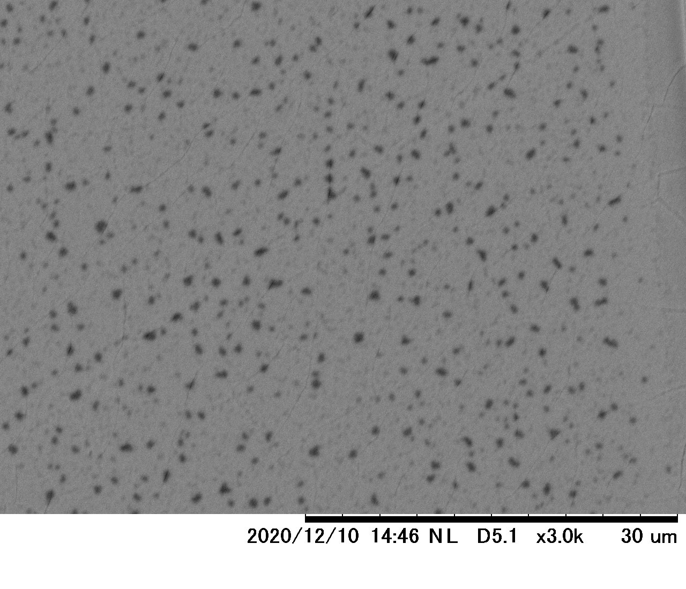

## 1.諸言

今回の実験では、チタン酸バリウム($\ce{BaTiO3}$,BTO)薄膜の作成、物性評価を行った。薄膜とはnmスケールの膜であり、同じ物質であってもバルクとは異なる物性を持つ。また薄膜加工は半導体デバイス、表面加工(メッキ)などに広く用いられており工業的に重要である。今回の実験ではゾルゲル法による薄膜作成、XRD,XRF,走査型膜厚測定,電子顕微鏡を用いた薄膜評価を行った。  

## 2.実験方法  

#### 試薬

* 酢酸 3.75[mL]  
* 酢酸バリウム  0.6268[g]
* 2-メトキシエタノール  3.75[mL]
* オルトチタン酸テトライソプロピル  0.75[mL]
* アセチルアセトン  0.365[mL]  
  
#### 基板

* $\ce{Si/SiO2}$基板(以後Si基板)
* $\ce{Pt/Ti/Si/SiO2}$基板(以後Si-Pt基板)

#### 薄膜調整  

1. 60℃に加熱した酢酸に秤量した酢酸バリウムを加え、冷却しながら攪拌して溶解させた。
2. 2-メトキシエタノールにオルトチタン酸テトライソプロピル・アセチルアセトンをそれぞれ加えた。
3. 1で作成した溶液を攪拌しながら1滴づつ2の溶液に加えた。全て加えたのち、密封容器で静置した。
4. Si-Pt基板、Si基板それぞれに3の溶液を数滴滴下し、200rpmで30秒間スピンコートさせて基板表面に拡散させた。
5. 200℃に熱したホットプレートで5分間乾燥させた。
6. 4,5を合計で5回行った後、800℃で１時間焼成した。

今回のゾルゲル法では以下のような反応を用いてBTOを得た。
$$\mathrm{Ba}(\mathrm{OR})_{2}+\mathrm{Ti}(\mathrm{OR})_{4}+3 \mathrm{H}_{2} \mathrm{O} \longrightarrow \mathrm{BaTiO}_{3}+6 \mathrm{ROH}$$

## 3.結果  

#### XRDによる結晶構造解析

今回は二種類の基板について薄膜を作成した。このそれぞれの薄膜についてXRDの測定結果を以下の図1,2に示す。n=5の移動平均を用いてノイズを消去してピークを検出した。  
また、それぞれの測定結果について▼で示したピークについて、JCPDSプロファイルを用いてピークの帰属を行い、さらにその時の格子定数をX線波長$\lambda=1.54068$[Å]として求めた。  

{height=70mm}  

##### XRDピーク帰属(Si基板)  

|  2θ  |    強度    |  格子定数[Å]  |帰属(h,k,l)|
|:----:|:--------:|:----:|:----:|
|22.21|    48.50|4.000|cubic-BTO(100)|
|32.97|  6022.17|2.715|Unknown|
|38.90|    30.17|2.313|cubic-BTO(111)|
|44.88|    43.83|2.018|cubic-BTO(200)|
|50.73|    14.83|1.798|cubic-BTO(210)|
|56.39|    29.67|1.631|cubic-BTO(211)|
|61.69|    24.83|1.502|Unknown|
|69.13|249824.33|1.358|Unknown|    

{height=70mm}    

##### XRDピーク帰属(Si-Pt基板)  

|  2θ  |    強度    |  格子定数[Å]  |帰属|
|:----:|:--------:|:----:|:----:|
|22.11|    53.33|4.018|tetragonal-BTO(110)|
|31.55|   162.67|2.834|tetragonal-BTO(101)|
|32.99|   455.83|2.713|Unknown|
|34.22|    54.50|2.618|Unknown|
|39.90|  1651.17|2.258|Pt(111)|
|45.22|    35.67|2.004|tetragonal-BTO(002)|
|46.46|   304.00|1.953|tetragonal-BTO(200)|
|66.52|  1062.50|1.405|tetragonal-BTO(220)|
|69.13|218575.67|1.358|Unknown|
|76.32|    43.83|1.247|Si(331)|
  
#### XRFによる組成分析  

Si-Pt基板を用いた薄膜のXRFによる組成分析は以下図3のような結果となった。  

{height=70mm}  

Ba,Tiの物質量比はそれぞれ以下のようになった。  

|Ba|Ti|
|---|---|
|57.2347[atom%]|42.7653[atom%]|

#### 膜厚測定  

Si基板、Si-Pt基板で作成した薄膜それぞれについて膜厚を測定した。その結果を以下に示す。  

|基板|膜厚[nm]|
|----|----|
|Si|619|
|Si-Pt|489|

#### SEMによる表面観察  

Si-Pt上で形成した薄膜について電子顕微鏡で観察を行った。1000倍,3000倍,10000倍の画像を以下図4,5,6に示す。  

{height=70mm}  

{height=70mm}  

{height=70mm}  

1000倍では画面縦方向に亀裂が見られた。また、亀裂がない部分でも表面に点状の欠陥または突起と見られる構造が点在していた。  
3000倍では、1000倍で見られた点状の構造の間にさらに微小な亀裂が見られた。10000倍ではそれらの亀裂がはっきりと見え、またさらに微小な点状構造が見られた。

### ZnO紫外線吸光  

ZnO薄膜のUV-Visスペクトルを以下の図7に示す。  

{height=80mm}  

また、この結果から以下の式を用いてTaucプロットを作成した。さらに、このtaucプロットの直線部分を延長することでZnOのバンドギャップを求めた。ZnOのTaucプロットを以下の図8に示す。  

{height=80mm}    

## 4.考察  

## 5.課題  

#### (1)  

平均膜厚はSi-Ptのものの方が130[nm]薄く、XRDは(2)で示すような違いが見られた。Si基板で作成した薄膜はスピンコート時に溶液を多く塗布しすぎたため、膜厚が厚くなり、また表面に亀裂などの発生した荒い薄膜となったと考える。

#### (2)  

Si-Pt基板を用いて作成した薄膜では$2\theta=45^{\circ}$付近に二つのピークが見られた。それぞれのピークは正方晶系BTOの(h,k,l)=(0,0,2),(2,0,0)に当たると考えられ、このことからBTOが正方晶系であることが確認された。一方、Si基板を用いた薄膜では$2\theta=45^{\circ}$付近のピークが一本しか見られなかったことからBTOが立方晶系の状態であると考えられる。これについて、以下のように考察する。  
本来、BTOの相転移温度は120[℃]ほどであり、常温で相転移したとは考えにくい。しかし、この薄膜は表面に亀裂が入っていた。BTOは粉末状にすると物性が変化する「サイズ効果」と言う特性を持っており、粒径85[nm]以下では常温でも立方晶となる。この薄膜の亀裂部分では膜が薄くなっていると考え、このことから、Si基板上の薄膜では一部が立方晶系となっていると考える。  
また、どちらの薄膜でも$2\theta=32^{\circ}$,$2\theta=69^{\circ}$付近に高いピークが見られた。これらは帰属が不明だったが、1,2班の分析でも近い位置にピークが見られたことから全ての基板に共通して用いられている$\ce{SiO2}$のピークであると考える。  
JCPDSカードに記載されていた$2\theta$の値と見られたピーク間に1~2度のシフトが見られた。これは試料が平面であるため、試料の場所により回折角に差が生じたためと考える。  

#### (3)  

Taucプロットにより得られたバンドギャップは3.2[eV]だった。この値は理論値である3.3[eV]と比較しても妥当な値であると考える。

#### (4)  

半導体は電子遷移過程の違いにより、以下の二つに分けることができる。また、ここで言う波数は結晶中の電子の波動関数から求められた電子振動の波長の逆数に2πを乗じたものであり、波数が大きいほど波長が短く、高エネルギーである。また、フォノンとは結晶の振動を量子化したもであり、結晶中の格子振動の激しさをフォノンの数で表す。  

* 直接遷移型半導体：価電子帯にある時の電子が持つ波数と伝導帯にある時の電子の波数が等しい。つまり、遷移によって波数が変化しない。バンド図では垂直に遷移するAに当たる。この遷移はフォノンの放出を伴わないため早く起こる。また、半導体では電子のエネルギー準位に対してホールのエネルギー準位がバンド図上で真上にあるため、電子とホールが結合する際に発光が起こる。GaAsなどが代表的である。

* 間接遷移型半導体：価電子帯にある時の電子が持つ波数と伝導帯にある時の電子の波数が異なる。そのため、電子遷移はまず垂直に移動した、つまり光エネルギーを得た後、フォノンの出入りにより波数が変化する。半導体においては、電子とホールが結合する際に波数の変化を伴い、この時にフォノンが放出される。エネルギーがフォノンによって放出されるため、発光を伴わないのが特徴である。ダイヤモンドやSiと言った単原素半導体が多い。  

#### (5)  

薄膜形成法には、今回用いたゾルゲル法以外に以下のような方法が代表的である。

* 蒸着法  
  薄膜材料を真空中で蒸発させ、気体にして拡散させたのち基板上で凝縮させる方法の総称である。加熱法には過電流を用いたもの、電子線を照射するものなどがある。  
  この方法は、真空中に混入した微量の不純物による汚染が生じる可能性があることと、膜厚の制御が難しい点が欠点である。

* 真空蒸着法
  蒸着法のうち、薄膜材料に過電流を流して加熱することで薄膜材料を蒸発させる方法である。この方法は簡便だが、蒸発量の制御が困難なため膜厚の制御が難しいことと、タングステンなどの高融点金属やセラミックなど、融点が高い物質には適さないという欠点がある。

* 電子線加熱法
  薄膜材料に電子線を照射して加熱、蒸発させる方法である。真空蒸着法よりも加熱性能が高く、ほとんどの材料に用いることができる。一方で、多数の元素からなる組成の薄膜では、構成元素ごとに蒸気圧が異なるため、原料組成と薄膜組成が異なる組成傾斜が発生することがある。

* パルスレーザー蒸着法  
  組成傾斜を防ぐため、レーザーを用いて加熱するパルスレーザー蒸着法がある。この方法では薄膜の一部のみを高精度で加熱することができ、加熱された部分の組成を薄膜で再現することができる。

* スパッタリング  
  真空放電中、陰極から原子が放出される現象をスパッタリングという。これは、放電で生じたプラズマ中のイオンが陰極原子に衝突する際に運動量が交換されるためである。このようにして放出された陰極原子を基板上に集積させることで薄膜を形成する。  
  真空放電の際の陰極に薄膜材料を直接用いる直流・高周波スパッタリング、磁場を用いて電子の飛程を伸ばし、イオン化効率を上げたマグネトロンスパッタリング、単体金属をスパッタリングさせたのち基板上で反応させて化合物の薄膜を得る反応性スパッタリングなどがある。

* CVD(Chemical Vapor deposition)  
  気相における粘性流を用いて原料を基板近くに輸送し、基板上の表面化学反応を用いて薄膜を形成する方法である。予め基盤を反応温度まで加熱し、原料ガスを上から流すことで表面での反応を起こすホットウォール法や、所定の温度に設定した基盤にプラズマを照射することで反応を開始させるプラズマ誘起CVD法などがある。  

#### (6)  

* ICP発光分光分析法
  試料中の構成元素外部からプラズマを照射することで励起させ、基底状態に戻るときに生じる蛍光スペクトルを分析する方法である。XRFに比べて高感度で高精度である。また、リンやホウ素といった軽量元素、希土類などのXRFに適さない元素も測定することができる。

* 原子吸光分析法
  加熱により原子蒸気化させた試料に特定波長の光を透過させ、吸光度から元素分析を行う。各元素が吸収する光の波長はエネルギー準位によって異なるため、透過させる光の波長を変化させることで様々な元素を検出することができる。  
  
## 6.結言  

今回の実験でスピンコート法による薄膜作成について学ぶことができた。また、XRD,XRF,UV-Visなど各種の分析手法について仕組みとデータの解釈を習得することができた。

## 7.参考文献  

* PVD法による薄膜作製技術の歴史と展望,金原粲,表面技術Vol.58,No12,2007
* https://www.shincron.co.jp/technical/device8-1.html,8.薄膜作製に関するポイント｜技術情報｜株式会社シンクロン
* https://www.oike-kogyo.co.jp/research/column/ion/,イオンプレーティング技術 | コーティング技術解説コラム | 技術・研究開発 | 尾池工業株式会社
* https://www.hitachi-hightech.com/hhs/products/tech/ana/icp/descriptions/,ICP発光分光・質量分析：原理解説 ：日立ハイテクサイエンス