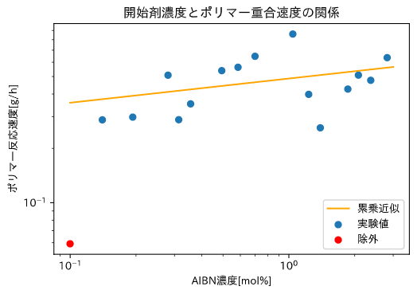
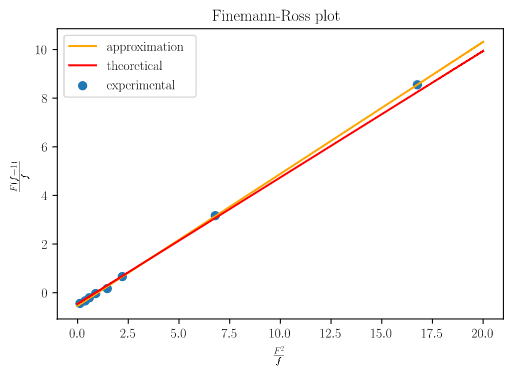

---
output:
  pdf_document:
    latex_engine: lualatex
documentclass: ltjsarticle
filters:
  - pandoc-crossref
header-includes:  \usepackage[version=4]{mhchem}
  \usepackage{amsmath}
  \usepackage{chemfig}
  \usepackage{siunitx}
  \usepackage[margin=1in]{geometry}
---

## 目的  

今回の実験は、スチレンの塊状重合・スチレンとメタクリル酸メチルの共重合という二つのラジカル重合を扱った。スチレンの塊状重合では「開始剤濃度と重合速度の関係」、スチレンとメタクリル酸メチルの共重合では「モノマー仕込み比とポリマー組成比」の関係について提唱されている理論を実験的に検証することを目的とした。  

## 原理

### ラジカル重合の反応速度

ラジカル重合は、開始剤$\mathrm{I}$、モノマー$\mathrm {M}$,ポリマー$\mathrm{P}$とそれらのラジカルが関係する以下の五段階の反応によっておこる。  
開始段階では、開始剤がラジカル開裂し、二分子のラジカル$\mathrm{R\cdot}$が生成する。(1)  

$$\mathrm{I \rightarrow 2R\cdot }　~~~~~反応速度:k_d$$  

このラジカルがモノマーと反応しモノマーラジカルが生成する。(2)ここまでが開始段階である。  

$$\mathrm{R \cdot + M \rightarrow M\cdot }~~~~~反応速度:k_1$$ 

次に、モノマーとモノマーラジカル、ポリマーラジカルとモノマーが結合する成長反応(3)がおこる。  

$$M +  M_{n}\cdot \rightarrow M_{n-1} \cdot~~~~~反応速度:k_p$$

この時、ポリマーの反応性は成長末端のモノマーによって決まる、つまり、ポリマーラジカルとモノマーラジカルの反応性は等しいため、3式の反応速度は一定と考える。  

最後に、ラジカル同士が結合して反応が停止する停止反応がおこる。(4)停止反応には(5)再結合停止(反応速度定数$k_{tc}$)と不均化停止(反応速度定数$k_{td}$)の二種類がある  

$$2M\cdot \rightarrow P~~~~~$$

ここで、簡単のため、以下の３つの仮定をおく。

1. 成長反応の速度定数はポリマーラジカルまたはポリマーの長さ($M_n$のn)によらない

2. 成長ラジカルの生成速度($k_p$)と消失速度は等しく、成長段階にある時はラジカル濃度は変化しない

3. モノマーは成長反応によってのみ消失する。

3の仮定よりモノマーは(3)の反応によってのみ消費される。重合速度$R_p$をモノマーの消費速度と定義すると、

$$R_p=-\cfrac{d[M]}{dt}=k_p[M][M \cdot]~~~~(1)$$

2の仮定よりラジカル濃度は開始段階で生成したものから変化しないと考える。。そのため、開始剤濃度と生成するモノマーラジカル濃度の関係は以下の式で表される。開始剤効率を$f$とすると  

$$2k_df[I]=k_t[M\cdot]^2~~~~(2)$$

左辺が(1)で生成するラジカルの濃度、右辺が(4),(5)で消失するラジカルの濃度である。  

ここから、開始剤濃度とモノマーラジカル濃度の間に以下の関係が言える。  

$$[M\cdot]=\sqrt{\cfrac{2k_df}{k_t}}[I]^{\frac{1}{2}}~~~~(3)$$

よって、(3)を(1)に代入すると  

$$R_p=\sqrt{\cfrac{2k_df}{k_t}}k_p[I]^{\frac{1}{2}}[M]$$  

となり、反応速度が開始剤濃度の$\frac{1}{2}$乗に比例することがわかる。  

### Fineman-Rossプロット  

二種類のモノマーが関与する共重合では、成長段階の反応に以下の四種類がある。  

$$\mathrm{M_1\cdot +M_1 \rightarrow M_1\cdot}$$
$$\mathrm{M_1\cdot +M_2 \rightarrow M_2\cdot}$$
$$\mathrm{M_2\cdot +M_1 \rightarrow M_1\cdot}$$
$$\mathrm{M_2\cdot +M_2 \rightarrow M_2\cdot}$$

それぞれの反応速度定数を$k_{11},k_{12},k_{21},k_{22}$とすると、各モノマーの消失速度は以下の二式で表すことができる。  

$$-\cfrac{d\mathrm{[M_1]}}{dt}=k_{11}\mathrm{[M_1\cdot][M_1]}+k_{21}\mathrm{[M_2\cdot][M_1]}$$

$$-\cfrac{d\mathrm{[M_2]}}{dt}=k_{12}\mathrm{[M_1\cdot][M_2]}+k_{22}\mathrm{[M_2\cdot][M_2]}$$  

よって、モノマーの消失速度比は  

$$\mathrm{\cfrac{d[M_1]}{d[M_2]}=\cfrac{k_{11}\mathrm{[M_1\cdot][M_1]}+k_{21}\mathrm{[M_2\cdot][M_1]}}{k_{12}\mathrm{[M_1\cdot][M_2]}+k_{22}\mathrm{[M_2\cdot][M_2]}}}$$  

定常状態を仮定し、各ラジカルの濃度($\mathrm{[M_1\cdot],[M_2\cdot]}$)を一定とすると、  

$$\mathrm{k_{12}[M_1\cdot][M_2]=k_{21}[M_2\cdot][M_1]}$$  

が成立する。$r_{1}=\frac{k_{11}}{k_{12}},r_{2}=\frac{k_{22}}{k_{21}}$とし、()式を()式に代入すると

$$\mathrm{\cfrac{d[M_1]}{d[M_2]}=\cfrac{[M_1](r_1[M_1]+[M_2])}{[M_2]([M_1]+r_2[M_2])}}$$  

よって、モノマー仕込み比$\mathrm{\frac{[M_1]}{[M_2]}}$を$F$,ポリマー組成比$\mathrm{\frac{d[M_1]}{d[M_2]}}$を$f$とすると、

$$\cfrac{F(f-1)}{f}=\cfrac{r_1F^2}{f}-r_2$$  
という式で表すことができる。$F,f$は実験により求めることができ、x軸に$\frac{F^2}{f}$,y軸に$\frac{F(f-1)}{f}$をとったグラフは直線となる。また、このグラフの傾きが$r_1$,y切片が$-r_2$となることからモノマー反応性比を算出できる。これがFinemann-Rossプロットである。

## 実験方法

### 試薬

#### 《スチレンの塊状重合》

* スチレンモノマー(特級、和光純薬) 
* 2-2'アゾビスイソブチロニトリル(AIBN,特級,和光純薬)
* メタノール

#### 《スチレンとメタクリル酸の共重合反応》

* スチレンモノマー(特級、和光純薬) 
* メタクリル酸メチルモノマー(MMA,EP,ナカライテスク)
* 2-2'アゾビスイソブチロニトリル(AIBN,特級,和光純薬)
* メタノール
* クロロホルム
* 重クロロホルム

スチレンモノマー,AIBN,MMAについて密度、分子量を以下の表に示す。  

|物質|密度[g/ml]|分子量[g/mol]|
|----|----|----|
|スチレン|0.910||
|MMA|0.944|100.12|
|AIBN|-|164.21|

### 実験器具(共通)

* 重合管
* デシケーター
* ポンプ
* 二方コック
* ピンセット
* スパチュラ
* カップ
* スターラー
* 攪拌子
* ブフナー漏斗
* 濾紙
* 吸収瓶
* ビーカー(小)
* ビーカー(大)

### 実験操作

#### 《スチレンの塊状重合》  

1. スチレンを秤量し、重合管に加えた。
2. AIBNを秤量し、重合管に入れスチレンに溶解させた。その後、重合管のすりにワセリンを塗布し、二方コックで密栓した。
3. コックにポンプを接続し、ドライアイスで冷却したメタノール浴(-70℃)で5分管冷却し、凍結させた。完全に凍結したのち、ポンプで脱気した。
4. コックを締め、密栓した状態で室温で融解させた。
5. 完全に融解させたのち、60℃の恒温槽で60分間反応させた。
6. 氷水で冷却し、反応を止めた後にコックを外した。重合管のすり、コックをヘキサンで拭いた。
7. ビーカーにメタノール100mLを入れ、攪拌しながら重合管の内容物をビーカーに滴下した。重合管内部をメタノールで洗浄し、洗浄液もビーカーに加えた。
8. ビーカー中の反応溶液を吸引濾過した。この時、ビーカーをメタノールで洗浄し、洗浄液も濾過した。
9. 残った沈殿を濾紙ごとカップに移し、デシケーターで一晩真空乾燥させた。この時、濾紙、カップは予め秤量済みのものを用いた。
10. 真空乾燥したカップを秤量し、濾紙、カップの質量の差からポリマー収量を算出した。
11. 20分再度真空乾燥を行い、再秤量した。10,11の差が5%以内に収まるまで10,11を繰り返した。  

#### 《スチレンとメタクリル酸の共重合反応》

1. スチレン、MMAを秤量し、重合管に加えた。
2. AIBNを秤量し、重合管に入れスチレンに溶解させた。その後、重合管のすりにワセリンを塗布し、二方コックで密栓した。
3. コックにポンプを接続し、ドライアイスで冷却したメタノール浴(-70℃)で5分管冷却し、凍結させた。完全に凍結したのち、ポンプで脱気した。
4. コックを締め、密栓した状態で室温で融解させた。
5. 完全に融解させたのち、60℃の恒温槽で60分間反応させた。
6. 氷水で冷却し、反応を止めた後にコックを外した。重合管のすり、コックをヘキサンで拭いた。
7. ビーカーにメタノール100mLを入れ、攪拌しながら重合管の内容物をビーカーに滴下した。重合管内部をメタノールで洗浄し、洗浄液もビーカーに加えた。
8. ビーカー中の反応溶液を吸引濾過した。この時、ビーカーをメタノールで洗浄し、洗浄液も濾過した。
9. 残った沈殿を濾紙ごとカップに移し、デシケーターで一晩真空乾燥させた。この時、濾紙、カップは予め秤量済みのものを用いた。
10. 沈殿を少量のクロロホルムに溶解し、7のようにメタノールに滴下した。
11. 8と同様に濾過を行い、濾紙、沈殿をカップに移して20分間真空乾燥を行った。
12. 10~11を再度行い、合計で三回再沈殿を行った。三回目の濾過には、秤量したカップ、濾紙を使用した。
13. 一晩真空乾燥させた後、カップを秤量してポリマー収量を求めた。
14. ポリマーを20mg量りとり、重クロロホルムに溶解してNMRサンプルチューブに充填した。
15. $\mathrm{^{1}H}$NMRによる組成分析を行った。  

## 結果  

#### 《スチレンの塊状重合》

各サンプルについて、反応時間1[h]でのポリマーの収量,スチレン・AIBNそれぞれの使用量[mg],それぞれの使用量[mol],AIBN濃度を以下の表に示す。  

| ポリマー収量[g] |AIBN[mg] |St[ml] |St$\mathrm{\times 10^{-2}[mol]}$|AIBN$\mathrm{\times 10^{-3}[mol]}$|AIBN濃度|
|:-----:|:----:|:--:|:-----:|:-------:|:------:|
|0.3983| 88.4|  5| 4.369|  0.5383|1.23225|
|0.4260|133.5|  5| 4.369|  0.8130|1.86093|
|0.5092|149.2|  5| 4.369|  0.9086|2.07978|
|0.6361|202.0|  5| 4.369|  1.2301|2.81579|
|0.2599| 99.9|  5| 4.369|  0.6084|1.39256|
|0.4766|169.9|  5| 4.369|  1.0347|2.36833|
|0.3528| 51.0| 10| 8.737|  0.3106|0.35546|
|0.5627| 84.0| 10| 8.737|  0.5115|0.58546|
|0.6473|100.5| 10| 8.737|  0.6120|0.70046|
|0.8597|149.6| 10| 8.737|  0.9110|1.04268|
|0.2882| 45.0| 10| 8.737|  0.2740|0.31364|
|0.5389| 70.8| 10| 8.737|  0.4312|0.49346|
|0.2877| 30.2| 15|13.106|  0.1839|0.14032|
|0.5086| 60.3| 15|13.106|  0.3672|0.28018|
|0.0592| 21.5| 15|13.106|  0.1309|0.09990|
|0.2979| 41.6| 15|13.106|  0.2533|0.19329|  

この値から、開始剤濃度を横軸・ポリマー収量を縦軸にとった両対数グラフを作成した。  
次に、累乗近似を行うため、関数形として
$$y=b(x^a)$$
を仮定して外れ値を含むフィッティングを行った。  
統計的な処理を行うにあたり、各データを$y_i$,フィッティングによって求まる推定値を$\hat y_i$とする。
この時、誤差を$b'$とおき、
$$y_i=b'\cdot\hat y_i$$とする。  
両辺の対数をとると
$$\begin{aligned}\log y_i&=\log(b'\cdot\hat y_i)\\&=\log(b'\cdot b(x^a))\\&=\log b'+(\log b + a\log x)\end{aligned}$$
となる。
よって今回は、各実験値・推定値それぞれに対して常用対数をとり、差をとった物である$\log b'$を誤差項とした。
この誤差項について正規分布を仮定し、99%信頼区間をもちいてスミルノフ＝グラブス検定を行い、外れ値を除外した。
外れ値を除外したデータについてもう一度フィッティングを行い、これを累乗近似としてグラフ上に記載した。  

{height=80mm}  

この累乗近似の式は以下の通りであった。($R_p$:ポリマー反応速度,$\mathrm{[I]}$:開始剤濃度)

$$\mathrm{R_p=A\cdot [I]^{0.447}}$$

#### 《スチレンとメタクリル酸の共重合反応》  

##### NMRピークの帰属

##### 共重合体組成の決定  

各サンプルについて、スチレン、MMAそれぞれの使用量、NMR積分比()、仕込み比、共重合体組成比を以下の表に示す。

|スチレン使用量[mL]|MMA使用量[mL]|積分比|仕込み比|ポリマー組成比|
|--:|--:|-------:|------:|------:|
| 10|  2|    5.53| 4.6334| 3.1621|
|  8|  4|    8.14| 1.8534| 1.5564|
|  6|  6|   11.31| 0.9267| 0.9627|
|  4|  8|   16.83| 0.4633| 0.5785|
|  2| 10|   30.06| 0.1853| 0.2956|
| 11|  1|    4.29|10.1935| 6.2016|
|  7|  5|    9.96| 1.2974| 1.1494|
|  5|  7|   13.53| 0.6619| 0.7597|  

この値を用いて、2節で述べた式に基づきFinemann-Rossプロットを作成した。  

{hight=60mm}  

このプロットから算出したモノマー反応性比と理論値を以下の表に記載する。  

|モノマー|実験値|理論値|
|------|-----|-----|
|$r_1$|0.54|0.52|
|$r_2$|0.54|0.46|

## 考察  

### 《スチレンの塊状重合》
　
#### (1)反応次数の検証

今回得られた反応次数は、累乗近似より0.477であった。これは、スミルノフ＝グラブス検定を用いて外れ値を除外したものである。理論値である反応次数0.5との差異は、実験値のばらつきによるものであると考える。このばらつきは重合管に混入した酸素が開始剤と反応することでラジカルを生成し、モノマーラジカルが生成しなかったことが原因と考える。よって、仮定は妥当であると考える。

#### (2)酸素阻害

ラジカル重合において、酸素は開始剤によって生成したラジカルと反応し、モノマーラジカルの生成を阻害し、反応を遅らせる。ラジカル生成の起こりやすさは結合解離エネルギーによって決まる。したの図から、酸素の方が結合解離エネルギーが小さく、開裂しやすいため酸素阻害の影響が大きいと考える。今回の実験では冷凍脱気を行って酸素を除去することで酸素阻害を抑えた。  
カチオン重合、アニオン重合などのイオン重合においては求電子/求核付加反応が発生する。  
水は平衡状態でわずかに電離しているためプロトン性の溶媒であり、$H^{+}$と$OH^{-}$を含む。そのため、水中でイオン重合を行うとこれらのイオンが活性種を消滅させてしまい、水による阻害が発生する。

#### (3)分子量制御

ラジカル重合において分子量に分布が生じる原因は、活性末端のラジカルが付近化や再結合を起こして反応性を失うことである。そこで、ドーマント種と呼ばれる前駆体を用いて可逆的にラジカルを保護し、モノマーに対する反応性を維持するリビングラジカル重合が有効である。

### 《スチレンとメタクリル酸の共重合反応》　　

#### 共重合体組成の検討  

Fineman-Rossプロットから算出したポリマー反応性比と理論値の差について考察する。ポリマー反応性比はFinemann-Rossプロットの最小二乗法による近似で求めたが、この時、最も右端の点が理論線よりも上にあることがわかる。この点はスチレン11[mL],MMA1[mL]とMMAが最も少ない条件である。このことから、この反応においてはMMAが使い果たされた、または少量となったために、モノマー大過剰の仮定が崩れて右端の点がずれ、回帰直線も理論線とずれが生じたと考える。

#### NMRスペクトルの特徴  

$H^1NMR$では、プロトンの化学シフトを検出する。この化学シフトは分子のコンホメーションの違いによっても発生する。この時は、炭素や酸素による化学シフトとはことなり、連続的なシフトが繋がって見られるためブロードなスペクトルが見られる。  
高分子においては、分子鎖のコンホメーション変化に加えてセグメント運動も発生し、プロトンの運動が激しいためブロードなピークとなる。

## 結言  

スチレンの塊状重合については開始剤濃度とポリマー収量の関係、スチレンとメタクリル酸の共重合反応についてはモノマー仕込み比に対するポリマー組成比について、実験的に確認することができたことから、本実験の目的は達成された。  

## 参考文献  

* https://labchem-wako.fujifilm.com/jp/product/detail/W01W0119-0820.html  試薬ホームページ｜試薬-富士フイルム和光純薬
* https://labchem-wako.fujifilm.com/jp/product/detail/W01W0101-0493.html 試薬ホームページ｜試薬-富士フイルム和光純薬
* https://www.nacalai.co.jp/ss/ec/EC-srchdetl.cfm?HP=1&l=JP&lc=1&syohin=2272595&syubetsu=3&catalog=&SiireC=&MakerC=&yoro= e-Nacalai Search Version 製品詳細情報
* リビングラジカル重合 ―これまでの進展と今後への展望― ,高分子論文集,Vol.64,No.6,pp.329―342(Jun.,2007),山田 健史・飯田 和則・山子 茂
* スチレンとメタクリル酸メチルのラジカル共重合における貧溶媒の影響,日本化学会誌,No.1,pp.71~74,(1991),山本統平・竹内淳・末政健・山本忠弘・蒲池幹治
* 高分子化学最近の進歩-ラジカル重合-,大津隆行,高分子,vol.28(Oct.,1979)
* 
