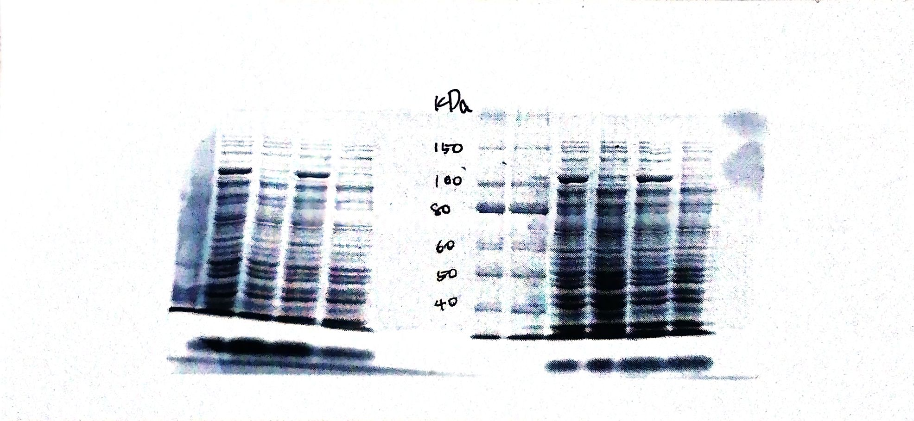
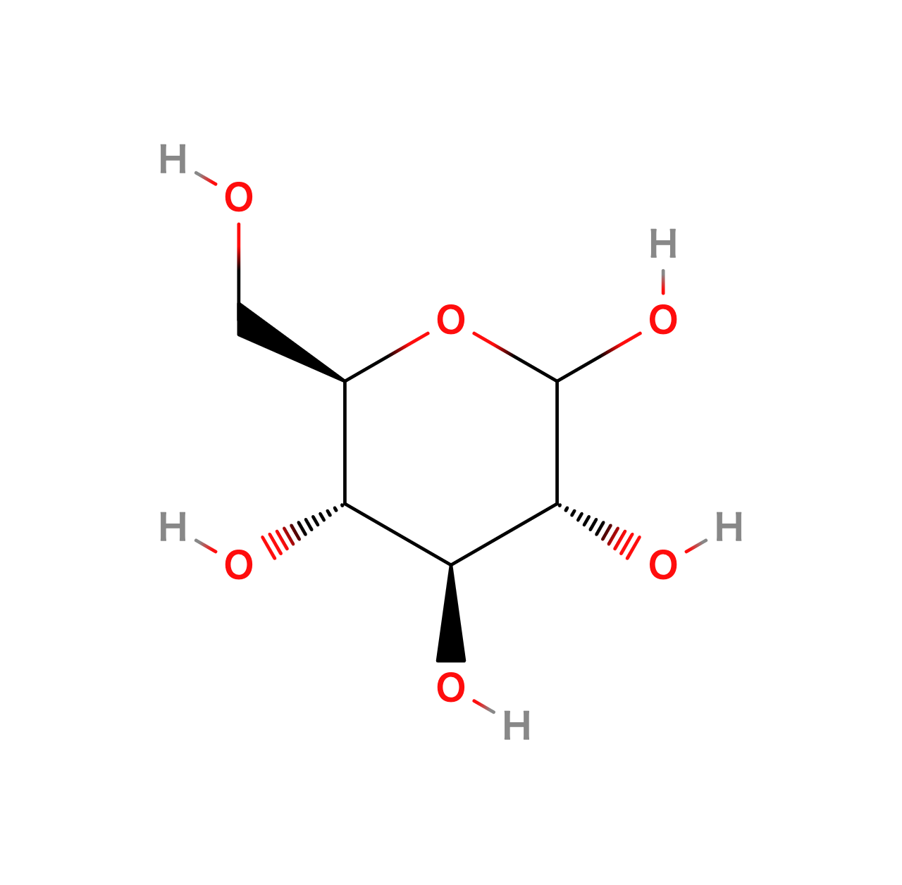
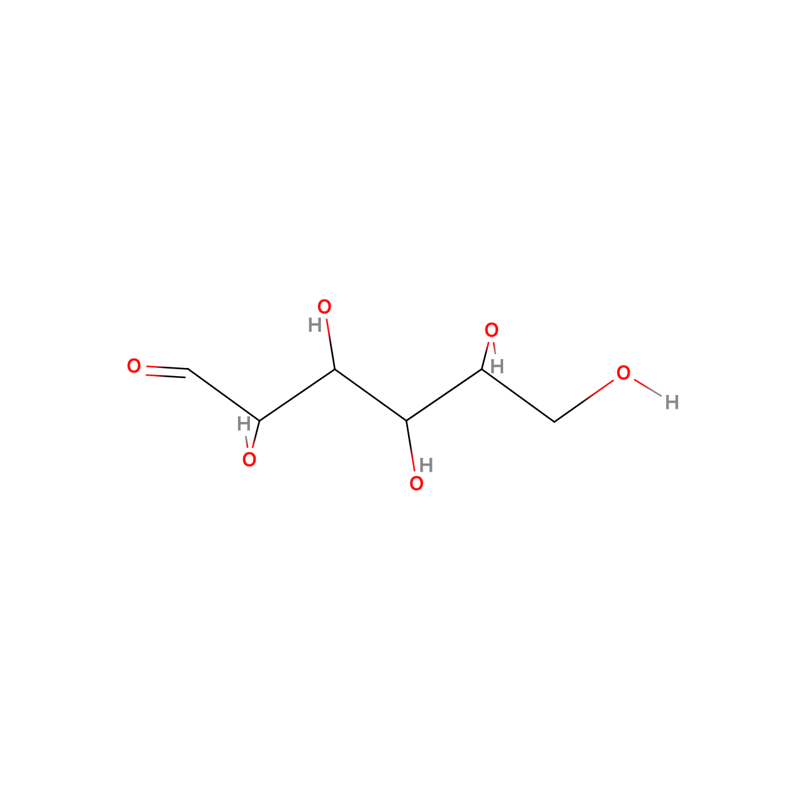

---
output:
  pdf_document:
    latex_engine: lualatex
documentclass: ltjsarticle
header-includes:  \usepackage[version=4]{mhchem}
  \usepackage{amsmath}
  \usepackage[margin=1in]{geometry}
---

## 1.緒言

本実験では、大腸菌の遺伝子発現機構について、βガラクトシダーゼの発現を通じて学んだ。  
また、タンパク質の電気泳動を行い、分子量を測定する手法、
細菌培養や無菌操作など、生物実験特有の操作についても学んだ。  

## 2.実験方法  

### 試薬

* 滅菌水
* 大腸菌($Escherichia~~coli$)k-12株

##### 培養液  

* 100mM IPTG　(Isopropyl β-D-thiogalactopyranoside)  
  
《LB培地  

* polypeptone  10[g]
* Yeast extract  5.0[g]
* NaCl  10.0[g]
  
##### SDS-PAGE関連試薬

* 分子量マーカー

《SDS-PAGE runnninng buffer》

* SDS(Sodium dodecyl sulfate)  1.0[g]
* Tris  3.0[g]
* Glycine 14.4[g]

《CBB染色液》

* CBB 5.0[g]
* Methanol 100[mL]
* Acetic Acid 10[mL]
  
《SDS-PAGE sample buffer》

* SDS  0.40[g]
* 0.5M Tris-HCl  2.0[mL]
* 1M Dithintheitol(DTT)  2.0[mL]
* Coomassie brilliant blue(CBB)  20.0[mg]
* Glycerol  2.0[g]

《CBB脱色液》  

*  Methanol  10[mL]
*  Acetic acid  14[mL]
*  30%(w/v)Acrylamide
*  Acrylamide  75.0[g]
*  N,N'-Methylenebisacrylamide 2.0[g]

《分離ゲル(8%)》

* 30％(w/v)Acrylamide 2.4[mL]
* 1.5M Tris-HCl  2.25[mL]
* 10%(w/v) SDS  90[µL]
* $\ce{H2O}$  4.17[mL]
* TEMED  7.5[µL]
* APS  75[µL]  

《濃縮ゲル(5%)》

* 30％(w/v)Acrylamide 415[µL]
* 0.5M Tris-HCl  625[µL]
* 10%(w/v) SDS  25[µL]
* $\ce{H2O}$  1.4[mL]
* TEMED  2.5[µL]
* APS  25[µL]  
  
##### βガラクトシダーゼ活性測定試薬

* 1M $\ce{Na2CO3}$
* 0.4%(w/v)ONPG
  
《ZーBuffer(pH 7.0)》

* 0.2M $\ce{Na2HPO4}$  300[mL]
* 0.2M $\ce{NaH2PO4}$  200[mL]
* 1M $\ce{KCl}$  10[mL]
* 1M $\ce{MgSO4}$  1.0[mL]
* 1M DTT  1[mL]
* Chloroform  50[mL]
* 10%(w/v)SDS  10[mL]

### 実験方法  

##### 1. SDS-PAGEゲル調整  

1. SDS-PAGE用ガラス板を洗浄し、二枚の間にスペーサーを挟んでクリップで固定した。
2. ガラス板下部から6cmのところに印をつけた。
3.  試薬の項に準じて8%の分離ゲルを50mLの遠沈管に作成し、ガラス板下部から6cmのところまでガラス板の間に注いだ。  
この時、TEMED,APSの両試薬はゲルが固まるのを防ぐために最後に加えた。
4.  ゲルが乾燥しないように滅菌水を1mLゲルの上部に注いだ。
5.  分離ゲルが固まった後、滅菌水を取り除いた。
6.  3同様に試薬の項に準じて5%の濃縮ゲルを50mL遠沈管に作成し,分離ゲルの上部に注いだ。
7.  上部からコームを差込み、一晩静置した。

##### 2. 大腸菌培養  

1. 試験管2本にLB培地を3mLずつ入れ、それぞれA,Bとラベルをつけた。
2. ガスバーナーで試験管の口・蓋を加熱した後、寒天培地から爪楊枝で大腸菌をとり、植菌した。
3. Aの試験管のみIPTGを15µL加え、一晩振とう培養した。

##### 3. 大腸菌懸濁液の調整、光学測定

1. 振とう培養の後、1.5mLマイクロチューブに1mLずつ分注し、15000rpmで一分間遠心分離した。
2. 培地をマイクロピペットで取り除き、滅菌水1mLを加えてボルテックスを用いて攪拌し、懸濁させた。これを大腸菌懸濁液A,Bとした
3. A,Bそれぞれについて、新しい1.5mLマイクロチューブ2本に大腸菌懸濁液を50µL,100µL分注し、これをそれぞれSDS-PAGE用,光学測定用とした。
4. 光学測定用のサンプルについては滅菌水900µLをさらに加えて、10倍希釈した。
5. 10倍希釈した光学測定用サンプルを200µLセルに移し,波長600nmで光学濃度を測定した。この値を$OD_{600}$とした。

##### 4. SDS-PAGE

1. 前項で述べたSDS-PAGE用の大腸菌懸濁液に、SDS-PAGE sample bufferを加え、98℃で五分間加熱した。これをSDS-PAGEサンプルとした。
2. SDS-PAGE用ゲルを泳動槽にたて、SDS-PAGE runnninng bufferを注いだ。また、コームを抜き、ウェルの角度を調整した。
3. 分子量マーカーを2µL,SDS-PAGEサンプルを各20µLウェルに充填し,上部に負極,下部に正極が来るように電極をつないで電気泳動を行った。

##### 5. βガラクトシダーゼの活性測定

1. 3-3で調整した大腸菌懸濁液A,Bをそれぞれ15mL遠沈管に100µLずつ分注した。
2. Z-Buffer 12mLに10%(w/v)SDSを120µL加え、よく攪拌して均一になるようにした。
3. 1の遠沈管それぞれに2で作成したZ-bufferを4.9mLずつ加え、良く攪拌して均一になるようにした。これを反応液A,Bとした。
4. 試験管4本をそれぞれA,A',B,B'とし、A,A'には反応液A,B,B'には反応液Bを1.3mLずつ分注した。
5. A',B'には$\ce{Na2CO3}$を500µL加えた。
6. 各試験管をウォーターバスで28℃に保ち、5分間静置して温度を平衡とした。
7. 試験管に0.4(w/v)ONPGを200µL加え、呈色がみられるまでウォーターバスで温度を保ちながら攪拌しながら反応させた。また、ONPGを加えてから呈色がみられるまでの時間を計測した。
8. 呈色がみられた後、すぐに$\ce{Na2CO3}$を500µL加えて反応を停止した。反応がみられない場合は反応開始5分後に$\ce{Na2CO3}$を500µL加えた。
9. 1.5mLマイクロチューブに反応後のA,A',B,B'のサンプルを1.2mLずつ分注し、13000rpmで1分間遠心分離を行った。
10. 各サンプルの上澄を200µLずつ光学測定ようセルに移し、420nmで吸光度を測定した。

## 3.結果  

####  SDS-PAGE  
SDS-PAGEの結果を以下に示す。  

{height=60mm}  

#### 大腸菌培養液光学濃度測定  

IPTGを加えた大腸菌培養液A,加えなかった大腸菌培養液Bについて、光学濃度($\mathrm{OD_{600}}$)を測定した。結果を以下の表に示す。  

|サンプル|$\mathrm{OD_{600}}$|
|------|----------|
|A|0.623|
|B|0.681|

####  βガラクトシダーゼ活性
βガラクトシダーゼ活性の測定に用いたサンプルA,A',B,B'について、呈色までに要した時間、呈色した後の吸光度について以下の表に示す。  

|サンプル|時間[sec]|吸光度$\mathrm{OD_{420}}$|
|----|----|----|
|A|15|0.107|
|A'|300|0|
|B|122|0.064|
|B'|300|0|  

呈色がみられなかった物、吸光度が負の値になった物は時間を300[sec],吸光度を0とした。

## 4.課題

#### 課題1  

大腸菌のラクトースオペロンでは、今回の実験で用いたβガラクトシダーゼをコードする遺伝子lacZなどが含まれている。通常は、これらの遺伝子の手前にあるプロモーター領域にリプレッサーと呼ばれる阻害因子が結合している。このリプレッサーにより、RNAポリメラーゼによる転写が阻害されるため、通常はlacZなどの遺伝子は発現しない。また、ラクトースはリプレッサーに結合するため、lacZはラクトースが過剰なときに発現する。これは、ラクトースが過剰な時にその代謝を促すため、と考える。これが負の調節機構である。  
今回用いたIPTGはリプレッサーと親和性が高いため、これを用いてリプレッサーを取り除くことができる。よってRNAポリメラーゼが結合可能となり、lacZによってコードされるβガラクトシダーゼが合成される。これがIPTGによるタンパク質発現誘導である。  
  一方、トリプトファンオペロンは通常阻害因子を持たないが、トリプトファンとリプレッサーが結合すると遺伝子発現が阻害される。これはトリプトファンが過剰な時にその産生を抑えるため、と考える。これが正の調節機構である。

#### 課題2  
βガラクトシダーゼは本来、ラクトース(図１)をグルコース(図２)とガラクトース(図3)に分解する反応を触媒する。これは、分子中のグリコシド結合を加水分解して切断する反応である。  
ONPG(図4)はガラクトースとO-ニトロフェノールがグリコシド結合した物質であり、酵素により分解すると黄色のo-ニトロフェノールが産生する。この呈色によりβガラクトシダーゼの活性を測定する。(左からラクトース、グルコース、ガラクトース,ONPG)  

{height=40mm}
{height=40mm}
{height=40mm}
{height=40mm}  

#### 課題3  

泳動により見られたバンドのうち、求めるタンパク質の周辺のゲルを取り、ゲルの成分とタンパク質を分離する。泳動によりタンパク質は分離するため、あるバンドには同じ種類のタンパク質が集まっている。この部分のみを取り出すことで他のタンパク質の汚染の少ない、高純度のタンパク質を得ることが可能である。

#### 課題4

SDSーPAGEは、分離用ゲルにポリアクリルアミド(PAGE),タンパク質の変性にSDSを用いる泳動法である。  
タンパク質は等電点以外のpHでは正または負の電荷を持っており、この状態で電圧をかけることでタンパク質を電極に引き寄せることができる。この性質を利用したものが電気泳動である。  
電気泳動では、網目状のゲル内での移動距離が分子量と相関を持つことを利用してタンパク質を分離する。これは、分子量が大きいタンパク質はゲルの網目に絡まって移動距離が短くなり、逆に分子量が小さいタンパク質はゲルをすり抜けて移動距離が長くなるという関係であり、タンパク質分子が直鎖状である時のみ成立する。
しかしタンパク質は、ジスルフィド結合や静電的相互作用などにより折り畳まれた高次構造を持っているため、泳動に適さない。  
よって、負電荷を持つ界面活性剤であるSDSをタンパク質表面の正電荷と結合させることで静電的相互作用を阻害し、タンパク質を直鎖状にして泳動を行うことでタンパク質の分子量を得ることができる。これがSDS-PAGEである。  
SDS-PAGEではSDSによるタンパク質の変性を伴うが、変性を伴わない泳動法には以下のようなものがある。  

* Native-PAGE法

    ポリアクリルアミドゲルを用い、SDSによる変性を行わずに泳動する方法である。タンパク質の立体構造が保たれるため、正確な分子量の測定には適さないが、目的のタンパク質のみを染色、標識することで分離することが可能である。

* 等電点分離法

    pH勾配のあるゲル中で電気泳動を行う方法である。先述の通り、タンパク質は等電点では電荷を持たず、電場の影響を受けずに静止する。等電点はタンパク質により異なるため、静止した位置によりタンパク質を測定することができる。  

#### 課題5

タンパク質の泳動により作成した検量線は以下の通りである。  
グラフは縦軸を対数軸とし、検量線は関数形を以下のようにおいて最小二乗法による累乗近似を行った。  

$$
y=10^{Ax+B}
$$

{height=80mm}  

近似により、  
$$A=-0.02343557\\B=2.30343239$$

と求めることができた。  
この検量線より、βガラクトシダーゼの分子量を算出すると、108[kDa]となった。βガラクトシダーゼの分子量は116[kDa]であり、下方誤差がみられた。これはSDSによる変性が足りず、ペプチド鎖が直鎖状になりきらなかったためと考える。  

####  課題6

4.結果より、ONPGとβガラクトシダーゼの反応による吸光度変化からβガラクトシダーゼの活性を算出した。  

o-ニトロフェノールの生合成量[nmol]は以下のLambert-Beer則にて算出した。  

$$
A=\epsilon cl
$$

($\epsilon$=モル吸光係数,$c$=モル濃度,$l$=光路長,$A$=吸光度)
今回の条件ではモル吸光係数は0.0045[$\mathrm{mL~nmol^{-1} cm^{-1}}$],光路長は1[cm]とした。  

次に、o-ニトロフェノールの生合成量からβガラクトシダーゼの活性を算出する式は以下の通りである。  

$$
\beta-ガラクトシダーゼ活性＝\cfrac{o-ニトロフェノールの生合成量}{反応時間　\times　反応に使用した菌体量}
$$

反応に使用した菌体量は、光学濃度($\mathrm{OD_{600}}$)より以下の式で求められる。  

$$反応に使用した菌体量=反応に使用した培養液量\times　OD_{600}$$

ここで、ONPGとの反応に用いた培養液は100[µL]より、サンプルA,Bそれぞれのβガラクトシダーゼ活性は以下の表の通りとなる。  

|サンプル|活性$\mathrm{[nmol~mL^{-1}min^{-1}]}$|
|---|---|
|A|1526|
|B|103|  

IPTGを入れたAのサンプルの方がβガラクトシダーゼ活性が高く、リプレッサーの排除により負の調節機構が働かなくなり、β-ガラクトシダーゼがより多く産生されたと考える。一方、Bのサンプルもわずかにβ-ガラクトシダーゼが産生されていることがわかる。これは、何らかの理由で調節機構が働いていなかった大腸菌が少量混入、増殖していたためと考える。  

\newpage

## 5.結言

今回の実験を通じて、遺伝子発現の調節機構について理解が深まった。また、無菌操作等も実際に行うことができたため、本実験の目的は達成されたと言える。

## 6.参考文献

* β-D-ガラクトシダーゼの開発と利用,齋藤忠夫　他著,乳業技術vol67,2017
* ポリアクリルアミド電気泳動（SDS-PAGE）の原理と方法 | MBLライフサイエンス,https://ruo.mbl.co.jp/bio/support/method/sds-page.html