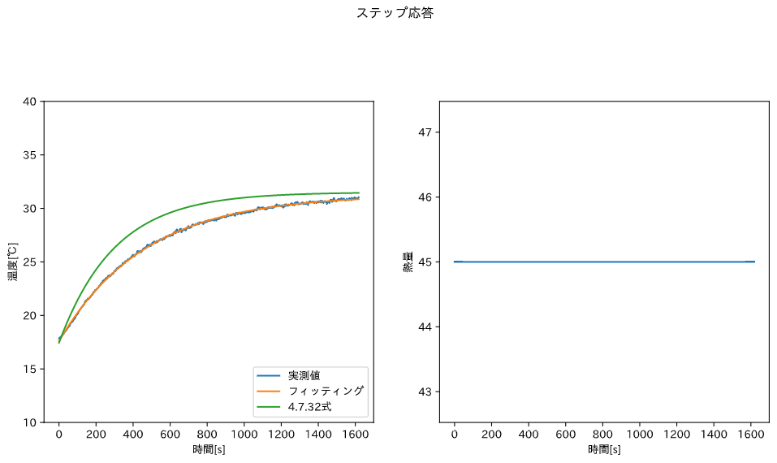

---
output:
  pdf_document:
    latex_engine: lualatex
documentclass: ltjsarticle
header-includes:  \usepackage[version=4]{mhchem}
  \usepackage{amsmath}
  \usepackage[margin=1in]{geometry}
---

# 1.緒言

流動層型反応装置は、重質油分解・粉体の乾燥・触媒反応など、流体と粒子が関連する系で多く用いられる。流動層では、充填した粒子に下から流体を吹き上げることで粒子を吹き飛ばすため、この系では粒子は流体として扱うことができる。本実験では、このように特徴的な流動層の流動特性を、実際に観察することで学ぶことを目的とした。また、本実験の二つ目のトピックである温度制御は、多くの化学プラントにおいて重要な位置を占めている。本実験では、フィードバック制御のうち、P制御・PID制御をさらに手動制御を用いて流動層の温度制御を行い、各制御の仕組みを学ぶことを目的とした。

# 2.原理

## 2.1 流動特性

今回用いた反応器内の流動状態は、大きく固定層・遷移状態・流動層に分けられる。  
固定層とは、粒子が動いていない状態をさす。この時、圧力損失は以下のErganの式(式4.7.1)で表される。  

$$\Delta_P=\cfrac{150\mu u_0(1-\epsilon_m)^2}{(\phi_s d_p)^2\epsilon_m^3}+\cfrac{1.75\rho_g u_0^2(1-\epsilon_m)}{\phi_s d_p \epsilon_m^3}~~~~~~(1)$$  

$\epsilon_{m}$は固定層での粒子の空隙率であり、$\phi_s$は粒子の形状定数である。  
一方、気体の流速が大きい時は気体が粒子に及ぼす揚力が粒子を押し上げることで、粒子を流体と考えることができる。この時、層内の圧力損失は流体の流速によらず、

$$\Delta_P=L_f(1-\epsilon_m)(\rho_p-\rho_g)~~~~~~(2)$$

となる。  
また、この二者の中間にあたる状態を遷移状態という。  
二つの式で表される圧力損失の値が等しくなる時、粒子に働く揚力と重力が釣り合っており、流動が始まる瞬間であると言える。この時の気体の流速を最小流動化速度$u_{mf}$と良い、2式を連立することで得られる。  
また、Erganの式においては、粘性の影響と乱流の影響が分かれている。それぞれの影響の大きさは流速・粒径によって異なる粒子Re数で決まり、粒子Re数が20以下の微小粒子では粘性が支配的であると考え、1000以上の粗大粒子では乱流が支配的であると考える。  
粒子Re数は以下の式で表される.(式4.7.3)

$$Re_p=\cfrac{d_p u_{mf} \rho_{g}}{\mu}~~~~~~(3)$$  

以上から、微小粒子・粗大粒子それぞれについて以下のように最小流動化速度が求められる。$\epsilon_{mf}$は流動開始時の粒子の空隙率である。

$$u_{mf}=\cfrac{\epsilon_{mf}^3\phi_s^2d_p^2(\rho_p-\rho_g)g}{150(1-\epsilon_{mf})\mu}~~~~~Re_p<20~~~~~(4)\\
u_{mf}=\sqrt{\cfrac{\epsilon_{mf}^3\phi_sd_p(\rho_p-\rho_g)g}{1.75\rho_g}}~~~~Re_p>1000~~~~~(5)$$  

また、空隙率$\epsilon_{mf}$,形状定数$\phi_s$には以下の近似式が成り立つ。  

$$\cfrac{1-\epsilon_{mf}}{\epsilon_{mf}^3\phi_s^2}\simeq11~~~~(6)\\
\cfrac{1}{\epsilon_{mf}^3\phi_s}\simeq14~~~~~~(7)
$$

この近似式を用いて最小流動化速度を簡略化すると、以下の簡略式が得られる。  

$$u_{mf}=\cfrac{d_p^2(\rho_p-\rho_g)g}{1650\mu}~~~~~Re_p<20~~~~~~(8)\\
u_{mf}=\sqrt{\cfrac{d_p(\rho_p-\rho_g)g}{24.5\rho_g}}~~~~Re_p>1000~~~~~~(9)$$  

## 2.2　プロセス制御

### 2.2.1 ラプラス変換とブロック線図

今回用いる流動層は、ヒーター・流入気体・外気と熱的な相互作用を持つ。流動層についてエンタルピー収支をとると以下の式となる。  

$$\tau_p\cfrac{dT}{dt}+T(t)=K_pQ(t)+K_{d1}T_{d1}(t)+K_{d2}T_{d2}(t)~~~~~~(10)$$

$T(t)$が槽内の温度を表、右辺第一項目は流入気体・二項目は外気・三項目はヒーターとの熱のやりとりを表す。このように、温度制御のみならず多くの系では制御したい変数が微分方程式の形で表される。また、外乱も加わり、より複雑な関係となる。このような複雑な系を簡単に表すため、ラプラス変換を用いる。  

上記の微分方程式をラプラス変換すると、 

$$\bar{T_e}(s)=\cfrac{K_p}{\tau_ps+1}\bar{Q_e}(s)+\cfrac{K_{d1}}{\tau_ps+1}\bar{T_{d1,e}}(s)+\cfrac{K_{d2}}{\tau_ps+1}\bar{T_{d2,e}}(s)~~~~~~(11)$$  

のように入力と出力を完全に分けることができる。また、$\bar{Q_e}(s),\bar{T_{d1,e}}(s),\bar{T_{d2,e}}(s)$にかかっているsの関数を伝達関数といい、入力・出力・伝達関数を一つの図にまとめると以下のようになる。このような図をブロック線図という。  

{height=60mm}

###  2.2.2 ステップ応答によるパラメーター推定  

時定数$\tau_p$,定常状態ゲイン$K_p,K_{d1},K_{d2}$は装置や反応に用いる物質に固有のパラメーター である。今回はこの値を求めるため、ステップ応答を用いた。式11について、外気温・流入気体温度を一定とすると、式11は以下のように簡略化することができる。  

$$\bar{T_{e}}(s)=\cfrac{K_p}{\tau_p s +1}\cfrac{\Delta Q}{s}~~~~~~(12)$$  

これをラプラス変換し、ヒーター出力と槽内温度の関係は以下の通りとなる。  

$$T(t)=K_p\left\{1-\exp\left(-\cfrac{t}{\tau_p}\right)\right\}\Delta Q + T_s~~~~~~(13)$$

この時、ヒーター出力である$\Delta Q$をステップ変化させると、温度は以下のように応答する。この応答から、時定数・比例ゲインと言ったパラメーター を求めることができる。また、このステップ応答は一般的には以下の式で表すことができ、これを「一時遅れ＋無駄時間系」という。  

$$y(t)=\left\{
    \begin{array}{l}
       y_s~~~~~~(t<t_d)\\
      K_p\left\{1-\exp\left(-\cfrac{t-t_d}{\tau_p}\right)\right\}\Delta u + y_s~~~~~~(t\geqq t_d)~~~~~~(14)
    \end{array}
  \right.$$

### 2.2.3 フィードバック制御

図1のブロック線図に、フィードバック制御を追加すると以下の図になる。  

{height=60mm}  

フィードバック制御とは、出力と設定値の差(偏差)を制御器の入力とし、偏差が0になるように操作変数を調整する方法である。フィードバック制御の代表例に比例(P)・成分(I)・微分動作(D)を組み合わせたPID制御がある。ラプラス変換した、一般的なPID制御の式は以下の通りである。  

$$\bar{U_{e}}(s)=K_c\left\{1+\cfrac{1}{\tau_I + s}+\tau_D s\right\}\left(\bar{Y}_{set,e}-\bar{Y_e}(s)\right)~~~~~~(15)$$  

この式の制御パラメーターはプロセスのモデルパラメーターから以下のように求めることができる。  

P制御においては、

$$K_c=\cfrac{\tau_p}{K_pt_d}\left(1+\cfrac{t_d}{3\tau_p}\right)~~~~~~(16)\\\tau_I=\infty~~~~~~(17),\\ \tau_D=0~~~~~(18)$$  

PID制御においては、

$$K_c=\cfrac{\tau_p}{K_pt_d}\left(\cfrac{4}{3}+\cfrac{t_d}{4\tau_p}\right)~~~~~~(19),\\\tau_I=\cfrac{\left(32+\cfrac{6t_d}{\tau_p}\right)t_d}{13+\cfrac{8t_d}{\tau_p}}~~~~~~(20),\\\tau_d=\cfrac{4t_d}{11+\cfrac{2t_d}{\tau_p}}~~~~~(21)$$  

これらの関数を用いてパラメーターを求める方法をCohen-Coonの応答曲線法という。  

# 3.実験方法

## 3.1 実験装置

今回用いた流動層は以下の写真のものである。  

{height=80mm}  

流動層下部には空気を供給するブロワーを設置し、また槽内部には温度測定用の熱電対、加熱用のヒーターが設置されている。空気の流量はバルブで調整した。また、空気供給用の管にはオリフィスとマノメーター2が設置されており、空気流量の測定はこのマノメーター2を用いて以下の式で求めた。($C$=オリフィス系数,$\Delta h_{M2}$=マノメーター高さ,$v$=流量)  

$$\Delta h_{M2}=Cv^2~~~~~(22)$$  

また、管内の圧力損失はマノメーター1を用いて測定した。  

ヒーター、熱電対はコントローラーを介してコンピューターに接続されている。コントローラーは、熱電対の入力を温度データに変換してコンピューターに送り、またコンピューターからの入力に応じてヒーターの出力を変更する.  
コンピューターでは、LABVIEW というソフトを用いてステップ応答、P制御、PID制御といった制御が可能であり、パラメータの入力やデータの可視化もこのソフト上で行った。

## 3.2　流動特性

1. 粒子充填層を軽く叩いて空隙率を下げたのち、層高さを測定した。
2. バルブを閉じてブロアーを作動させ、送風を開始した後にバルブを徐々に開けて空気を供給した。
3. 固定層状態では流量を10[L/min]変化させるごとに一点、最小流動化速度付近の遷移域では5[L/min]ごとに一点、流動層状態では10[L/min]ごとに一点、圧力損失と空気流量、粒子層の高さを測定した。また、一度流動状態になった後、流量を下げて同様に測定を行った。

## 3.3 ステップ応答

1. 粒子充填槽に空気を導入し、槽内の粒子が流動状態になるように保った。また、この時の層高さ、流量を測定した。
2. LABVIEWプログラムのうち、Step_Response.viを起動した。
3. ステップ入力値を45Wに設定し、ヒーターの電源を入れると同時にプログラムを実行し、実験を開始した。
4. 実験終了時にヒーターの電源を切り、加熱を終了させた。

また、ステップ応答、P制御、PID制御においては、空気の流量を130[L/min]とし、以後はこの値を用いて計算した。

## 3.4 P制御

1. 3.3同様に空気を導入し、層内を流動状態に保った。
2. LABVIEWプログラムのうち、P_control.viを起動した。
3. 設定温度を40[℃],比例ゲインをステップ応答より求めた値に設定し、ヒーターの電源を入れると同時にプログラムを実行し、実験を開始した。
4. 実験終了時にヒーターの電源を切り、加熱を終了させた。

## 3.5 PID制御

1. 3.3同様に空気を導入し、層内を流動状態に保った。
2. LABVIEWプログラムのうち、PID_control.viを起動し,3.4同様に設定温度、比例ゲインを入力した。
3. ヒーターの電源を入れると共にプログラムを実行し、実験を開始した。
4. 実験中に、外乱として空気流量をステップ的に変化させた。外乱の大きさ、加えた時刻を以下に示す。  
   
   |時刻[s]|流量[L/min]|
   |---|---|
   |845|150|
   |1235|110|

5. 実験終了時にヒーターの電源を切り、加熱を終了させた。

## 3.6 手動制御

1. 3.3同様に空気を導入し、層内を流動状態に保った。
2. LABVIEWプログラムのうち、Manual_control.viを起動した。
3. ヒーターの電源を入れると共にプログラムを実行し、実験を開始した。ヒーター出力は手動で調整した。
4. 実験中に、外乱として空気流量をステップ的に変化させた。外乱の大きさ、加えた時刻を以下に示す。  
   
   |時間[s]|流量[L/min]|
   |---|---|
   |1002|150|
   |1363|110|
5. 実験終了時にヒーターの電源を切り、加熱を終了させた。

# 4.結果

## 4.1　流動層の流動特性

流動層の流動特性について、横軸に流速の対数$\log u$,縦軸に圧力損失の対数$\log \Delta P$をとってプロットした。また、空気流量をあげて行った場合を行き、下げていった時を帰りとした。  

{height=60mm}

## 4.2 プロセス制御

ステップ応答・P制御・PID制御・手動制御それぞれについて、時間-温度、時間-熱量のグラフを以下に示す。  

{height=80mm}  

{height=80mm}  

{height=80mm}  

{height=80mm}  

# 5.課題

## 5.1 流動層の流動特性  

### 課題1

固定層状態・遷移域について、式1,式2を用いて圧力損失を計算した。結果を図8に示す。  

{height=60mm}  

推算するにあたり、遷移域は式1,式2の両方を用いて計算した。Erganの式を用いた圧力損失の計算結果は、全ての点において実測値よりも大きい値となった。また、Ergunの式では行きと帰りに有意な差が見られた。これは、帰りには遷移状態がなく、全て固定層であると考えられるため行きよりも圧力損失が小さくなったと考える。  
また、実測値との差については以下のように考察する。Erganの式は流体の粘性・乱流によるエネルギー損失のみを加味した式であり、粒子どうしの相互作用・粒子と壁面との相互作用を考えていない。この点から、実際は粒子は壁や他の粒子と接触することで流体との接触面積が減少し、流体が粒子から受ける力が小さくなるためErgunの式よりも小さい圧力損失が得られたと考える。  
また、他の文献にもあるようにErgunの式は精度が50~60%ほどであり、粒子の形状や壁との相互作用を加味した修正Ergun式が多数考案されている。

### 課題2

流動層状態・遷移域について、式2を用いて圧力損失を計算した。結果を図8に示す。この時も課題1同様に、遷移域についても計算を行った。実験値と比較した時、遷移域を含めてよく一致することから層内の圧力損失について式3で表せることと、遷移域は流動層状態であると近似できるということがわかった。また、この式は流速に依存しないため、行きと帰りで有意な差は見られず、平坦なグラフとなった。

### 課題3  

流速をあげた時と下げた時で圧力損失が異なる理由として、固定層の構造が考えられる。流速を下げた時では、一度流動状態となり、空隙率が上がった状態からまた固定層となる。この時形成された固定層の空隙率は最初から固定層だった時の空隙率よりも大きくなっており、気体が通りぬけやすいため圧力損失が小さいと考える。  
また、流速をあげた時に最小流動化速度近傍で圧力損失が大きくなる原因として、粒子や壁面との摩擦が考えられる。流動化が始まる時は、気体が粒子を押し上げる力が粒子の質量を上回ることに加え、粒子どうしや粒子・壁面間の摩擦による抵抗も上回らなければならない。このため、気体の運動エネルギーが粒子を押し上げる以上に使われ、圧力損失が大きくなると考える。

### 課題4

式3,式4,式5を用いて最小流動化速度、Re数を求めた。結果を以下に示す。また、最小流動化速度については図中にも点線で示した。  
Re数が20以下であったことから、微小粒子であると考えて式4を適応した。  

|$u_mf$[m/s]|Re|式|粒子|
|---|------|---|---|
|0.16|4.25|4|微小粒子|

\newpage

### 課題5 

課題4と同様に,式8,式9を用いて最小流動化速度、Re数を求めた。また、図中へのプロットも同様に行った。

|$u_mf$[m/s]|Re|式|粒子|
|---|------|---|---|
|0.14|4.15|9|微小粒子|

### 課題6  

グラフより、最小流動化速度は$0.18[m/s]$であると考える。課題4との差異はデータ点の数とErgunの式の誤差によるものであると考える。課題1でも述べた通り、今回の実験における流動状態はErgunの式との差異が大きく、したがってこの式を元に算出した最小流動化速度にも差が生じたと考える。また、課題5との差異については近似の精度が低いためであると考える。

## 5.2 プロセス制御  

### 課題1

4.7.32式に基づき算出したパラメーター を以下の表に示す。  

|$\tau_p$[s]|$K_p$[℃/W]|$K_{d1}$[-]|$K_{d2}$[-]|
|--------|-----|--------|--------|
|300.5|0.30|0.79|0.208|  

### 課題2

課題1で求めた値を式14式に代入し、結果を4.2のグラフ上にプロットした。また、$t_d$,定常状態温度$y_s$は実験値から得られた値を用いた。実験値との差異の原因として、流動状態では層高さが一定ではなく、伝熱面性が不定であることと、熱電対やヒーターの動特性が存在することが考えられる。  
14式は、槽内に伝わる熱量はヒーター・外気・空気のみからであることを仮定している。さらに、ヒーター出力が上がってから熱が伝わるまでの時間、温度が上昇してから熱電対の出力値に反映されるまでの時間などを含めた「動特性」を加味していない。このことが、実験値とのずれの原因であると考える。

### 課題3

ステップ応答より、$K_p$,$\tau_p$,$t_d$を以下のように求めた。  
まず、式14における$y_s$を、測定開始時の層内温度とし、$K_p,t_d,\tau_p$をパラメーターとして14式を実験データとフィッティングした。この値を以下の表に示す。また、フィッティングしたグラフは4.2に示した。  

|$K_p$[℃/W]|$t_d$[s]|$\tau_p$[s]|
|-----|-----|---------|
|0.298|8.91|464|

### 課題4

課題1(計算値),課題3(実験値)の値をそれぞれ式16~21に代入し、P制御,PID制御それぞれの$K_c$,$\tau_I$,$\tau_D$を求めた。結果を以下の表に示す。

《P制御》

|課題|$K_c$[-]|$\tau_I$[sec]|$\tau_D$[sec]|
|----|----|------|------|
|1|112.2|-|-|
|3|175.8|-|-|

《PID制御》

|課題|$K_c$[-]|$\tau_I$[sec]|$\tau_D$[sec]|
|----|----|------|------|
|1|148.9|21.7|3.23|
|3|233.7|21.8|3.23|

P制御、PID制御における$K_c$は、実験値と計算値で大きな差が見られ、どちらも計算値の方が小さかった。この値は比例ゲインを意味し、偏差をコントローラーに入力する際の比例係数となる。計算値では、モデルパラメーターの中$\tau_p$が実験値よりも小さかったため、このような差が生じたと考える。  一方で、$\tau_I,\tau_D$についてはあまり差が見られなかった。これは、$t_d$について両方とも実験から得られた値を用いたためと考える。

### 課題5

P制御の測定結果のうち、実験終了から5点の平均値を$t=\infty$での値として、設定値との差からオフセットを求めた。

$$offset=0.635$$

### 課題6

PID制御の測定結果から応答時間$t_r$[s]を算出した。なお、オーバーシュート、振幅減衰比、整定時間については偏差からの誤差が±5%を超える点がなかったため、今回の条件では振動が発生していなかったとみなし、計算は行わなかった。  
また、外乱は3.5に示した通りに行い、外乱を加えた時間は4.2の図中に▲で示した。

$$t_r=372\mathrm{[s]}$$  

外乱を加えてからの整定時間については、双方共に偏差からの誤差は5%を超えなかったが、流量を下げた時の方が大きい変化が確認された。  
また、流量が下がって一度温度が上昇してから温度が下がり、また温度が上昇した後に安定している様子がグラフから確認された。これは、外気が槽内温度よりも低温で、流量を下げることで槽内の温度が上昇するためと考える。PID制御で振動が見られる場合は、通常、一度オーバーシュートした後に徐々に振幅が減衰しながら安定し、今回はこの反応が見られたと考える。  
一方、流量をあげた場合は低温の空気が流入して温度が低下し、これに合わせてヒーター出力が上昇し、設定温度を超える前にヒーター出力が低下すると考えられる。そのため、流量を下げた場合よりも振幅が小さいと考える。

### 課題7

外乱は3.6に示した通りに加え、外乱を加えた時間は4.2の図中に▲で示した。また、図中に番号で示した点について、実際に実験を行ったチームにおいて考えられる操作の意図を以下の表に示す。  

|番号|時間[s]|出力[%]|意図|
|---|--|----|---|
|1|380|50|温度が設定値を上回ったため下げた|
|2|520|100|降下傾向になったため上げた|
|3|550|50|再び設定値を上回ったため下げた|
|4|750|75|安定させるため細かく上げ下げした|
|5|1010|100|外乱により温度が低下するため上げた|
|6|1100|50|上昇傾向になったため下げた|
|7|1200|80|安定したため一定値で保った|
|8|1360|0|外乱により温度が上昇するため下げた|
|9|1500|75|下降傾向になったため下げた|
|10|1750|60|安定させるため細かく上げ下げした|  

また、自分が行うと仮定した場合は、温度が一度設定値を上回ってから、上昇傾向が見えたら出力を下げ、逆に下降傾向が見えたら出力を上げる動作を繰り返すことで安定した温度制御が可能であると考える。これは、出力を変化させてから応答が見られるまでに時間がかかることを加味し、予め出力を制御することで擬似的にフィードバック制御を行うという意図である。

# 6.結言

流動層の流動特性については、Ergunの式などを用いた解析により、流動現象の物理的なメカニズムについて理解を深めることができた。また、プロセス制御についても、主にステップ応答の結果を用いたパラメーターのチューニングやCohen-Coonの応答曲線法を用いた解析を通じて、実践的なフィードバック制御について理解を深めることができた。よって、本実験における目的は達成されたと言える。

# 7.参考文献

* http://www.mohno-dispenser.jp/compass/compass16.html,流路と圧力損失の関係 | 技術コラム（吐出の羅針学） | ヘイシン モーノディスペンサー
* 流動層,噴流層における流動化の特性とその応用,横川明,粉体工学会誌,Vol.21No.11(1984)
* 充墳塔圧力損失に関する二・三の考察,久保建二・小田島誠治,大阪府立工業高等専門学校研究紀要, 1969, 3, p.53-57
* 粒子直線率および壁面効果による修正Ergun式の提案,河府賢治et .al,J. Soc. Powder Technol., Japan, 44, 259-266 (2007)
* 焼結鉱およびコークスの層空間率と形状係数の推定,一田守政 et al,鉄と鋼第77年 (1991) 第10号
