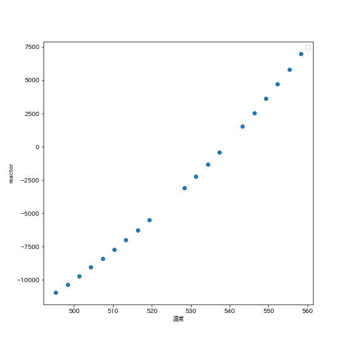

---
output:
  pdf_document:
    latex_engine: lualatex
documentclass: ltjsarticle
header-includes:  \usepackage[version=4]{mhchem}
  \usepackage{amsmath}
  \usepackage[margin=1in]{geometry}
---

# 1.概要  

今回の実験では、エチレンの合成・地熱発電・アンモニアの合成という3つの系についてASPEN Plusという定常シミュレーターを用いたプラント設計を行った。  
シミュレーターでは、物質収支・熱収支・エントロピー収支を数値的に解くことで、系の特定の場所での組成や温度を求めている。つまり、シミュレーターに用いる物質の物性やプロセスのフローシートを与えると自動で必要な値を計算させることが可能である。  

今回題材にしたプロセスについて、それぞれ概要を述べる。

## エチレンの合成  

課題1では、エチレンの合成についてシミュレーションを行った。この課題で用いたフローシートは以下の通りである。  

{height=60mm}  

また、以下このプロセスにおいて管は100本使用しているものと考え、目標反応率は0.85に設定する。

今回のエチレンの合成は以下の反応式で表される気相反応である。
$$\ce{C2H6 -> C2H4 + H2}$$  
管型反応器において、微小体積$dV$における物質収支は、反応速度$r_A$を用いて以下のように表すことができる。  
$$\frac{d F_{\mathrm{A}}}{d V}=r_{\mathrm{A}}$$
ここで、反応は一次反応を仮定しており、反応速度定数は以下のアレニウスの状態方程式から求めた。
$$-r_{\mathrm{A}}=k_{\mathrm{A}} C_{\mathrm{A}}$$
$$k=6.193\times10^{16}exp(\cfrac{-3.43\times10^5}{RT})$$  
物質収支から設計方程式を導出すると、滞在時間$\tau$,体積増加率$\epsilon$を用いて以下のように書ける。  
$$k_{\mathrm{A}} \tau=\frac{k_{\mathrm{A}} C_{\mathrm{A} 0} V}{F_{\mathrm{A} 0}}=\left(1+\varepsilon_{\mathrm{A}}\right) \ln \left(\frac{1}{1-x_{\mathrm{A}}}\right)-\varepsilon_{\mathrm{A}} x_{\mathrm{A}}$$  
この左辺の値を温度、反応器体積に応じて変化させることで設計方程式から反応率を算出した。  
また、ASPENでは気体の状態方程式としてPeng-Robinson型状態方程式を用いた。  

## 地熱発電  
課題2では、地熱発電についてシミュレーションを行った。この課題で用いたフローシートを以下に示す。  

{height=60mm}  

地熱発電は、高温高圧の地下水を汲み上げ、減圧することで生じた水蒸気を用いてタービンを回転させることで電気エネルギーを取り出す。  
今回は、プロセスを流体の供給・バルブによる断熱膨張・フラッシュによる気液分離・タービンの回転の4段階と考える。タービンの効率を80%,出口圧力を大気圧と同じ0.101MPaに設定してシミュレーションを行った。  
バルブ,フラッシュは等エンタルピー過程であると考え、エネルギーの変化はタービンのみで生じると考える。また、タービンから取り出された仕事を$w$,タービン前後の流体の持つエンタルピーをそれぞれ$H_3,H_4$とし、さらにタービンに流れ込む気体物質量を$m$とする。　さらに、タービンは等エントロピー過程と考えるとタービンから得られる仕事は以下のように表すことができる。

$$w_{\text {ideal }}=m_{3}\left(H_{3}-H_{4}\right)$$

また、バルブ、フラッシュでは流体・エネルギーの流入出はなく、物質収支・エネルギー収支が成り立つと考えればFeed,フラッシュ温度を指定すれば仕事を求めることができる。フラッシュではその温度における気液平衡となっており、タービンに流入する気体の物質量はこの平衡から算出される。

## アンモニアの合成  
課題3で用いたアンモニア合成のフローシートを以下に示す。  

{height=60mm}  

ハーバー・ボッシュ法によるアンモニアの合成は、以下の反応式で表される。また、この反応は発熱反応であるため、高温ほど平衡が左に偏る。さらに、左辺よりも右辺の方が分子数が少ないため、高圧ほど平衡は右に偏る。
$$\ce{N2 + 3 H2 -> 2 NH3}$$

このうち$\ce{H2}$はメタンの酸化によって得られ、$\ce{N2}$は空気中から供給される。また、アンモニア合成段階では一度反応したのち、アンモニアとそれ以外の物質に分離し、未反応物をリサイクルすることで反応効率を上げている。また、リサイクルを繰り返すと未反応のメタン・酸素などの不純物が溜まるため、これを排出する。この不純物をパージガスという。  

# 2.課題の回答

## 2.1 課題1  

### (a)

管径を0.05[m],管長を10[m],反応温度845[℃]に固定した時、ASPENにより求められた反応率は0.726であった。  
また、設計方程式を元に算出した反応率は0.724であった。  
これらは以下のストリーム表通りである。  

| ストリーム           | 単位   | FEED    | PRODUCT |
|:---------------------:|:-------:|:-------:|:-------:|
| Phase                 | 　      | 気相   | 気相   |
| 温度           | ℃       | 845     | 845     |
| 圧力              | MPa     | 0.5     | 0.5     |
| モル流量            | kmol/hr | 1197.22 | 2066.06 |
| エタン流量              | kmol/hr | 1197.22 | 328.383 |
| エチレン流量              | kmol/hr | 0       | 868.838 |
| 水素流量              | kmol/hr | 0       | 868.838 |

### (b)

反応温度845[℃]において、管長を10[m]で固定して管径を0.01[m]~0.15[m]まで変化させた時の反応率の変化を以下のグラフに示す。また、各感度解析において、目標転化率である0.85付近を拡大したグラフも同時に示す。  

{height=60mm}  

このグラフから、目標反応率を達成するのに必要な管径は0.0629[m]であるということがわかった。  
次に、反応温度845[℃]において、管径を0.15[m]に固定して管長を1[m]~100[m]まで変化させた時の反応率の変化を以下のグラフに示す。  

{height=60mm}  

このグラフから、目標反応率を達成するために必要な管長は15.82[m]であることがわかった。  

### (c)

管長を10[m],管径を0.15[m]に固定した時、温度ごとの反応率の変化を以下のグラフに示す。  

{height=80mm}
このグラフから、目標反応率を達成するために必要な温度は859.48[℃]であることがわかった。  
さらに、高温ほど反応率が上昇することから、この反応は吸熱反応であることがわかった。

また、全てのグラフについて設計方程式を用いて算出した反応率・ASPENを用いて算出した反応率を比較するため、同一グラフ上にプロットした。  

これらの値は、小数点以下第二位までは一致していた。小数点以下第3位以降のズレは、ASPEN
で用いたPeng-Robinson型状態方程式(1)と、設計方程式で用いた理想気体の状態方程式(2)の違いであると考える。  

$$P=\frac{R T}{v-b}-\frac{a \alpha}{v(v+b)+b(v-b)}\\
\alpha=\left[1+m\left(1+T_{r}\right)^{0.5}\right]^{2} \\ 
m=0.37464+1.54226 \omega-0.26992 \omega^{2} ~~~~~(1)$$

$$PV=nRT$$

Peng-Robinson状態方程式は実在気体を仮定したものであるが、今回用いたエタンは分子量が小さく、系も高温であるために理想気体との差異が小さい。そのため、小数点以下代2位のずれで収まったと考える。

## 2.2 課題2  

本実験では、バルブ出口圧力を低圧・高圧の二種類の条件でシミュレーションを行った。

### (a),(b)

プロセスがバルブ、フラッシュのみと仮定した場合の出口流体について以下のStream表に示す。この時、Feedは530000[kg/h],温度Tは280℃，バルブの出口圧力はCase1では0.75[MPa],Case2では18[MPa]とした。  

《Case1》  

| Stream Name          | Units    | FEED     | FEED2     | LIQUID   | VAPOR      | VAPOR2     |
|:--------------------:|:--------:|:--------:|:---------:|:--------:|:----------:|:----------:|
| Phase                | 　       | Liquid   | Mixed     | Liquid   | Vapor      | Mixed      |
| Temperature          | C        | 280      | 167.749   | 167.749  | 167.749    | 99.8843    |
| Pressure             | MPa      | 50       | 0.75      | 0.75     | 0.75       | 0.101      |
| Mass Vapor Fraction  | 　       | 0        | 0.253186  | 0        | 1          | 0.888936   |
| Mass Liquid Fraction | 　       | 1        | 0.746814  | 1        | 0          | 0.111064   |
| Mass Solid Fraction  | 　       | 0        | 0         | 0        | 0          | 0          |
| Mass Enthalpy        | kJ/kg    | -14741   | -14741    | -15261.7 | -13205.3   | -13546.2   |
| Mass Entropy         | cal/gm-K | -1.5461  | -1.48743  | -1.76949 | -0.655478  | -0.655478  |
| Mass Density         | gm/cc    | 0.804485 | 0.0152619 | 0.899742 | 0.00391368 | 0.00067026 |  

ここで、バルブ出口に当たるのはFEED2のStreamである。この時、気体の割合が約0.253,液体の割合が0.747であることから、バルブによる減圧で蒸気が生じたことがわかる。また、この時の出口温度は約167.75[℃]であったことから、水の蒸発にエネルギーが消費されて温度が下がったと考える。  

\newpage

《Case2》  

| Stream Name            | Units    | FEED     | FEED2    | LIQUID   | VAPOR   | VAPOR2  |
|:----------------------:|:--------:|:--------:|:--------:|:--------:|:-------:|:-------:|
| Phase                  | 　       | Liquid   | Liquid   | Liquid   | 　      | 　      |
| Temperature            | C        | 280      | 279.571  | 279.571  | 　      | 　      |
| Pressure               | MPa      | 50       | 18       | 18       | 　      | 　      |
| Mass   Vapor Fraction  |          | 0        | 0        | 0        | 　      | 　      |
| Mass   Liquid Fraction |          | 1        | 1        | 1        | 　      | 　      |
| Mass   Solid Fraction  |          | 0        | 0        | 0        | 　      | 　      |
| Mass Enthalpy          | kJ/kg    | -14741   | -14741   | -14741   | 　      | 　      |
| Mass Entropy           | cal/gm-K | -1.5461  | -1.52855 | -1.52855 | 　      | 　      |
| Mass Density           | gm/cc    | 0.804485 | 0.768532 | 0.768532 | 　      | 　      |  

同様にFEED2がバルブ出口流体を表す。この時、液体の割合が1であることから流体の全量が液体であることがわかる。これは十分な減圧が足りなかったためである。しかし、温度が約279.6[℃]に低下していることから液体がわずかに膨張したと考える。

### (b)

タービンを追加したフローシートは上で示した通りである。  
また、タービンを追加した時の出口流体については上記のストリーム表通りである。  
Case1,Case2のモデル表について以下に示す。   

《Case1》  

| Name                                        | TURBINE    |
|---------------------------------------------|------------|
| Property method                             | IAPWS-95   |
| Water solubility method                     | 3          |
| Specified discharge pressure   [MPa]        | 0.101      |
| Isentropic efficiency                       | 1          |
| Net work required [kW]                      | -10165.417 |
| Efficiency (polytropic /   isentropic) used | 1          |
| Calculated discharge pressure   [MPa]       | 0.101      |
| Calculated pressure change   [MPa]          | 0.649      |
| Calculated pressure ratio                   | 0.13466667 |
| Outlet temperature [C]                      | 99.8843126 |
| Vapor fraction                              | 0.88893573 |  

\newpage

《Case2》  

| Name                                        | TURBINE  |
|---------------------------------------------|----------|
| Property method                             | IAPWS-95 |
| Water solubility method                     | 3        |
| Specified discharge pressure   [MPa]        | 0.101    |
| Isentropic efficiency                       | 1        |
| Net work required                           | 　       |
| Efficiency (polytropic /   isentropic) used | 1        |
| Calculated discharge pressure   [MPa]       | 18       |
| Calculated pressure change   [MPa]          | 0        |
| Calculated pressure ratio                   | 1        |
| Outlet temperature                          | 　       |
| Vapor fraction                              | 　       |  

この時、Case1で得られた仕事はエンタルピー収支より12707kwであった。タービンの効率が80%であるため、実際に得られる仕事は

$$12707\times0.8=10166\mathrm{[kW]}$$

であった。  
また、Case2でバルブ出口圧力を18[MPa]に設定した時は、仕事が得られなかった。この時は(a)で述べた通りフラッシュに流入する流体が全て液体となるため、タービンに水蒸気が供給されず、仕事を取り出すことができない。

### (c)

バルブ出口圧力を0.101~30[MPa]まで変化させた時の得られる仕事の関係を以下のグラフに示す。  

{height=60mm}

また、このグラフで極大値付近となる出口圧力1~1.6[MPa]の範囲について、得られる仕事の関係を以下のグラフに示す。  

{height=60mm}  

このグラフから、仕事が最大となる出口圧力は1.2303[MPa],その時得られる仕事は10738.5[kW]となった。  

得られる仕事は、概要の項で示した通りタービン前後のエンタルピー差に比例する。タービンは大気開放されているため、タービンから出る水蒸気の圧力は大気圧と等しい。したがって、得られる仕事の大きさはタービンに流入する流体の持つエンタルピーに依存する。バルブ前後で流体は等エンタルピー過程となっており、これはT-S線図の1に当たる。その後、フラッシュで2,3の過程を通って気液が分離し、タービンでは4の減圧過程を通る。  

{height=60mm}  

T-S線図より、タービン前後のエンタルピー差は約300[kJ/kg]であることが読み取れる。  
また、Case2ではバルブ出口圧力を18[MPa]とした。

## 2.3 課題3  

(a)  
プロセスを反応器のみと仮定した場合の温度・Feed圧力がN2基準転化率に及ぼす影響を以下のグラフに示す。  

{height=60mm}  
{height=60mm}  

アンモニアの合成反応は発熱反応であるため、反応温度が高くなるほど転化率は下がる。しかし、反応速度は温度が高いほど大きくなるため、実際のプロセス設計ではこの影響も加味しなければならない。  
一方、圧力は高くするほど転化率が高くなることがわかった。これは、アンモニアの合成により気体分子の物質量が半分になるため、高圧ほど平衡が右に偏るためである。  

(b)  
アンモニアの合成プラントについて、温度・圧力をそれぞれ操作変数とした時のセパレーター1,セパレーター2,反応器における消費エネルギー,コンプレッサーで与える仕事、N2基準収率について以下に示す。温度一定の時は反応器温度は 552.34[℃],圧力一定の時は34.83[MPa]である。  

《収率について》  
{height=60mm}{height=60mm}  

温度・圧力を変化させた時でも、収率に大きな変化は見られず、およそ0.95を記録していたことから、温度・圧力による収率変化は無いと言える。これは、未反応物をリサイクルしているためである。反応しなかった5%は、パージガスと共に排出されると考える。

《コンプレッサーの仕事について》  
{height=60mm}{height=60mm}  

コンプレッサーには、リサイクルしたガスをFeedに戻す前に加圧する役割がある。圧力が上がるとコンプレッサーが与える仕事が小さくなるのは、圧力の上昇に応じてアンモニアの合成反応が進み、Feedに戻さなければならない水素や窒素が減少したためである。また、温度が上がるとコンプレッサーが与える仕事が大きくなるのは、温度上昇によりアンモニア合成の平衡が左に偏り、未反応の水素や窒素が増えるためと考える。

《セパレーター1の仕事について》  

{height=60mm}{height=60mm}  

《セパレーター2の仕事について》  

{height=60mm}{height=60mm}  

セパレーター1・2については、反応生成物であるアンモニアと未反応の水素・窒素を分離するために一度ガスを冷却・液化する。その際に負の仕事が必要になる。故に、反応温度がもともと低温であったり高圧であったりすると、冷却する際に吸収しなければならないエネルギーがー小さくなる。一方、反応温度が高温・または低圧でガスが拡散している状態では余分に冷却・圧縮する必要があるため吸収しなければならないエネルギーが大きくなる。

《反応器で必要になるエネルギーについて》  

{height=60mm}{height=60mm}  

圧力一定では、温度が上昇するほど反応器で必要になるエネルギーが大きくなった。反応器温度は一定であるが、アンモニアの合成反応により熱の出入りが生じる。このグラフは、この熱の出入りを相殺するためにどれだけのエネルギーが必要かを示している。アンモニアの合成は発熱反応であるため、高温では吸熱方向に平衡が偏る。そのため、反応器の温度を下げないために正のエネルギーが必要になる。一方、低温では発熱反応により生じる熱を取り除く必要があるため、負の仕事が必要となる。  
圧力変化については、常に正の仕事が必要であるということがわかった。これは、設定した温度が552℃と高温であり、温度変化のグラフにおいても正の仕事が必要な領域である。そのため正の仕事が必要となったが、高圧ほどアンモニア合成反応が進み発熱するため必要な仕事が少なくなっていると考える。

